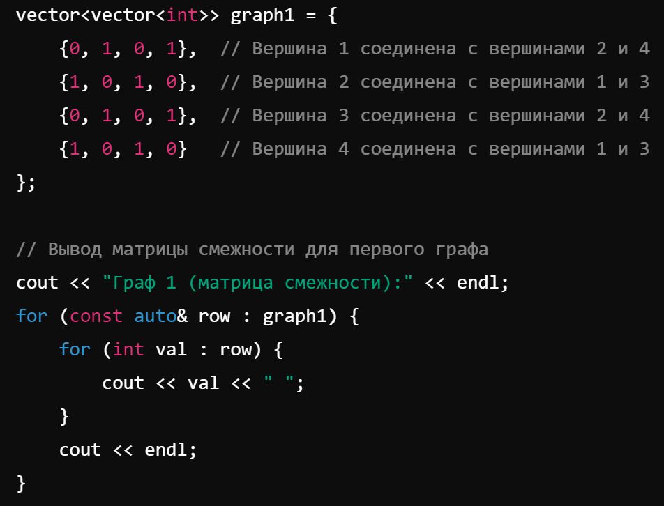
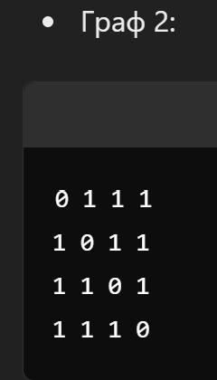
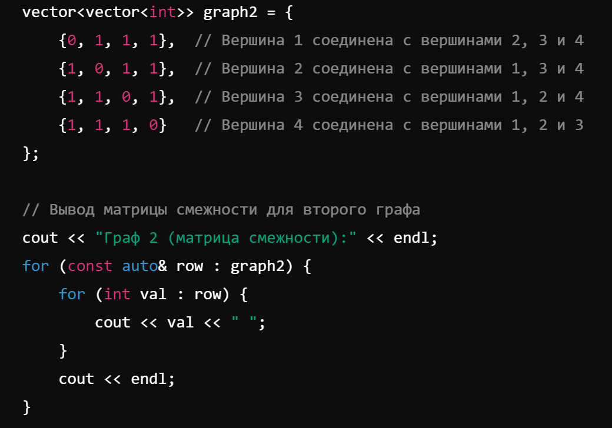

# Расчетная работа 

## Введение

### Цели: 
Научится работать и проводить различные операции с графами.

### Задача: 
Найти пересечение множества неориентированных графов
### Вариант: 
4.9  (матрица смежности)

### Определения:

`Матрица смежности` —  это квадратная матрица, используемая для представления конечного графа.

`Смежость` — непосредственная близость, примыкание.
В элементарной геометрии смежность вершин многоугольника или многогранника определяется их принадлежностью к одному ребру (реже — грани)
В теории графов смежность вершин соответствует наличию ребра между ними.

`Граф` — математическая абстракция реальной системы любой природы, объекты которой обладают парными связями. Граф как математический объект есть совокупность двух множеств — множества самих объектов, называемого множеством вершин, и множества их парных связей, называемого множеством рёбер. Элемент множества рёбер есть пара элементов множества вершин.

`Неориентированный граф` - это граф, где рёбра не имеют направления, что делает связь между вершинами двусторонней.

### Алгоритм:

1. Представление графов: Каждый граф представлен матрицей смежности. Для примера, я использовал три графа с 4 вершинами.

Если элемент 
𝑚𝑎𝑡𝑟𝑖𝑥[𝑖][𝑗]=1
matrix[i][j]=1, то между вершинами 𝑖 i и 𝑗 j есть ребро.
Если элемент matrix[i][j]=0 
matrix[i][j]=0, то ребра нет.

2. Пересечение графов:
Для каждого графа выполняется побитовая операция AND на его матрице смежности с результирующей матрицей пересечения. Это гарантирует, что ребро в пересечении существует только тогда, когда оно есть в каждом графе.

3. Вывод матрицы пересечения: Функция printMatrix выводит итоговую матрицу смежности, которая представляет пересечение всех графов.

4. Ввод данных с клавиатуры:
Мы сначала запрашиваем у пользователя количество графов и количество вершин.
Затем, для каждого графа, вводится матрица смежности. Пользователь вводит значения для каждой ячейки матрицы с помощью цикла cin >>.

5.Генерация графов:
Мы используем вектор векторов векторов (vector<vector<vector<int>>>), чтобы хранить несколько матриц смежности для разных графов.

6. Логика работы остается неизменной:
Функция intersection продолжает работать так же, как и раньше, находя пересечение графов.
После вычисления пересечения выводится матрица смежности пересекающего графа.
           
## Код программы:
```cpp
#include <iostream>
#include <vector>
using namespace std;

// Функция для нахождения пересечения графов
vector<vector<int>> intersection(const vector<vector<vector<int>>>& graphs) {
    int n = graphs[0].size(); // Предполагаем, что все графы имеют одинаковое количество вершин
    vector<vector<int>> result(n, vector<int>(n, 1)); // Начнем с матрицы, которая представляет полный граф

    // Перебираем все графы и выполняем побитовую операцию AND для их матриц смежности
    for (const auto& graph : graphs) {
        for (int i = 0; i < n; i++) {
            for (int j = 0; j < n; j++) {
                result[i][j] &= graph[i][j]; // Пересечение: оба графа должны иметь ребро между i и j
            }
        }
    }
    return result;
}

// Функция для вывода матрицы смежности
void printMatrix(const vector<vector<int>>& matrix) {
    for (const auto& row : matrix) {
        for (int val : row) {
            cout << val << " ";
        }
        cout << endl;
    }
}

int main() {
    setlocale(LC_ALL, "ru");
    int numGraphs, numVertices;

    // Вводим количество графов
    cout << "Введите количество графов: ";
    cin >> numGraphs;

    // Вводим количество вершин в графах
    cout << "Введите количество вершин в графах: ";
    cin >> numVertices;

    // Вектор для хранения матриц смежности графов
    vector<vector<vector<int>>> graphs(numGraphs, vector<vector<int>>(numVertices, vector<int>(numVertices)));

    // Вводим матрицы смежности для каждого графа
    for (int g = 0; g < numGraphs; g++) {
        cout << "Введите матрицу смежности для графа " << g + 1 << " (размер " << numVertices << "x" << numVertices << "):" << endl;
        for (int i = 0; i < numVertices; i++) {
            for (int j = 0; j < numVertices; j++) {
                cin >> graphs[g][i][j];
            }
        }
    }

    // Находим пересечение графов
    vector<vector<int>> intersectionGraph = intersection(graphs);

    // Выводим результат
    cout << "Матрица смежности пересечения графов:" << endl;
    printMatrix(intersectionGraph);

    return 0;
}

```
## Пример графа:

## Работа кода:


## Пример графа:

## Работа кода:


## Пример графа:

## Работа кода:


 ## Вывод
 В результате выполнения данной работы изучил и применил базовые алгоритмы для работы с графами.
  
  
