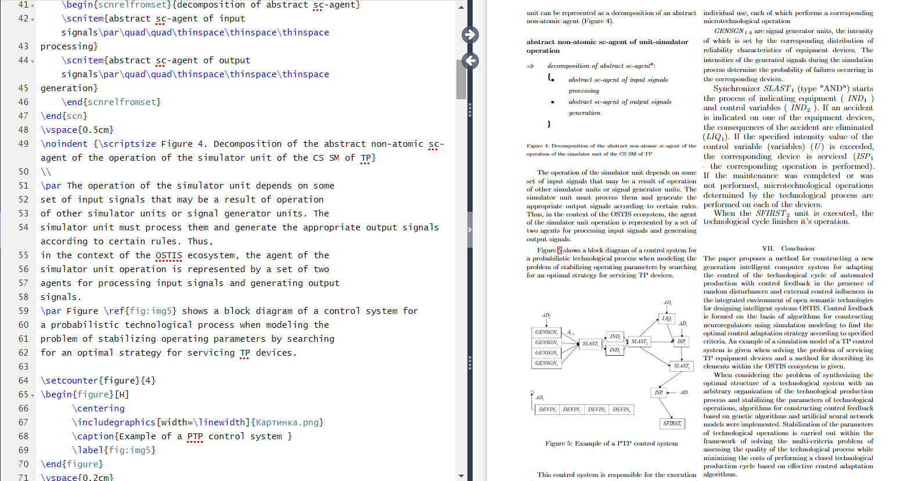

# Лабораторная работа 1

### Цель: 
Познакомиться с системой верстки текстов TeX, языком верстки TeX, издательской системой LaTeX. Выполнить вариант индивидуального задания.

### Основные команды
- multicols- для разбиения страницы на части;
- itemize - для создания списка;
- scn - для подключения одноименной библиотеки;
- newpage - для создания новой страницы.

Более подробно с LaTex вы можете ознакомится [тут](https://www.overleaf.com/learn/latex/Learn_LaTeX_in_30_minutes)

# Лабораторная работа 3

### Цель:
Познакомиться с программами git, освоить их программные аргументы.

### Основные команды:
- git status - прорверяет статус текущего репозитория;
- git push - отправляет локальную ветку на удаленный репозиторий;
- git clone <url> - скачивание удаленного репозитория;
- git commit -m "Ваше сообщение" - непосредственно сам коммит с его описанием;
- git add - переносит изменения из рабочего каталога в раздел проиндексированных файлов.
- git checkout main - переключение на указанную ветку
- git stash - скрыть изменение файла в последнем коммите
Более подробно с основными командами Git можно ознакомиться [тут](https://habr.com/ru/articles/587558/)

### Вывод:

Git позволяет отслеживать любые изменения в файлах, хранить их версии и оперативно возвращаться в любое сохранённое состояние. Это позволяет редактировать код и исправлять ошибки, без риска потреять текущее состояние. Гит значительно облегчает совместную разработкую Также можно создать удалённую копию на хостинг-платформе, которая работает с Git. Полученным результатом можно поделиться с другими пользователями или удаленно помочь в написании кода.

### Ресурсы для обучения
<a href="https://habr.com/ru/articles/541258/">📙</a>
<a href="https://www.udemy.com/course/git-basic-concept-fundamentals-github/">📕</a>
<a href="https://www.udemy.com/course/git-complete/">📗</a>
<a href="https://www.udemy.com/course/git-expert-4-hours/">📘</a>
<a href="https://www.udemy.com/course/git-and-github-complete-guide/">📖</a>
