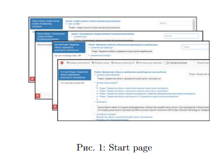

<h1 align="center"> Работа с Latex</h1>

Для выполнения Лабораторной работы № 1
Был использован Overleaf

Для регистрации можно перейти по ссылке:
<a href="https://www.overleaf.com/">OverLeaf</a>

*OverLeaf — онлайн редактор Latex* 

## Использованные пакеты Latex

Для корректной работы в LaTeX нужно подключить специальные пакеты, в данной работе были использованы следующие:

```
\usepackage{graphicx} % Required for inserting images
\usepackage{inputenc}
\usepackage{biblatex}
\usepackage{import}
\usepackage{scn} 
\usepackage{setspace}
\usepackage[russian]{babel} 
```

## Вставка фото и подпись под ней

```
\begin{figure}[h]
    \centering
    \includegraphics[width=\linewidth]{images/first.png} 
    \caption{Start page} 
    \label{Figure 1}
\end{figure}
```

а вот как выглядит это в **pdf**
  <p  align="center"></p>

## Ссылка на фото

```
\ref{Figure 1}
```

## Создание списка
\begin{itemize}
\item  Improving system performance and especially accelerating system response time to user requests.
It is connect with productivity and overall user
satisfaction.

\item Continuous updating and refactoring ontological
models (further formalization of missing concepts,
fix typos and etc.);
\end{itemize}

а вот как выглядит это в **pdf**
  <p  align="center"></p>

## Римские цифры
Команда была изменена для нумерации заголовков с помощью римских цифр

```
\MakeUppercase{\romannumeral 5}
```
## Выделение текста

```
\textbf{text}
```

## Подчеркивание текста

```
\underline{text}
```

## Вертикальный отступ между строками 

```
\vspace{2 mm}
```

## Переход на новую страницу
```
\newpage
```

<h1 align="center"> Лабораторная работа №3 </h1>

## Цель: работа с Git и GitHub

 <p><b>Git</b> (произносится «гит») — распределённая система управления версиями.</p>

 [Git](https://git-scm.com/)

 <a href="https://github.com/">GitHub</a>
 
 ### Основные команды:

<p>1. Проверка стасуса</p>

 ```
 git status
 ```
<p>2. Добавление файлов</p>

```
git add .
```
<p>3. Создание коммита с комментарием к нему</p>

```
git commit -m "message"
```
<p>4. Загрузка на определенную ветку в GitHub</p>

```
git push origin <название ветки>
