# ЛАБА 1

### ЦЕЛЬ

- Познакомиться с системой верстки текстов TeX, языком верстки TeX, издательской системой LaTeX.Выполнить вариант индивидуального задания.

### УСЛОВИЕ

- Сверстать три страницы научной статьи с использованием системы верстки текстов TeX.
- На странице [OSTIS Research Papers Collection (171-173)](https://proc.ostis.net/proc/Proceedings%20OSTIS-2024.pdf) необходимо взять доклад, соответствующий варианту индивидуального задания.

### [РЕЗУЛЬТАТ](lab1/LAB1.pdf)

# ЛАБА 3
### ЦЕЛЬ

- Познакомиться с программами git, освоить их программные аргументы.

### ВЫВОДЫ

- Научился на практике выполнять всевозможные действия с репозиторием и отвечать на теоретические вопросы из списка заданий.
- Получил практические навыки работы в консоли, использования консольных команд.

## ОТЧЁТ
1. git init  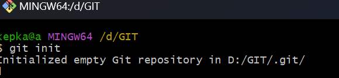
2. git status  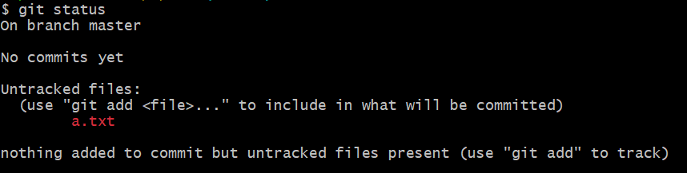
3. последовательность коммитов, master   /   main  
4. git add {file}  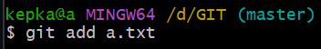
5. git commit -m "comment"  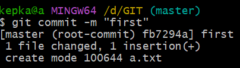
6. git log  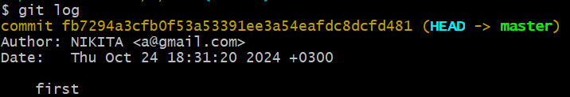
7. git config --list  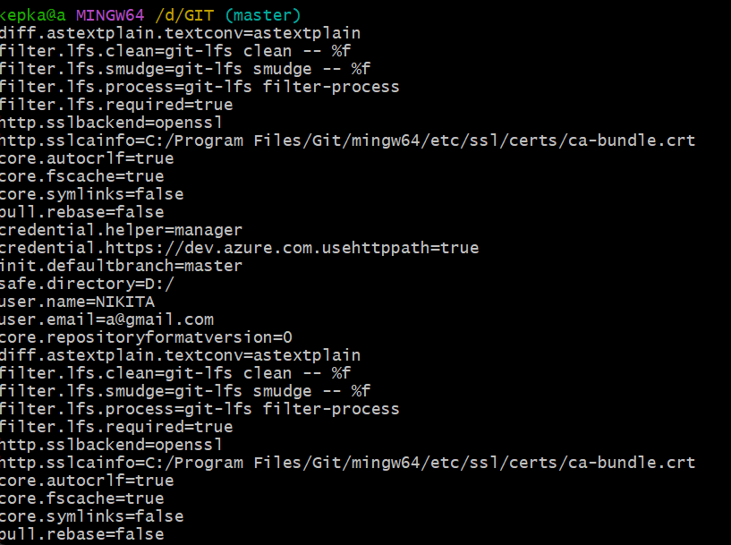
8. git restore --staged {file}   /   git reset  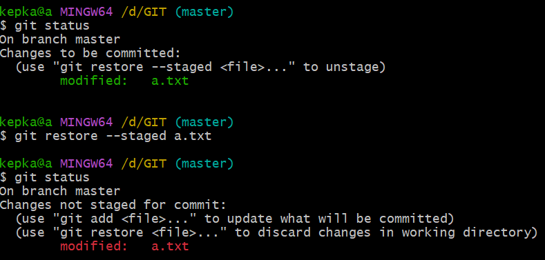
9. git diff {file}  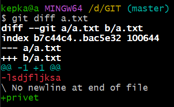
10. git checkout {file}  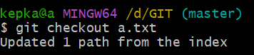
11. git add --all   /   git add .  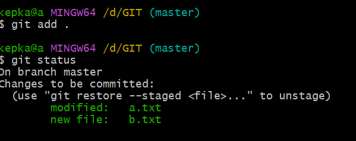
12. git config --global  
13. git config --global [user.name](http://user.name) {name}  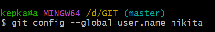
14. git branch  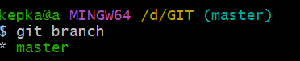
15. git branch {name}  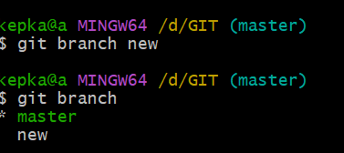
16. git checkout {name} / git switch {name}  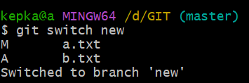
17. git checkout -b {name}  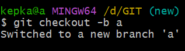
18. git branch -d {name}  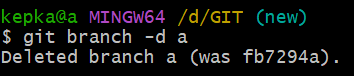
19. git merge {name}  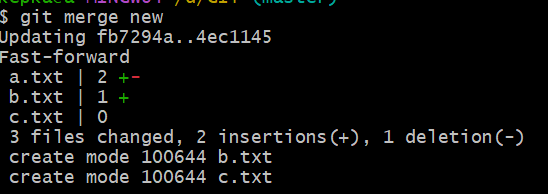
20. конфликт в случае слияния веток с разными изменениями в одном файле  
21. git merge → git status  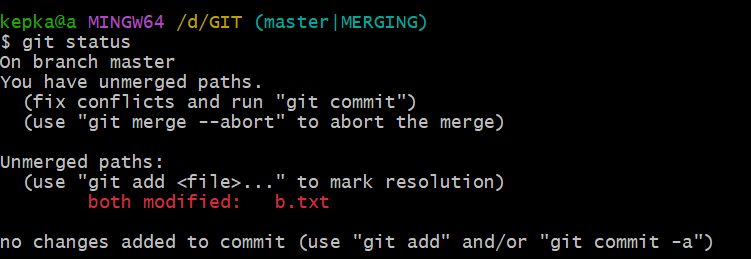
22. устранить конфликт вручную изменив файл до удовлетворительного состояния  
23. git checout {hash}  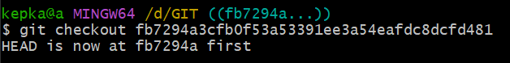
24. git rebase {name}  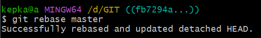
25. git rebase --abort  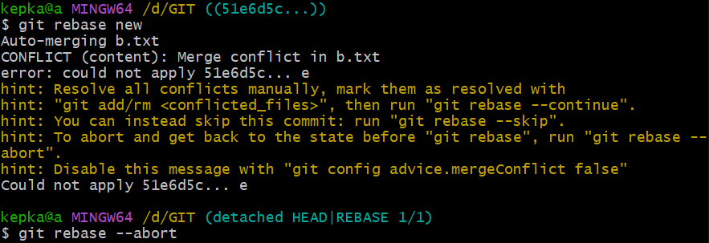
26. git rebase --skip  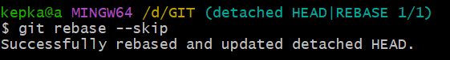
27. git push  
28. git fetch → git merge  /  git pull  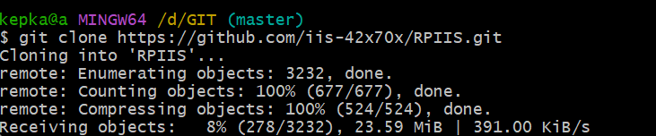
29. git pull origin {name}  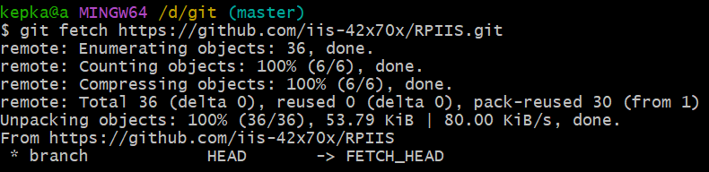
30. git clone {name} {name}  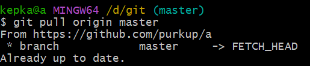
31. git commit --amend -m “comment”  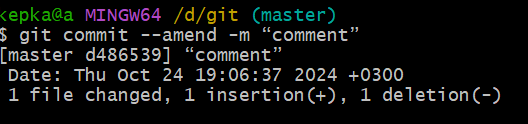
32. git rebase -i HEAD~n  
