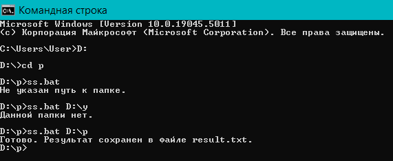
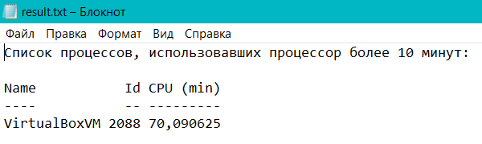
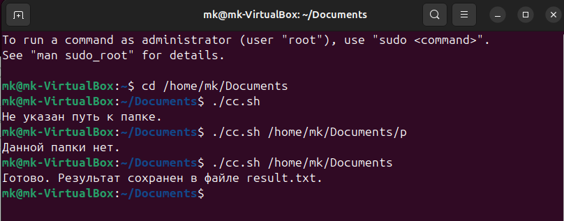
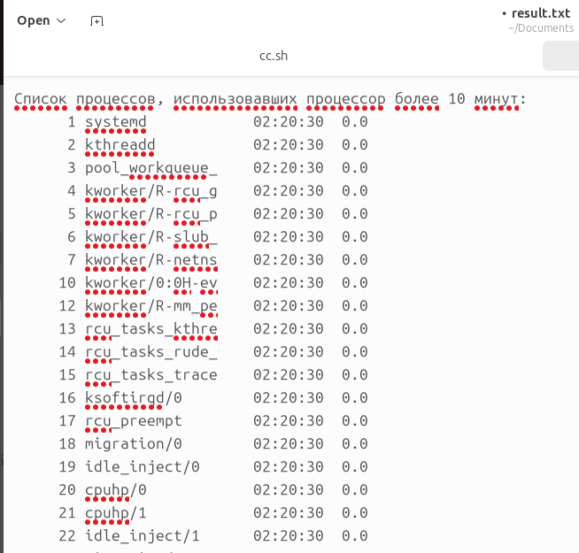
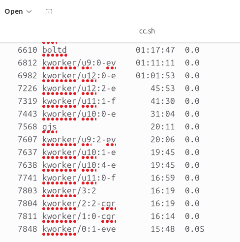

В рамках ЛР 5 необходимо было сделать 60 заданиие из  [списка](https://docs.google.com/document/d/1jQIRngcwNa9yVtQns-ID8a5rRZHwlNSgp8OFaTEHMHc/edit?tab=t.0) заданий.

Выполнялась ЛР 5 в cmd(Windows) и в терминале(Linux). Результат выполнения лабораторной добавлен в ветку.


### Код программы в cmd(Windows):
```
 @echo off
chcp 65001 >nul

if "%~1"=="" (
    echo Не указан путь к папке.
    exit /b 1
)

if not exist "%~1" (
    echo Данной папки нет.
    exit /b 1
)

cd "%~1"

echo Список всех процессов: > result.txt

powershell -Command "Get-Process | Sort-Object TotalProcessorTime -Descending | Select-Object Name, Id, @{Name='CPU (min)';Expression={ $_.TotalProcessorTime.TotalMinutes }} | Format-Table -AutoSize | Out-File -FilePath result.txt -Append -Encoding UTF8"

echo Готово. Результат сохранен в файле result.txt.


```

 Как это выглядит в cmd:
 <p  align="center"></p>

 Как это выглядит в result.txt
 <p  align="center"></p>

### Код программы в терминале(Linux):
```
#!/bin/bash

if [ -z "$1" ]; then
    echo "Не указан путь к папке."
    exit 1
fi

if [ ! -d "$1" ]; then
    echo "Данной папки нет."
    exit 1
fi

cd "$1"

echo "Список процессов, использовавших процессор более 10 минут:" > result.txt

ps -eo pid,comm,etime,%cpu --sort=-etime | awk '
{
    split($3, time, "-")
    if (length(time) == 2) {
        days = time[1]
        split(time[2], hms, ":")
    } else {
        days = 0
        split(time[1], hms, ":")
    }
    if (length(hms) == 3) {
        hours = hms[1]
        minutes = hms[2]
        seconds = hms[3]
    } else {
        hours = 0
        minutes = hms[1]
        seconds = hms[2]
    }
    total_minutes = days * 1440 + hours * 60 + minutes
    if (total_minutes > 10) {
        print $0
    }
}' >> result.txt

echo "Готово. Результат сохранен в файле result.txt."
```
  Как это выглядит в терминале:
 <p  align="center"></p>

 Как это выглядит в result.txt
 <p  align="center"></p>
 <p  align="center"></p>


