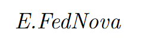
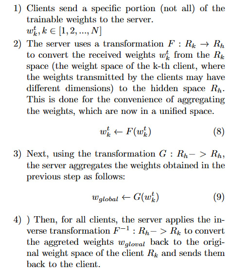
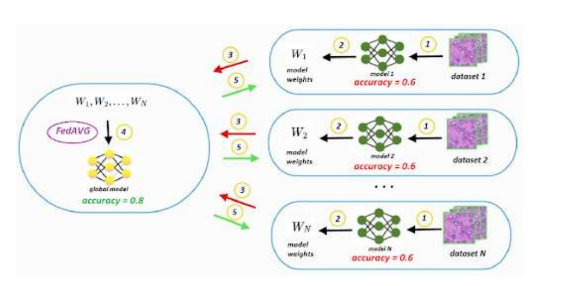
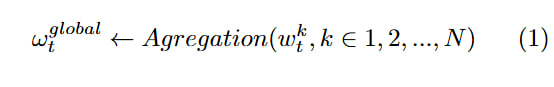

В рамках ЛР 1 необходимо было сверстаь страницы 303-305 [сборника](https://docs.google.com/document/d/1LoQUc3vnl5gvPJD2AASKpqAh-MAW2DTD95snxD1PNmw/edit) средствами LaTeX.

Выполнялась ЛР 1 на сайте overleaf. Результат выполнения лабораторной скомпилированный pdf-файл добавлен в выданную ветку.


<h1 align="center"> Работа с LaTeX в OverLeaf</h1>
<p  align="center"></p>


### Надоели потери покетов - так подключи их сам!
```
\documentclass[8pt]{article}
\usepackage{amsmath}
\usepackage{graphicx} % Required for inserting images
\usepackage{authblk}
\usepackage[usenames]{color}
\usepackage{colortbl}
\parindent=0.3cm
\usepackage{array}
\usepackage{geometry} 
\usepackage{multicol}
\usepackage{enumitem}
\usepackage{ragged2e}
\usepackage{amsfonts, amssymb, amsthm}
\usepackage[utf8x]{inputenc}
\usepackage{titlesec}
\titleformat{\subsection}[runin]
  {\normalfont\large\bfseries}{\thesubsection}{1em}{}
\titlespacing{\subsection}{0}{0}{-3.5pt}
\titleformat{\subsection} {\large\centering}{\thesubsection.}{1pt}{}
\geometry{verbose,a4paper,tmargin=2cm,bmargin=2cm,lmargin=2cm,rmargin=2cm}
\setcounter{page}{303}
\renewcommand{\thesection}{\Roman{section}} 
\renewcommand{\thesubsection}{\Roman{subsection}}

```
### Оформление авторов через таблицу:
```
\begin{tabular}{c c c}
 \\ Aliaksei Himbitski & Victor Zelenkovsky & Maksim Zhydovich \\ \textit{Belarusian State University} & \textit{Belarusian State University} & \textit{Belarusian State University} \\ Minsk, Belarus & Minsk, Belarus & Minsk, Belarus\\Email: alekseygimbickiy@gmail.com \\ \\ Vassili Kovalev \\ \textit{The United Institute of Informatics Problems} \\ \textit{of the National Academy of Sciences of Belarus} \\ \textit{biomedical image analysis laboratory} \\ Minsk, Belarus \\ \\ \\
\end{tabular}
```
 УФф как красиво выглядит в pdf
 <p  align="center"></p>

### Оформление нумерации:
```
\begin{enumerate}[itemsep=-2pt, topsep=-1pt]
\item Clients send a specific portion (not all) of the trainable weights to the server. \\
$w^t_k, k \in [1,2,...,N]$
\item The server uses a transformation $F : R_k \xrightarrow{} R_h$ to convert the received weights $w_k^t$ from the $R_k$ space (the weight space of the k-th client, where the weights transmitted by the clients may have different dimensions) to the hidden space $R_h$.  This is done for the convenience of aggregating the weights, which are now in a unified space.
\begin{align}
    w^t_k \xleftarrow{} F(w^t_k)
\end{align}
\item Next, using the transformation $G : R_h- > R_h$, the server aggregates the weights obtained in the previous step as follows:
\begin{align}
    w_{global} \xleftarrow{} G(w^t_k)
\end{align}
\item ) Then, for all clients, the server applies the inverse transformation $F^{-1} : R_h- > R_k$ to convert the aggreted weights $w_{gloval}$ back to the original
weight space of the client $R_k$ and sends them back
to the client.
\end{enumerate}
```
 Итоговый результат:
 <p  align="center"></p>


### Оформление картинки через ctrl_v:
```
\begin{center}
\begin{figure}
    \centering
    \includegraphics[width=1\linewidth]{image.png}
    \caption{ Diagram of the federated learning process}
    \label{fig:enter-label}
\end{figure}
\end{center}
```
 Вот эту картинку

  <p  align="center"></p>

### Написание уравнений:
```
  \begin{align}        
    \omega_t^{global} \xleftarrow{} Agregation(w^k_t,k \in 1,2,...,N)
    \end{align}

```
 Как в учебнике:

  <p  align="center"></p>


 ### Для работы с курсивом использауется команда:
 ```
 \textit{E.FedNova}
```
<p align="center" 
</p>
 <p  align="center"></p>
 

## В рамках ЛР З необходимо было добавить исходники ЛР 1 в выданную ветку репозитория RPIIS в отдельную папку, сформировать README.md файл, в котором добавить условие задание ЛР 1, описать цель и выводы по ЛР 3. Целью ЛР 3 является изучение основ использования git: создание репозиториев, просмотр предыдущих версий файлов репозитория, коммит новых изменений и файлов, откат изменений, изменение глобальных/локальных настроек и создание веток, устранение конфликтов и прочий функционал системы контроля версий.
### Вот примеры основных команд:
 
 Создать локальный репозиторий в текущей папке:
   
    git init
   

 Посмотреть статус текущего репозитория:
   
    git status
   


Добавить файл в контекст, который будет коммититься:
   
    git add <имя_файла>
   

Создать коммит на основе текущего контекста и указать для него комментарий:
   
    git commit -m "Комментарий к коммиту"
   

 Создать коммит, включающий изменения всех наблюдаемых файлов и указать для него комментарий:
   
    git commit -a -m "Комментарий к коммиту"
   

 Посмотреть протокол (лог) коммитов:
   
    git log
   

 Посмотреть информацию о текущих настройках:
   
    git config --list
   

 Убрать файл из контекста:
   
    git reset <имя_файла>
   

 Посмотреть изменения в файле по сравнению с последним коммитом:
   
    git diff <имя_файла>
   

 Убрать изменения относительно последнего коммита из файла:
   
    git checkout -- <имя_файла>
   

 Добавить в контекст коммита все измененные и созданные файлы:
   
    git add .
   

 Изменить глобальные/локальные настройки:
   
    git config --global <параметр> <значение>
    git config <параметр> <значение>
   

 Переписать имя пользователя:
   
    git config --global user.name "Ваше имя"
   

 Просмотреть существующие ветки:
   
    git branch
   

 Создать новую ветку:
   
    git branch <имя_ветки>
   
         
 Переключиться на другую ветку:
   
    git checkout <имя_ветки>
   

 Создать новую ветку и сразу же переключиться на неё:
   
    git checkout -b <имя_ветки>
   

 Удалить ветку/удалить ветку, даже если она не примержена:
   
    git branch -d <имя_ветки>
    git branch -D <имя_ветки>
   

 Примержить изменения из указанной ветки в текущую:
   
    git merge <имя_ветки>
   


 Как посмотреть в каких файлах конфликты:
   
    git status
   
   

 Как переключиться на указанный коммит:
   
    git checkout <хэш_коммита>
   

 Сделать ребазирование (rebase) текущей ветки:
   
    git rebase <имя_ветки>
   

 Устранение конфликтов во время ребазирования:
    - Разрешить конфликты вручную, затем выполнить:
   
    git rebase --continue
   

Отменить ребазирование во время конфликтов:
   
    git rebase --abort
   

 Пропустить текущий конфликтный коммит и перейти к следующему:
   
    git rebase --skip
   

 Отправить изменения из локального репозитория для указанной ветки в удалённый (дистанционный) репозиторий:
   
    git push origin <имя_ветки>
   

 Забрать изменения из репозитория, для которого были созданы удалённые ветки по умолчанию:
   
    git fetch
   

 Забрать изменения удалённой ветки из репозитория по умолчанию, основной ветки:
   
    git pull origin main
   

 Создание копии репозитория:
   
    git clone <URL_репозитория>
   

 Переименовать последний коммит:
   
    git commit --amend -m "Новый комментарий"
   

 Переименовать не последний коммит:
    - Используя интерактивное ребазирование:
   
    git rebase -i <хэш_коммита>
   

 Скрыть изменения по сравнению с последним коммитом:
   
    git stash
 