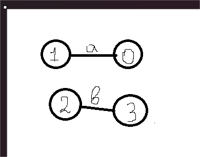
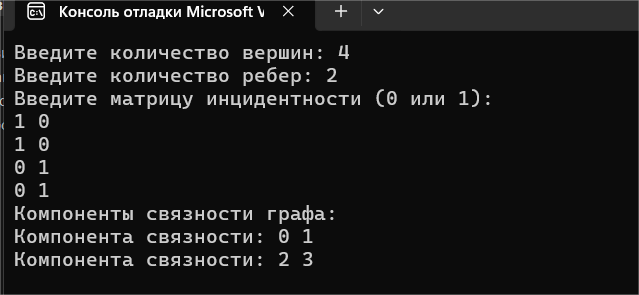
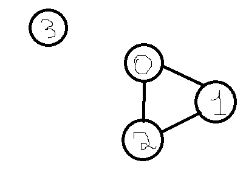
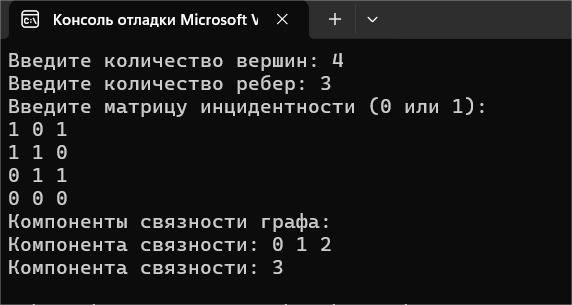
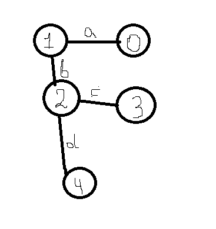
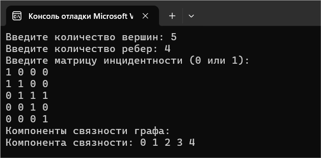
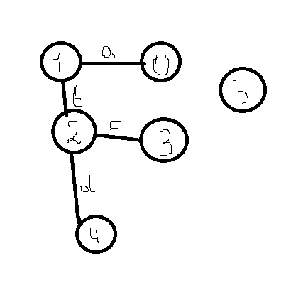
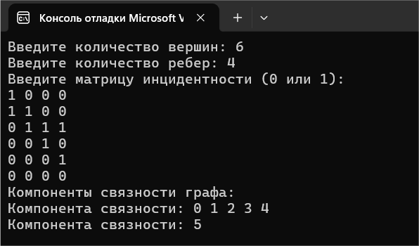
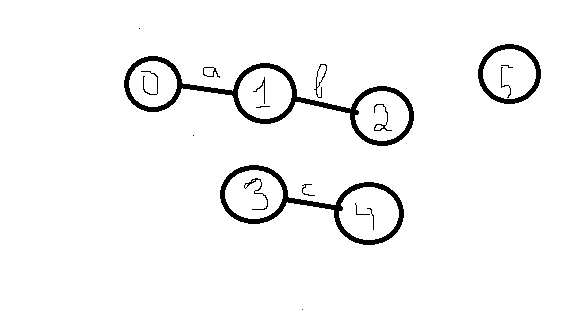
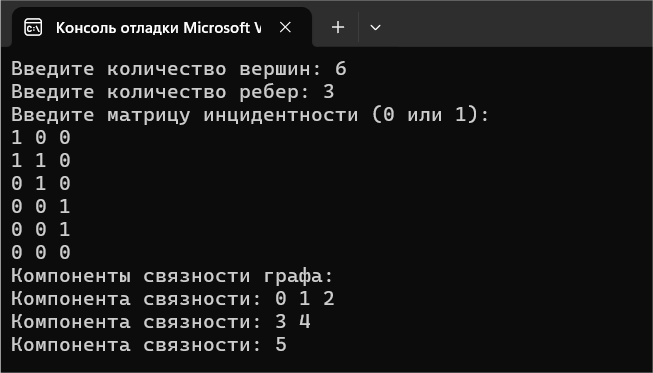

# Расчетная работа 

## Введение

### Цели: 
Научится работать с графами, создавать программы определяющие виды графов

### Задача: 
Найти компоненты связанности неориентированного графа 

### Вариант: 
5.4 (матрица инциндентности)

### Определения:

`Матрица инцидентности` — одна из форм представления графа, в которой указываются связи между инцидентными элементами графа (ребро(дуга) и вершина). Столбцы матрицы соответствуют ребрам, строки — вершинам. Ненулевое значение в ячейке матрицы указывает связь между вершиной и ребром (их инцидентность).

`Граф` — математическая абстракция реальной системы любой природы, объекты которой обладают парными связями. Граф как математический объект есть совокупность двух множеств — множества самих объектов, называемого множеством вершин, и множества их парных связей, называемого множеством рёбер. Элемент множества рёбер есть пара элементов множества вершин.

`Инцидентность` — понятие, используемое только в отношении ребра и вершины. Две вершины или два ребра не могут быть инцидентны.

`Компонента связности графа` - некоторое подмножество вершин графа такое, что для любых двух вершин из этого множества существует путь из одной в другую, и не существует пути из вершины этого множества в вершину не из этого множества.
 

`Кубический граф` - граф, в котором все вершины имеют степень три.


 
### Алгоритм:
1. Определить максимальное количество вершин (MAX_VERTICES) и ребер (MAX_EDGES).
2. Создать матрицу инцидентности graph[MAX_VERTICES][MAX_EDGES] для представления графа.
3. Создать массив visited[MAX_VERTICES] для отслеживания посещенных вершин.
4. Запросить у пользователя количество вершин и ребер.
5. Запросить у пользователя значения для матрицы инцидентности (0 или 1).
6.Для каждой вершины i от 0 до numVertices - 1:
6.1. Если вершина i не была посещена:
6.1.1. Вывести сообщение о начале новой компоненты связности.
6.1.2. Вызвать рекурсивную функцию dfs для вершины i.
7. Пометить текущую вершину как посещенную.
8. Вывести номер текущей вершины.
9. Для каждого ребра j от 0 до numEdges - 1:и
9.1. Если graph[vertex][j] == 1 (ребро инцидентно текущей вершине):
9.1.1.Для каждой вершины k от 0 до numVertices - 1:
9.1.1.1. Если k не равна текущей вершине и graph[k][j] == 1 (ребро инцидентно вершине k) и k не посещена:
Вызвать dfs для вершины k.

## Код программы:
```cpp
#include <iostream>
#include <cstring> // Для memset

using namespace std;

const int MAX_VERTICES = 100; // Максимальное количество вершин
const int MAX_EDGES = 100; // Максимальное количество ребер

// Функция обхода в глубину (DFS)
void dfs(int graph[MAX_VERTICES][MAX_EDGES], bool visited[], int vertex, int numVertices, int numEdges) {
    visited[vertex] = true; // Помечаем вершину как посещенную
    cout << vertex << " "; // Выводим вершину

    // Обходим все ребра
    for (int j = 0; j < numEdges; j++) {
        // Проверяем, инцидентно ли ребро вершине
        if (graph[vertex][j] == 1) {
            // Находим другую вершину, инцидентную этому ребру
            for (int i = 0; i < numVertices; i++) {
                if (i != vertex && graph[i][j] == 1 && !visited[i]) {
                    dfs(graph, visited, i, numVertices, numEdges); // Рекурсивный вызов для соседней вершины
                }
            }
        }
    }
}

// Функция поиска компонент связности
void findConnectedComponents(int graph[MAX_VERTICES][MAX_EDGES], int numVertices, int numEdges) {
    bool visited[MAX_VERTICES];
    memset(visited, false, sizeof(visited)); // Инициализируем массив посещенных вершин

    for (int i = 0; i < numVertices; i++) {
        if (!visited[i]) { // Если вершина еще не посещена
            cout << "Компонента связности: ";
            dfs(graph, visited, i, numVertices, numEdges); // Запускаем DFS
            cout << endl; // Переход на новую строку после компоненты
        }
    }
}

int main() {
    setlocale(LC_ALL, ""); // Установка локализации
    int numVertices; // Количество вершин
    int numEdges; // Количество ребер
    int graph[MAX_VERTICES][MAX_EDGES]; // Матрица инцидентности

    cout << "Введите количество вершин: ";
    cin >> numVertices;

    cout << "Введите количество ребер: ";
    cin >> numEdges;

    cout << "Введите матрицу инцидентности (0, 1 или 2):" << endl;
    for (int i = 0; i < numVertices; i++) {
        for (int j = 0; j < numEdges; j++) {
            cin >> graph[i][j]; // Заполнение матрицы
        }
    }

    cout << "Компоненты связности графа:" << endl;
    findConnectedComponents(graph, numVertices, numEdges);

    return 0;
}
```
## Пример графа:

## Пример работы кода:


## Пример графа:

## Пример работы кода:


## Пример графа:

## Пример работы кода:


## Пример графа:

## Пример работы кода:


## Пример графа:

## Пример работы кода:


 ## Вывод
 В результате выполнения данной работы были получены следующие практические навыки:
 
изучены основы теории графов

изучены способы представления графов

изучены базовые алгоритмы для работы с графами

 
