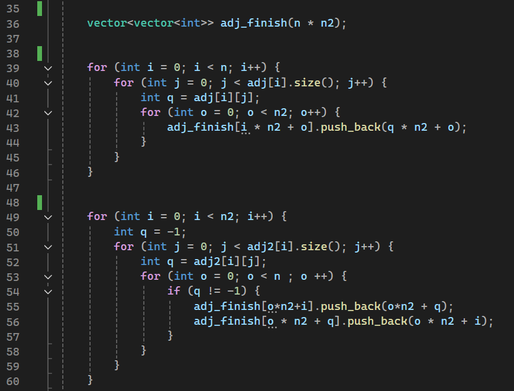
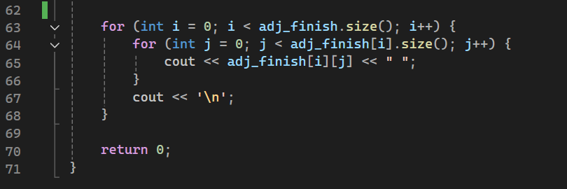

# Расчетная работа. Теория графов
## Цель:
- Ознакомиться с теорией графов и понять что это такое.
- Выяснить, для чего это нужно.
- Выяснить, какие виды графов бывают.
- Научиться понимать и решать теоретико-графовые задачи.
### Ключевые понятия
- Графом называется математическая структура, которая используется для моделирования парных отношений между объектами.
- Вершины представляют собой объекты или элементы, которые мы хотим связать.
- Рёбра представляют отношения или связи между этими вершинами.
- Ориентированный граф: Рёбра имеют направление. Например, если есть ребро от A к B, это означает, что A связано с B, но не обязательно наоборот.
- Неориентированный граф: Рёбра не имеют направления. Например, если существует ребро между вершинами A и B, это означает, что A связано с B и B связано с A.
- Граф считается связанным, если существует путь между каждой парой вершин. Если граф не связан, он состоит из нескольких компонент связности.
- Цикл — это путь в графе, который начинается и заканчивается в одной и той же вершине, не проходя по одному и тому же ребру более одного раза.
 ## Задача
  - Реализовать алгоритм на языке программирования C++, решающий теоретико-графовую задачу в соответствии с выданным вариантом.
## Вариант
Мой вариант 4.1 Граф задаётся списком смежности. Мне необходимо найти декартово произведение графов.

Варианты заданий можно посмотреть в методичке [по ссылке](https://drive.google.com/file/d/1-rSQZex8jW-2DlY2kko18gU1oUAtEGHl/view)

## Алгоритм программы:

## Шаг 1: Чтение входных данных

1. **Ввод имени файла**: Программа ожидает, что пользователь введет имя файла, содержащего данные графов.
2. **Открытие файла**: Используется `ifstream` для открытия файла. Если файл не удается открыть, программа выводит сообщение об ошибке и завершает работу.
3. **Чтение первого графа**:
   - Считываются количество вершин `n` и количество рёбер `m`.
   - Создается вектор `adj` (список смежности) размером `n`, который будет использоваться для хранения соседей каждой вершины.
   - В цикле считываются пары `c` и `d`, представляющие рёбра, и добавляются в список смежности для обеих вершин (так как граф неориентированный).
4. **Чтение второго графа**:
   - Считываются количество вершин `n2` и количество рёбер `m2`.
   - Создается вектор `adj2` (список смежности) размером `n2`.
   - В цикле считываются пары `c` и `d`, представляющие рёбра, и добавляются в список смежности для первой
   - вершины (граф неориентированный).

## Шаг 2: Построение декартова произведения

1. **Создание списка смежности для произведения**:
   - Создается вектор `adj_finish` размером `n * n2`, который будет содержать список смежности для декартова произведения двух графов.
2. **Связывание вершин первого графа с вершинами второго**:
   - Для каждой вершины `i` из первого графа:
     - Для каждого соседа `q` этой вершины:
       - Для каждой вершины `o` второго графа:
         - Добавляется ребро между вершиной `(i, o)` и её соседом `(q, o)` в списке смежности произведения.
3. **Связывание вершин второго графа с вершинами первого**:
   - Для каждой вершины `i` из второго графа:
     - Для каждого соседа `q` этой вершины:
       - Для каждой вершины `o` первого графа:
         - Добавляется ребро между вершиной `(o, i)` и её соседом `(o, q)` в списке смежности произведения.
         - Также добавляется ребро в обратном направлении между `(o, q)` и `(o, i)`.

## Шаг 3: Вывод результата

- **Печать списка смежности**: В конце программы выводится список смежности для декартова произведения, где для каждой вершины выводятся все её соседи.

## Проверки:

## Примечания

- Декартово произведение двух графов \( G_1 \) и \( G_2 \) создаёт новый граф, где каждая вершина представляется упорядоченной парой из вершин \( G_1 \) и \( G_2 \).
- Рёбра в новом графе добавляются по правилам: если существует ребро между двумя вершинами в одном из исходных графов, то эти вершины соединяются в декартовом произведении, сохраняя структуру соседства.
- Программа предполагает, что графы не содержат изолированных вершин, так как не обрабатывает случай, когда количество вершин или рёбер равно нулю.

## Использованные источники:

Информация для работы с графами на C++ была взята [тут](https://brestprog.by/topics/);

Дополнительную информацию можно найти [тут](https://habr.com/ru/companies/otus/articles/568026/);

## Литературные источники:

1. Берж К. Теория графов и её применение: монография. — Москва: Издательство иностранной литературы, 1962.

2. Белоусов А.В., Ткачев С.В. Дискретная математика: учебное пособие. — Москва: Издательство МГТУ им. Баумана, 2002.

3. Кормен Т.Х., Лейзерсон Ч.И., Ривест Р.Л., Штайн К. Алгоритмы: построение и анализ (3-е издание): учебное пособие. — Москва: Издательский дом «Вильямс», 2013.

4. Кристофидес Н. Теория графов: алгоритмический подход: монография. — Москва: Мир, 1977.

5. Майника Э. Алгоритмы оптимизации на сетях и графах: монография. — Москва: Мир, 1981.

6. Новиков А.A. Дискретная математика для программистов: учебное пособие. — Санкт-Петербург: Питер, 2001.

7. Уилсон Р. Введение в теорию графов: учебное пособие. — Москва: Мир, 1977.

8. Харари Ф. Теория графов: монография. — Москва: Мир, 1973.

