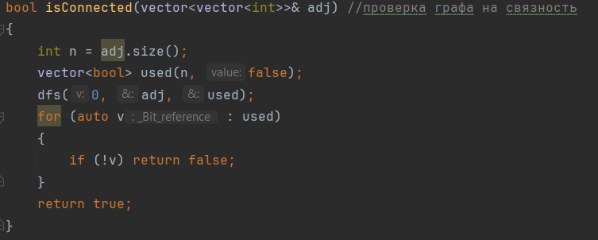

# Расчетная работа. Теория графов
## Цель:
 Ознакомиться с понятием графов.
- Выяснить, какие виды графов бывают.
- Ознакомиться со способами представления графов в памяти компьютера.
- Научиться решать теоретико-графовые задачи.

## Вариант:
Вариант 2.6. Граф задается матрицей смежности. Необходимо найти число вершинной связности графа.

Варианты можно найти [тут](https://drive.google.com/file/d/1-rSQZex8jW-2DlY2kko18gU1oUAtEGHl/view).

## Пошаговое выполнение работы:

### 1.Обход в глубину (DFS):

Принимает параметры:
 * v: текущая вершина
 * adj: матрица смежности графа
 * used: массив посещенных вершин

Рекурсивно обходит все достижимые вершины из текущей;
Помечает посещенные вершины в массиве used.

### 2. Проверка графа на связность:

Проверяет связность графа:
* Запускает DFS из вершины 0;
* Если после обхода остались непосещенные вершины, граф несвязный;
* Возвращает true, если граф связный, и false иначе.

### 3. Основная функция для нахождения числа вершинной связности графа:

* Перебирает возможное количество вершин k от 1 до n;
* Для каждого k генерирует все возможные комбинации k вершин;
* Использует рекурсивную лямбда-функцию generate для генерации комбинаций;
* При нахождении подходящего набора вершин выводит результат.

Для подсчета числа была использована лямбда-функция std::function<void(int, int)> generate = [&](int pos, int count).

Данная функция отвечает за генерацию различных комбинаций вершин в графе и, по сути, является основным компонентом этой работы.

//////////////////////

### 4. Проверки и вывод результата:

* Добавлена проверка на наличие только нулей в главной диагонали матрицы;
* Вводится число n и квадратная матрица размером n*n;
* Выводится число вершинной связности и номера вершин, которые нужно удалить.

## Вывод:

В ходе данной расчетной работы был реализован алгоритм решения задачи 2.6 и перенесен на ЯП C++.

## Использованные источники:

Информация для работы с графами на C++ была взята [отсюда](https://brestprog.by/topics/);

Дополнительную информацию можно найти [по ссылке](https://www.google.com/);

Код данной работы можно найти [здесь](https://github.com/xcuuuse/rr-pioivis).
