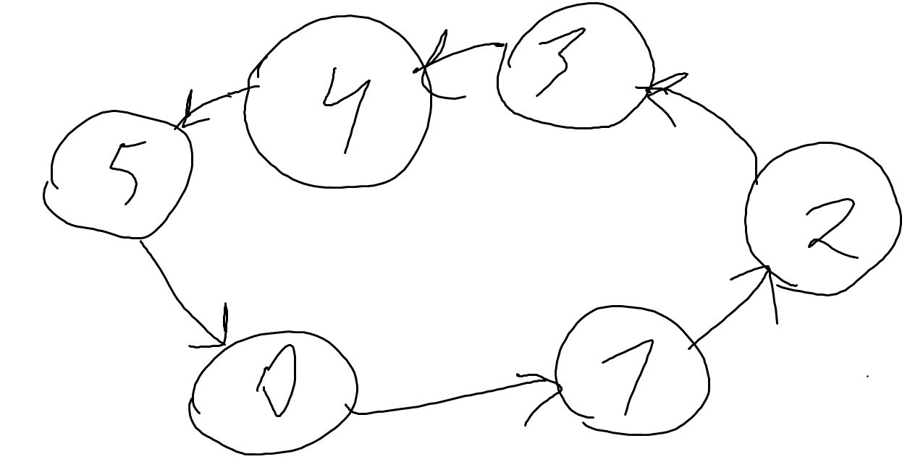
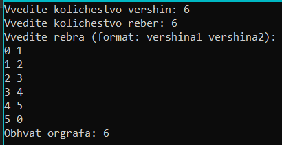
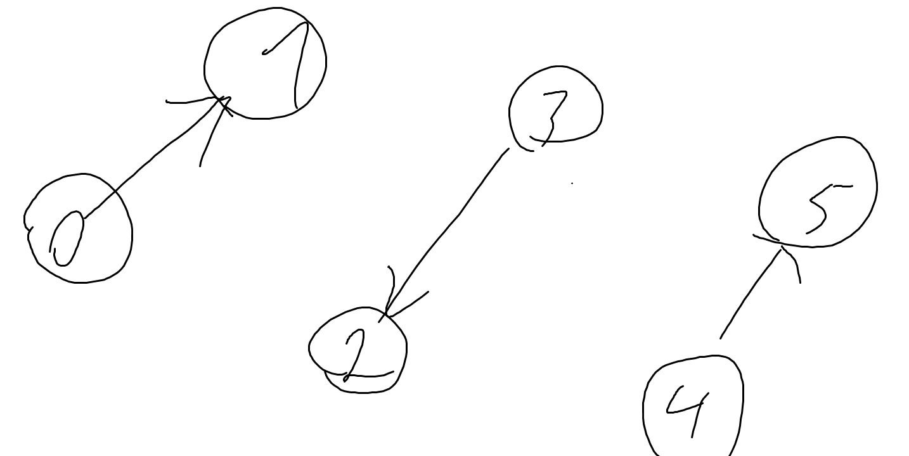
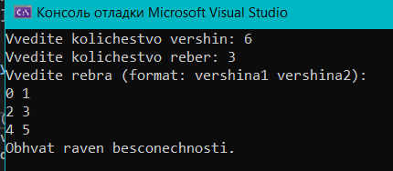
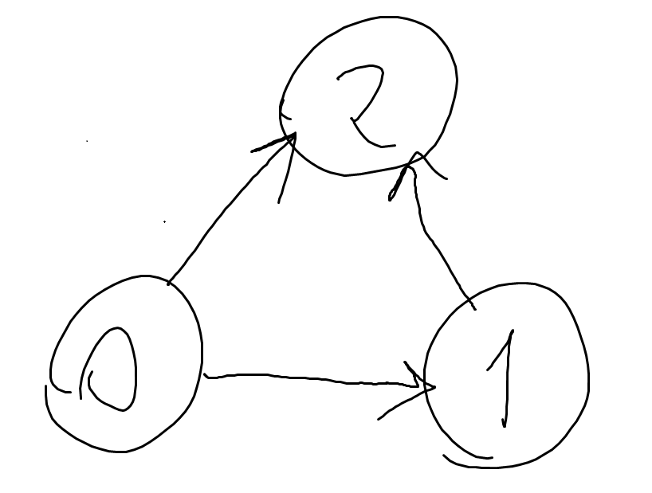
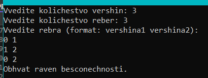
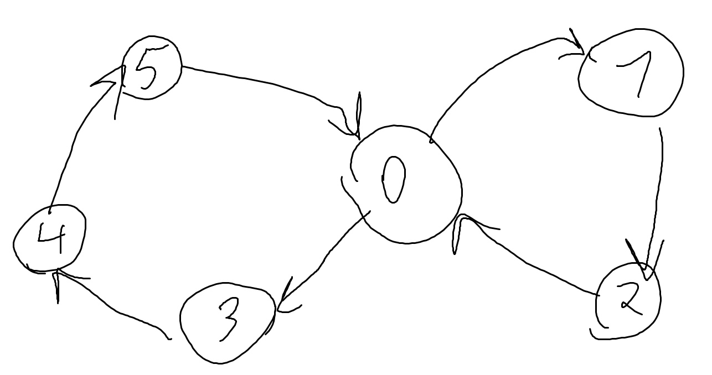

В рамках расчётной работы необходимо было сделать 2.13 (системой смежности) заданиие из  [сборника](https://drive.google.com/file/d/1-rSQZex8jW-2DlY2kko18gU1oUAtEGHl/view) заданий.
2. Определить числовую характеристику графа: 13. (3) Обхват орграфа cc(си).

Выполнялась  РР в VisualStudio 2022. Результат выполнения лабораторной добавлен в ветку.

Ориентированный граф (кратко орграф) — граф, рёбрам которого присвоено направление. Направленные рёбра именуются также дугами, а в некоторых источниках и просто рёбрами. Граф, ни одному ребру которого не присвоено направление, называется неориентированным графом или неорграфом.

Обхват графа — длина наименьшего цикла, содержащегося в данном графе. Если граф не содержит циклов (то есть является ациклическим графом), его обхват по определению равен бесконечности. 

Программа нахождения обхвата орграфа находилась при помощи поиска в глубину (DFS, Depth-First Search) — это алгоритм для обхода или поиска в графах, включая орграфы (ориентированные графы). Основная идея заключается в том, чтобы идти как можно глубже по каждому пути, прежде чем возвращаться назад и исследовать другие пути. 
Основные шаги и принципы работы DFS: Начало с Узла: 

1)Выбрать начальный узел (вершину) графа.

2)Посещение Узла: Пометить узел как посещённый.

3)Рекурсивное Посещение Соседей: Для каждого соседнего узла, если он не был посещён, рекурсивно примените к нему DFS.

4)Возврат: Когда все соседи узла посещены, вернутса к предыдущему узлу и продолжить обход.

 Пример 1:
 

 Ответ:
 

 Пример 2:
 

 Ответ:
 

 Пример 3:
 

 Ответ:
 

 Пример 4:
 

 Ответ:
 

 Пример 5:
 

 Ответ:
 

Литературные источники:
https://habr.com/ru/companies/otus/articles/568026/
https://blog.skillfactory.ru/glossary/orientirovannyj-graf/
https://youtu.be/3-XLRh2M5YI?si=sLVmw5h-6Y6qq7XK

