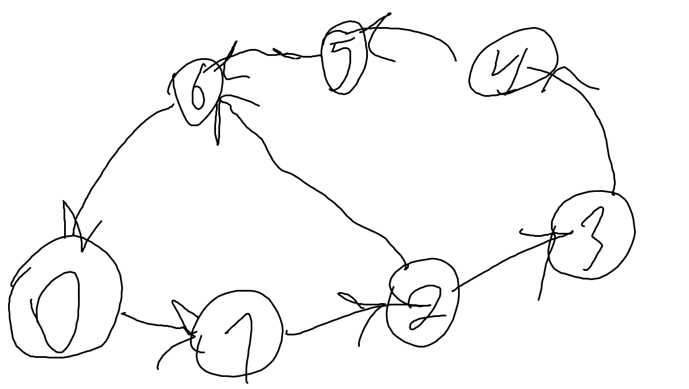
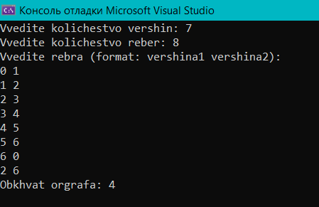

В рамках расчётной работы необходимо было сделать 2.13 (системой смежности) заданиие из  [сборника](https://drive.google.com/file/d/1-rSQZex8jW-2DlY2kko18gU1oUAtEGHl/view) заданий.

Выполнялась  РР в VisualStudio 2022. Результат выполнения лабораторной добавлен в ветку.


### Код программы в :
```
#include <iostream>
#include <limits.h>
using namespace std;

const int MV = 1000;
int ms[MV][MV];
bool visited[MV];
int dist[MV]; 

void DFS(int v, int n, int start, int& minCycle) {
    visited[v] = true;
    for (int i = 0; i < n; i++) {
        if (ms[v][i] == 1) {
            if (!visited[i]) {
                dist[i] = dist[v] + 1;
                DFS(i, n, start, minCycle);
            }
            else if (i == start) {
                minCycle = min(minCycle, dist[v] + 1);
            }
        }
    }
    visited[v] = false;
}

int main() {
    int n, e;
    cout << "Vvedite kolichestvo vershin: ";
    cin >> n;
    cout << "Vvedite kolichestvo reber: ";
    cin >> e;

    for (int i = 0; i < n; i++) {
        for (int j = 0; j < n; j++) {
            ms[i][j] = 0;
        }
    }

    cout << "Vvedite rebra (format: vershina1 vershina2):" << endl;
    for (int i = 0; i < e; i++) {
        int u, v;
        cin >> u >> v;
        ms[u][v] = 1; 
    }

    int minCycle = INT_MAX;

    for (int i = 0; i < n; i++) {
        for (int j = 0; j < n; j++) {
            visited[j] = false;
            dist[j] = 0;
        }
        DFS(i, n, i, minCycle);
    }

    if (minCycle == INT_MAX) {
        cout << "Obhvat ne nayden." << endl;
    }
    else {
        cout << "Obhvat orgrafa: " << minCycle << endl;
    }

    return 0;
}

```


#include <iostream>
#include <limits.h>
using namespace std;
Подключаем библиотеки для использования cout, sin. И для использования лимитов таких как INT_MAX.

const int MV = 1000;
int ms[MV][MV];
bool visited[MV];
int dist[MV]; 
Объявляем переменные: максимальное количество вершин, матрицу смежности, массив, который хранит значение посещённости, и массив дистанции.

void DFS(int v, int n, int start, int& minCycle) {
    visited[v] = true;
    for (int i = 0; i < n; i++) {
        if (ms[v][i] == 1) {
            if (!visited[i]) {
                dist[i] = dist[v] + 1;
                DFS(i, n, start, minCycle);
            }
            else if (i == start) {
                minCycle = min(minCycle, dist[v] + 1);
            }
        }
    }
    visited[v] = false;
}

Этот код работает по принципу поиска в глубину A.K.A. DFS(Depth First Search).

int main() {
    int n, e;
    cout << "Vvedite kolichestvo vershin: ";
    cin >> n;
    cout << "Vvedite kolichestvo reber: ";
    cin >> e;

    for (int i = 0; i < n; i++) {
        for (int j = 0; j < n; j++) {
            ms[i][j] = 0;
        }
    }
Вводим количество вершин и рёбер. И инициализируем матрицу смежности.

cout << "Vvedite rebra (format: vershina1 vershina2):" << endl;
for (int i = 0; i < e; i++) {
    int u, v;
    cin >> u >> v;
    ms[u][v] = 1; 
}
Вводим список смежности, и приравнием МС к 1.

    int minCycle = INT_MAX;

    for (int i = 0; i < n; i++) {
        for (int j = 0; j < n; j++) {
            visited[j] = false;
            dist[j] = 0;
        }
        DFS(i, n, i, minCycle);
    }

    if (minCycle == INT_MAX) {
        cout << "Obkhvat ne nayden." << endl;
    }
    else {
        cout << "Obkhvat orgrafa: " << minCycle << endl;
    }

    return 0;
}
Инициализация массивов, и вывод результатов.

 Вот для примера орграф:
 <p  align="center"></p>

 И вот что выдаёт. Ответ правильный.
 <p  align="center"></p>

