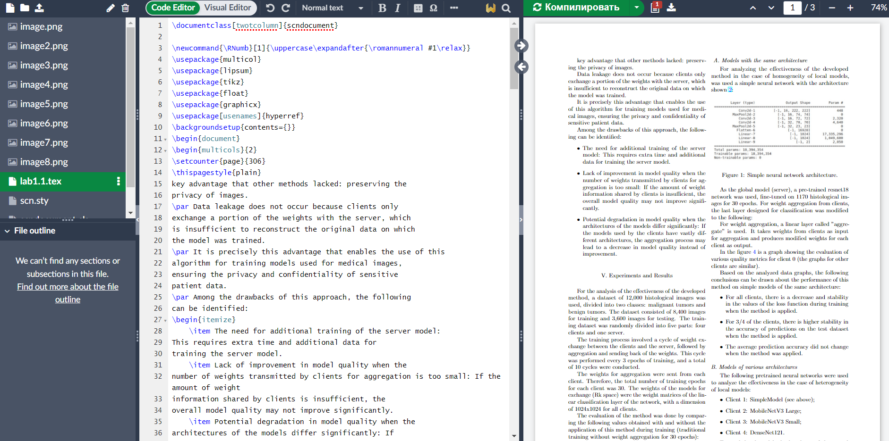

<h1 align="center"> Работа с Latex</h1>
<p  align="center"></p>
Для регистрации можно перйти по ссылке

<a href="https://www.overleaf.com/">OverLeaf</a>

Для начала проекта нужно нажать на кнопку
<p  align="center"></p>

### Для работы с Latex нужно подключитьспециальные пакеты
```
\documentclass[twotcolumn]{scndocument}

\newcommand{\RNumb}[1]{\uppercase\expandafter{\romannumeral #1\relax}}
\usepackage{multicol}
\usepackage{lipsum}
\usepackage{tikz}
\usepackage{float}
\usepackage{graphicx}
\usepackage[usenames]{hyperref}
```
### Работа со списками
```
\begin{itemize}
    \item Client 1: SimpleModel (see above);
    \item Client 2: MobileNetV3 Large;
    \item Client 3: MobileNetV3 Small;
    \item Client 4: DenseNet121. 
\end{itemize}
```
 а вот как выглядит это в **pdf**
 <p  align="center"></p>

### Вставка картинок
```
\begin{center}
    \begin{figure}[H]
    \centering
    \includegraphics[width=4.35cm]{figs/Picture.png}
    \caption{Figure 5.The first variant of mutual placement of objects.}
    \label{fig:first}
\end{figure}
\end{center}
```
 а вот как выглядит это в **pdf**

  <p  align="center"></p>

### Работа с таблицами
```
\begin{tabular}{|c|c|c|c|c|c|c|c|c|c|c|}
\hline
\textbf{Units} & \textbf{0} & \textbf{1} & \textbf{2} & \textbf{3} & \textbf{4} & \textbf{5} & \textbf{6} & \textbf{7} & \textbf{8} & \textbf{9} \\
\hline
\textbf{0} & 2 & 2 & 2 & 3 & 2 & 3 & 2 & 3 & 2 & 3 \\
\hline
\textbf{1} & 3 & 3 & 2 & 3 & 2 & 3 & 3 & 2 & 3 & 2 \\
\hline
\textbf{2} & 2 & 3 & 2 & 3 & 2 & 2 & 2 & 3 & 3 & 2 \\
\hline
\textbf{3} & 3 & 2 & 2 & 3 & 2 & 3 & 2 & 2 & 3 & 2 \\
\hline
\textbf{4} & 2 & 3 & 2 & 3 & 2 & 3 & 2 & 3 & 2 & 3 \\
\hline
\textbf{5} & 3 & 2 & 3 & 3 & 3 & 3 & 2 & 3 & 3 & 2 \\
\hline
\textbf{6} & 3 & 2 & 2 & 3 & 2 & 3 & 2 & 3 & 3 & 2 \\
\hline
\textbf{7} & 2 & 3 & 3 & 3 & 2 & 3 & 2 & 3 & 2 & 3 \\
\hline
\textbf{8} & 3 & 2 & 2 & 3 & 3 & 3 & 2 & 3 & 3 & 2 \\
\hline
\textbf{9} & 2 & 3 & 2 & 3 & 3 & 3 & 2 & 3 & 3 & 2 \\
\hline
\end{tabular}
```
 <p align="center"> а вот как выглядит это в <b>pdf</b>
</p>

 <p  align="center"></p>

 ### Работа с секциями  и римскими цифрами
 ```
 \section*{\fontsize{10}{11}\selectfont\textnormal{
  \RomanNumeralCaps{5}. Conclusion }
}
```
<p align="center"> а вот как выглядит это в <b>pdf</b>
</p>
 <p  align="center"></p>
 
 ## Вот так выглядит документ при его редактировании
  <p  align="center"></p>

## Цель: работа с Git и GitHub, а также научиться оформлять MarkDown  файлы

 <p  ></p>
 <p><b>Git</b> (произносится «гит») — распределённая система управления версиями.</p>

 [Git](https://git-scm.com/)

 <a href="https://github.com/">GitHub</a>
 
 ### Основные команды:

<p>1. Проверка стасуса</p>

 ```
 git status
 ```
<p>2. Добавление файлов</p>

```
git add .
```
<p>3. Создание коммита</p>

```
git commit -m "message"
```
<p>4. Загрузка на определенную ветку в GitHub</p>

```
git push origin <название ветки>
```
### вот рессурсы для обучения командам Git
<a href="https://habr.com/ru/articles/541258/">Работа с git</a>
