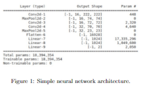

<h1 align="center"> Лабораторная работа 1 </h1>

### Для работы с Latex нужно подключитьспециальные пакеты
```
\documentclass[twotcolumn]{scndocument}

\newcommand{\RNumb}[1]{\uppercase\expandafter{\romannumeral #1\relax}}
\usepackage{multicol}
\usepackage{lipsum}
\usepackage{tikz}
\usepackage{float}
\usepackage{graphicx}
\usepackage[usenames]{hyperref}
```
### Работа со списками
```
\begin{itemize}
    \item Client 1: SimpleModel (see above);
    \item Client 2: MobileNetV3 Large;
    \item Client 3: MobileNetV3 Small;
    \item Client 4: DenseNet121. 
\end{itemize}
```
 а вот как выглядит это в **pdf**
 <p  align="center"></p>

### Вставка картинок
```
\begin{figure}[H]
  \centering
    \includegraphics[width=8cm,height=4cm]{image.png}
  \caption{Simple neural network architecture.}
\end{figure}
```
 а вот как выглядит это в **pdf**
  <p  align="center"></p>

 ### Работа с секциями  и римскими цифрами
 ```
\RNumb{5}. Experiments and Results
```
а вот как выглядит это в <b>pdf</b>
 <p  align="center"></p>

  ### Также использовались следующие команды
```
 \columnbreak
 ```
для прерывания колонны
 ```
 \href{https://proc.ostis.net/proc/Proceedings%20OSTIS-2024.pdf}{\textcolor{blue}{2}}
 ```
для добавления гиперссылки объекту
 
 ## Вот так выглядит документ при его редактировании
  <p  align="center"></p>

# Лабораторная работа 1 

## Цель: работа с Git и GitHub, а также научиться оформлять MarkDown  файлы

 </p>
 <p><b>Git</b> (произносится «гит») — распределённая система управления версиями.</p>

 [Git](https://git-scm.com/)

 <a href="https://github.com/">GitHub</a>
 
 ### Основные команды:

<p>1. Проверка стасуса</p>

 ```
 git status
 ```
<p>2. Добавление файлов</p>

```
git add .
```
<p>3. Создание коммита</p>

```
git commit -m "message"
```
<p>4. Загрузка на определенную ветку в GitHub</p>

```
git push origin <название ветки>
```
### вот рессурсы для обучения командам Git
<a href="https://habr.com/ru/articles/541258/">Работа с git</a>
