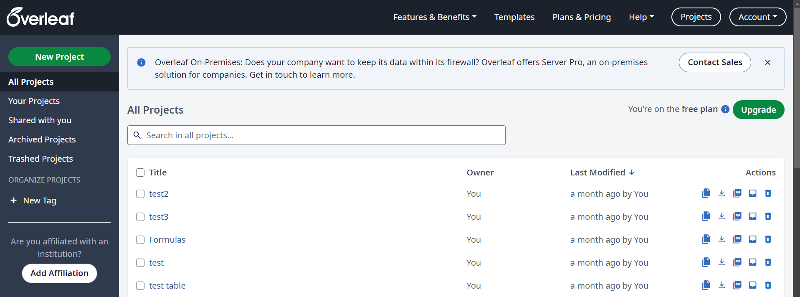
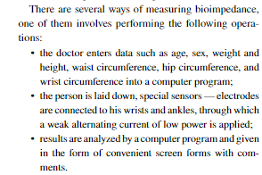
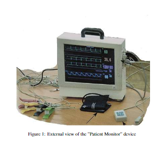
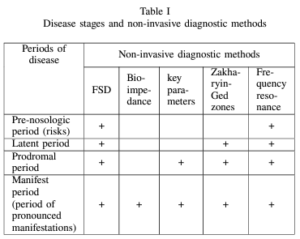

<h1 align="center">Лабораторная работа №3</h1>
<p align="center">
    
</p>

### Для регистрации можно перйти по ссылке

<a href="https://www.overleaf.com/">OverLeaf</a>

### Для создания проекта нажимаем сюда


### Загружаем нужные пакеты
```
\usepackage{multicol} %колонки
\usepackage{setspace} %межстрочный интервал
\usepackage{fancyhdr} %настройки верхнего и нижнего колонтитулов в документе.
\usepackage{newtxtext, newtxmath} % Задать шрифт Times New Roman
\usepackage{gensymb} % градусы
\usepackage{hyphenat}
\usepackage{graphicx}
\usepackage{caption}
\usepackage{scrextend}
\usepackage{enumitem}
\usepackage{mathtools}
\usepackage{ragged2e}
\usepackage{array}
\usepackage{booktabs}
\usepackage{multirow}
\usepackage{adjustbox}
\usepackage{tabularray}
\usepackage{makecell}
\UseTblrLibrary{amsmath, siunitx}
\usepackage[left=2.5cm,right=2.5cm,top=2.5cm,bottom=2.5cm]{geometry}
```
### Работа со списками
```
\begin{itemize}[leftmargin=7mm]
    \item the doctor enters data such as age, sex, weight and height, waist circumference, hip circumference, and wrist circumference into a computer program;
    \item the person is laid down, special sensors — electrodes are connected to his wrists and ankles, through which a weak alternating current of low power is applied;
    \item results are analyzed by a computer program and given in the form of convenient screen forms with comments.
\end{itemize}
```


### Вставка картинок

```
\captionsetup{font=footnotesize}
\begin{center}
    \includegraphics[width=0.49\textwidth]{photo.png}
    \captionof{figure}{External view of the "Patient Monitor" device} 
\end{center}
```


### Работа с таблицами
```
\begin{center}
    \scalebox{0.8}{ % Уменьшаем таблицу до 80% от исходного размера
    \begin{tabular}{ |p{2cm}|c|c|c|c|c| }
    \hline
    \makecell{\textbf{Periods} \\ \textbf{of} \\ \textbf{disease}} & \multicolumn{5}{c|}{\textbf{Non-invasive diagnostic methods}} \\ \cline{2-6}
                                                    & FSD & \makecell{Bio-\\impre-\\dance} & \makecell{Key \\parameters} & \makecell{Zakha-\\ryin-\\Ged \\zones} & \makecell{Fre-\\quency \\reso-\\nance} \\ \hline
    Pre-nosologic \\ period (risks)                    & +   &              &                &                      & +                   \\ \hline
    Latent period                                   & +   &              &                & +                    & +                   \\ \hline
    Prodromal \\ period                        & +   &              & +              & +                    & +                   \\ \hline
    Manifest \\ period \\ (period of \\ pronounced \\ manifestations)     & +   & +            & +              & +                    & +                   \\ \hline
    \end{tabular}
    }
\end{center}
```


### Основные команды git
<p>1. Проверка статуса</p>

```
git status
```

<p>2. Добавление файлов</p>

```
git add .
```

<p>3. Создание коммита</p>

```
git commit -m "сообщение коммита"
```

<p>4. Отправка изменений на удаленный репозиторий</p>

```
git push origin имя_ветки
```

<p>5. Получение изменений с удаленного репозитория</p>

```
git pull origin имя_ветки
```

<p>6. Переключение между ветками</p>

```
git checkout имя_ветки
```

<p>7. Создание новой ветки</p>

```
git checkout -b имя_новой_ветки
```

<p>8. Просмотр списка веток</p>

```
git branch
```

<p>9. Просмотр истории коммитов</p>

```
git log
```

<p>10. Отмена изменений в файле</p>

```
git checkout -- имя_файла
```

<p>11. Клонирование репозитория</p>

```
git clone URL_репозитория
```

<p>12. Просмотр различий</p>

```
git diff
```

<p>13. Удаление файлов из Git</p>

```
git rm имя_файла
```

<p>14. Переименование/перемещение файлов</p>

```
git mv старое_имя новое_имя
```

<p>15. Слияние веток</p>

```
git merge имя_ветки
```
