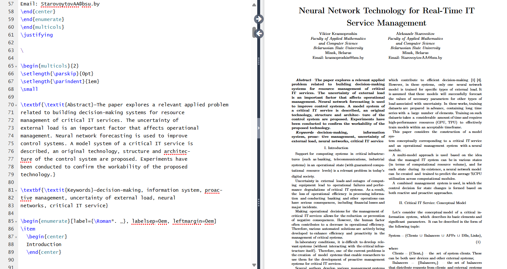
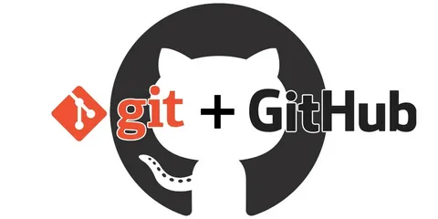

# Лабораторная работа 1

### Цель: 
Познакомиться с системой верстки текстов TeX, языком верстки TeX, издательской системой LaTeX. Выполнить вариант индивидуального задания.

### Основные команды
- multicols - для разбиения страницы на части;
- itemize - для создания списка;
- enumerate - для создания упорядочного списка;
- center - для помещения текста по центру;

Более подробно с LaTex вы можете ознакомится [тут](https://www.overleaf.com/learn/latex/Learn_LaTeX_in_30_minutes)

# Лабораторная работа 3

### Цель:
Познакомиться с программами git, освоить их программные аргументы.

### Основные команды:
- git stash - скрыть изменение файла в последнем коммите;
- git push - отправляет локальную ветку на удаленный репозиторий;
- git status - прорверяет статус текущего репозитория;
- git clone - скачивание удаленного репозитория;
- git checkout main - переключение на указанную ветку;
- git add - переносит изменения из рабочего каталога в раздел проиндексированных файлов.

Более подробно с основными командами Git можно ознакомиться [тут](https://habr.com/ru/articles/587558/)

### Вывод:

Git позволяет отслеживать любые изменения в файлах, хранить их версии и оперативно возвращаться в любое сохранённое состояние. Это позволяет редактировать код и исправлять ошибки, без риска потерять текущее состояние.  Значительно облегчает совместную разработкую. Также можно создать удалённую копию на хостинг-платформе, которая работает с Git. Полученным результатом можно поделиться с другими пользователями или удаленно помочь в написании кода.

### Ресурсы для обучения
<a href="https://git-scm.com/docs/gittutorial">🕮</a>
<a href="https://www.udemy.com/course/git-and-github-complete-guide">🕮<a>
<a href="https://www.udemy.com/course/git-complete/">🕮</a>
<a href="https://www.udemy.com/course/git-basic-concept-fundamentals-github/">🕮</a>
<a href="https://www.udemy.com/course/git-expert-4-hours/">🕮</a>

