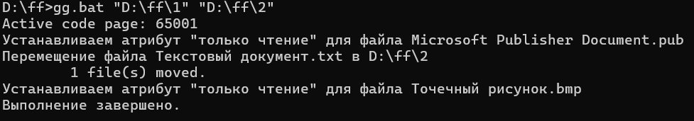

# Лабораторная работа 5
 
### Цель: 
 
Освоить командные оболочки shell (для OS семейства Unix) и cmd (для OS семейства MS Windows):
+ изучить основные встроенные команды,
+ научиться писать файлы сценариев,
+ научиться соотносить командные оболочки для разных OS.
+ Освоить командное окружение для OS семейства Unix(утилиты из пакета GNU Core Utilities), и соответствующие им утилиты для OS семейства MS Windows.
### Условия задания
61. Создать файл sh и bat, который выполняет следующее: 
На вход пакетному файлу приходит 2 относительных пути к папкам (как параметры пакетного файла). Если какой-нибудь папки нет, то писать “Данной папки нет - [Заданный_путь]” и завершить выполнение программы. В первой заданной папке должно содержаться некоторое число различных файлов. Всем файлам из данной директории присвоить атрибуты "только чтение", кроме файлов, тип которых *.txt. Перенести во вторую папку файлы с расширением txt.
## Batch файл
- ### Код программы :computer:
```batch
@echo off
chcp 65001
setlocal
if "%~2"=="" (    
    echo Необходимы два аргумента: путь к первой и второй папке.
    exit /b 1
)
set "iz=%~1"
set "v=%~2"
    	
if not exist "%iz%" (
	echo Данной папки нет - %iz%
    	exit /b 1
)
if not exist "%v%" (
	echo Данной папки нет - %v%
    	exit /b 1
)
pushd "%iz%"
for %%F in (*) do (
	if /I "%%~xF"==".txt" (
        echo Перемещение файла %%F в %v%       
        move /Y "%%F" "%v%\"
) else (        
	echo Устанавливаем атрибут "только чтение" для файла %%F
        attrib +r "%%F"   
)
)
popd
echo Выполнение завершено.
endlocal
```
### Пример работы кода


### Пояснение кода

Отключает вывод команд в командной строке, что делает вывод более чистым и удобным для пользователя.
```
@echo off
```
Устанавливает кодировку UTF-8, чтобы корректно отображать кириллические символы.
```
chcp 65001
```
Проверяет, переданы ли два аргумента (пути к директориям). Если нет, выводит сообщение об ошибке и завершает скрипт.
```
if "%~2"=="" (...)
```
Сохраняет переданные пути в переменные для дальнейшего использования.
```
set "iz=%~1" и set "v=%~2"
```
Проверяет, существует ли первая и вторая папка.
```
if not exist "%iz%" (...)
if not exist "%v%" (...)
```
Цикл для перебора всех файлов в первой папке.
```
for %%f in ("%iz%\*.*") do (...)
```
Условие в цикле, которое проверяет, не является ли файл .txt. Если нет, то выполняется следующая команда.
```
if /i not "%%~xf"==".txt" (...)
```
Устанавливает атрибут "только чтение" для файлов, не имеющих расширения .txt.
```
attrib +r "%%f"
```
Перемещение всех файлов .txt из первой папки ко второй.
```
move "%iz%\*.txt" "%v%\"
```
Вывод сообщения о том, что операция завершена.
```
echo Операция завершена.
```
Завершает выполнение скрипта с кодом 0 (успешное завершение).
```
exit /b 0
```
## Bash файл
- ### Код программы :computer:
```bash
#!/bin/bash
if [ "$#" -ne 2 ]; then
    echo "Необходимы два аргумента: путь к первой и второй папке."
    exit 1
fi
iz="$1"
v="$2"

if [ ! -d "$iz" ]; then    
   echo "Данной папки нет - $iz"
   exit 1 
fi
if [ ! -d "$v" ]; then
    echo "Данной папки нет - $v"   
    exit 1
fi

if [ -f "$file" ]; then        
    if [[ "$file" == *.txt ]]; then
           echo "Перемещение файла $(basename "$file") в $v"            
           mv "$file" "$v"
        else            
          echo "Устанавливаем атрибут 'только чтение' для файла $(basename "$file")"
          chmod 444 "$file"        
fi
fi 
done
echo "Выполнение завершено."
```
### Пояснение кода


echo "Операция завершена." — вывод сообщения о завершении операции.
exit 0 — завершает выполнение скрипта с кодом 0 (успешное завершение).

Указывает, что скрипт должен выполняться с использованием интерпретатора bash.
```
#!/bin/bash
```
Проверяет, что переданы два аргумента. Если нет, выводит сообщение об ошибке и завершает скрипт.
```
if [ "$#" -ne 2 ]; then
...
exit 1
```
Сохраняет переданные пути в переменные.
```
iz="$1"
v="$2"
```
Проверяет, существует ли первая папка. Если нет, выводит сообщение и завершает выполнение.
```
if [ ! -d "$iz" ]; then
...
exit 1
```
Проверяет, существует ли вторая папка. Если нет, выводит сообщение и завершает выполнение.
```
if [ ! -d "$v" ]; then
...
exit 1
```
Цикл для перебора всех файлов в первой папке.
```
for file in "$iz"/*; do ...
```
Условие, которое проверяет, не является ли файл .txt. Если нет, то выполняется следующая команда.
```
if [[ ! "$file" == *.txt ]]; then ...
```
Устанавливает атрибут "только чтение" для файлов, не имеющих расширения .txt.
```
chmod 444 "$file"
```
Перемещение всех файлов .txt из первой папки ко второй.
```
mv "$sourceDir"/*.txt "$destDir"
```
Вывод сообщения о завершении операции.
```
echo "Операция завершена."
```
Завершает выполнение скрипта с кодом 0 (успешное завершение).
```
exit 0
```
### Выводы: 
 В ходе выполнения лабораторной работы по освоению командных оболочек cmd (для операционных систем семейства MS Windows) и shell (для операционных систем семейства Unix) были получены практические навыки работы с консольными программами и командами в различных операционных системах. 
