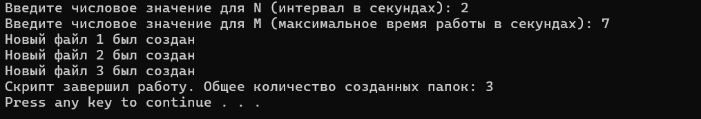

# Лабораторная работа 5
 
### Цель: 
 
Освоить командные оболочки shell (для OS семейства Unix) и cmd (для OS семейства MS Windows):
+ изучить основные встроенные команды,
+ научиться писать файлы сценариев,
+ научиться соотносить командные оболочки для разных OS.
+ Освоить командное окружение для OS семейства Unix(утилиты из пакета GNU Core Utilities), и соответствующие им утилиты для OS семейства MS Windows.
### Условия задания
Вариант 32: Создать файл sh и bat, который выполняет следующее: 
На вход пакетному файлу приходит числа (N и M) (как параметры пакетного файла). Каждые N секунд будет создаваться папка и файл в ней (файлы будут называться 1, 2, 3 и т.д.), в котором записано общее время работы скрипта на данный момент. Скрипт должен работать M секунд. Следующую папку создавать внутри уже созданной. При каждом создании файла писать в консоль «Новый файл был создан»
## Batch файл
- ### Код программы :computer:
```batch
@echo off
chcp 65001 > nul
set /p "N=Введите числовое значение для N (интервал в секундах): "
set /p "M=Введите числовое значение для M (максимальное время работы в секундах): "
set /a "total_time=0"
set /a "counter=1"
set "main_folder=%~dp0main_folder"
mkdir "%main_folder%"
set "current_path=%main_folder%"
   timeout /t %N% >nul
:loop
    if %total_time% geq %M% goto :end
    set "current_path=%current_path%\folder_%counter%"
    mkdir "%current_path%"
 set /a "total_time+=N"
    set "file_path=%current_path%\%counter%.txt"
    echo Общее время работы скрипта: %total_time% секунд > "%file_path%"
    echo Новый файл %counter% был создан
    set /a "counter+=1"
   
    timeout /t %N% >nul
goto :loop
:end
set /a "total_folders=counter-1"
echo Скрипт завершил работу. Общее количество созданных папок: %total_folders%

pause

```
### Пример работы кода


### Пояснение кода
Отключает вывод команд в командной строке, что делает вывод более чистым и удобным для пользователя.
```
@echo off
```
Устанавливает кодировку UTF-8, чтобы корректно отображать кириллические символы. > nul подавляет вывод сообщения о смене кодировки.
```
chcp 65001
```
Запрашивает у пользователя значения N и M. N указывает интервал между циклами в секундах, а M — общее время работы скрип
```
set /p "N=Введите числовое значение для N (интервал в секундах): "
set /p "M=Введите числовое значение для M (максимальное время работы в секундах): "
```
Инициализирует переменные total_time (счётчик времени работы скрипта) и counter (номер создаваемой папки/файла) со значениями 0 и 1 соответственно.
```
set /a "total_time=0"
set /a "counter=1"
```
Устанавливает путь к главной папке main_folder в том же каталоге, где расположен сам скрипт (%~dp0), добавляя к нему имя main_folder.
```
set "main_folder=%~dp0main_folder"
```
Создаёт главную папку main_folder
```
mkdir "%main_folder%"
```
Устанавливает current_path как начальную папку для сохранения текущей иерархии папок.
```
set "current_path=%main_folder%"
```
Вводит задержку на N секунд перед началом основного цикла. > nul скрывает вывод стандартного сообщения timeout.
```
timeout /t %N% >nul
```
Начало основного цикла скрипта. Всё, что следует после этого ярлыка :loop, будет повторяться.
```
:loop
```
Проверяет, не достиг ли скрипт максимального времени работы M. Если total_time больше или равен M, программа переходит к завершению (:end).
```
if %total_time% geq %M% goto :end
```
Создаёт путь для новой папки с уникальным номером folder_<counter> внутри main_folder.
```
set "current_path=%main_folder%\folder_%counter%"
```
Создаёт новую папку по адресу current_path.
```
mkdir "%current_path%"
```
Увеличивает total_time на N, добавляя интервал времени между итерациями к общему времени выполнения скрипта.
```
set /a "total_time+=N"
```
Создаёт путь для нового текстового файла внутри папки current_path, используя счётчик counter для имени файла.
```
set "file_path=%current_path%\%counter%.txt"
```
Записывает в файл file_path строку с текущим общим временем работы скрипта.
```
echo Общее время работы скрипта: %total_time% секунд > "%file_path%"
```
Выводит сообщение в консоль о создании нового файла с его номером counter.
```
echo Новый файл %counter% был создан
```

Увеличивает значение счетчика counter на 1, чтобы следующий цикл создал папку и файл с новым номером.
```
set /a "counter+=1"
```
Вводит задержку на N секунд перед следующим циклом.
```
timeout /t %N% >nul
```
Переход к началу основного цикла (:loop), если не достигнут предел по времени.
```
goto :loop
```
Метка конца работы программы. Выполнение скрипта перейдёт к этой строке, когда total_time станет больше или равен M.
```
:end
```
Вычисляет количество созданных папок, уменьшая counter на 1, поскольку counter увеличивается в конце каждого цикла.
```
set /a "total_folders=counter-1"
```
Выводит в консоль сообщение с итоговым количеством созданных папок.
```
echo Скрипт завершил работу. Общее количество созданных папок: %total_folders%
```
Выводит в консоль сообщение с итоговым количеством созданных папок.
```
pause
```
## Bash файл
- ### Код программы :computer:
```bash
#!/bin/bash
export LANG=en_US.UTF-8
read -p "Введите числовое значение для N (интервал в секундах): " N
read -p "Введите числовое значение для M (максимальное время работы в секундах): " M
total_time=0
counter=1
main_folder="$(pwd)/main_folder"
mkdir -p "$main_folder"
current_path="$main_folder"
sleep "$N"
while (( total_time < M )); do
    current_path="$current_path/folder_$counter"
    mkdir -p "$current_path"
    ((total_time += N))
    file_path="$current_path/$counter.txt"
    echo "Общее время работы скрипта: $total_time секунд" > "$file_path"
    echo "Новый файл $counter был создан"
    ((counter++))
    sleep "$N"
done
total_folders=$((counter - 1))
echo "Скрипт завершил работу. Общее количество созданных папок: $total_folders"
```
### Пояснение кода
Указывает, что скрипт должен выполняться с использованием интерпретатора bash.
```
#!/bin/bash
```
Устанавливает кодировку UTF-8 для правильного отображения текста на русском языке.
```
export LANG=en_US.UTF-8
```
read -p запрашивает у пользователя ввод двух значений: N (интервал в секундах) и M (максимальное время работы в секундах).
```
read -p "Введите числовое значение для N (интервал в секундах): " N
read -p "Введите числовое значение для M (максимальное время работы в секундах): " M
```
Инициализирует переменные total_time (счетчик времени, изначально равный 0) и counter (счетчик созданных папок, начинается с 1).
```
total_time=0
counter=1
```
Устанавливает main_folder как путь к папке main_folder в текущей директории (используя $(pwd), чтобы указать текущую папку).
mkdir -p создает папку main_folder, если она еще не существует.
current_path устанавливается как путь к текущей директории, которая будет использоваться для хранения вложенных папок.
```
main_folder="$(pwd)/main_folder"
mkdir -p "$main_folder"
current_path="$main_folder"
```
Выполняет задержку на N секунд, чтобы ожидание перед первой папкой также соответствовало заданному интервалу.
```
sleep "$N"
```
Начало основного цикла. Выполняется, пока значение total_time меньше M.
```
while (( total_time < M )); do
```
Обновляет current_path, добавляя папку с именем folder_<номер>, и создает эту папку.
```
   current_path="$current_path/folder_$counter"
    mkdir -p "$current_path"
```
Увеличивает значение total_time на N секунд.
Создает переменную file_path, указывающую путь к текстовому файлу внутри новой папки.
echo "..." > "$file_path" записывает общее время работы скрипта в файл.
Выводит сообщение о создании нового файла.
```
 ((total_time += N))
    file_path="$current_path/$counter.txt"
    echo "Общее время работы скрипта: $total_time секунд" > "$file_path"
    echo "Новый файл $counter был создан"
```
Увеличивает счетчик counter на 1, чтобы следующая папка и файл имели новый номер.
sleep "$N" выполняет паузу на N секунд, прежде чем перейти к следующей итерации цикла.
done обозначает конец цикла while.

```
((counter++))
    sleep "$N"
done
```
Вычисляет общее количество созданных папок, уменьшая значение counter на 1 (так как последний counter увеличивается после создания последней папки).
Выводит это значение в консоль, чтобы показать общее количество созданных папок.
```
total_folders=$((counter - 1))
echo "Скрипт завершил работу. Общее количество созданных папок: $total_folders"
```
### Выводы: 
 
