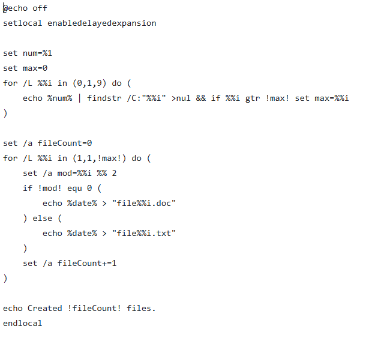

# Лабораторная работа №5
# Цель: в рамках ЛР 5 необходимо создать исполняемый файл в соответствии с заданным вариантом. 

Вариант 42: Создать файл sh и bat, который выполняет следующее: 
На вход пакетному файлу приходит число (как параметр пакетного файла). В данном числе найти самую максимальную цифру, создать ровно столько файлов с расширением txt, у каждого второго поменять расширение на doc и записать туда сегодняшнюю дату.

Код для Windows:

### Основные моменты:

* `@echo off` - отключает вывод команд в консоль, чтобы сделать вывод более чистым;
* `set num=%1` - cохраняет первый аргумент, переданный скрипту, в переменной num;
* `/L` - ключ, запускающий цикл от start до end с заданным step;
* `/a` - ключ, отвечающий за выполнение математических операций
* `findstr` - ключ, занимающийся поиском строк, соответстыующих заданному шаблону.

  
