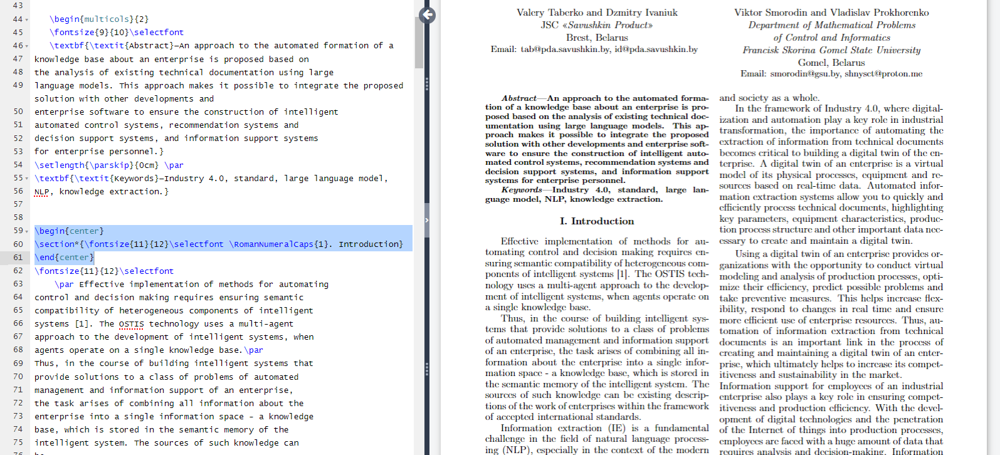
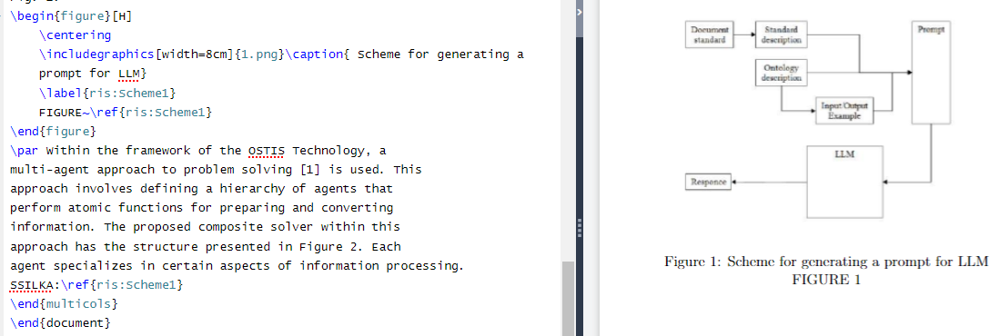

# Лабораторная работа №3
# Условие первой лабораторной работы:
Познакомиться с системой верстки текстов TeX, языком верстки TeX,
издательской системой LaTeX.Выполнить вариант индивидуального задания.
Для верстки документа использовать online ­редактор 
https://www.overleaf.com или любые другие LaTeX редакторы.
# Задание
Сверстать три страницы научной статьи с использованием системы верстки текстов TeX.
На странице https://proc.ostis.net/proc/Proceedings%20OSTIS-2024.pdf необходимо взять доклад, 
соответствующий варианту индивидуального задания.
Доклад представлен в форме статьи в формате *.pdf.
Для написания формального текста предлагается воспользоваться пакетом макросов “scn-latex”. 
Для оформления списка источников использовать \bibliography команду

Вот эти библиотеки были использованы в процессе работы над 1 лабораторной работой


* multicols - позволяет использовать разбиение страницы на несколько колонок.
* setspace - позволяет задавать интервал между строчками и абзацами в тексте.
* enumitem - позволяет настраивать споисок в документе(делать его в разных стилях).
* [T1]{fontenc} - рекомендуемая кодировка текста для русского и английского языков.
* graphicx - благодаря этой библиотеке можно вставлять картинки в файл.
* float - позволяет разместить картнку правильно.
* [left = 1.7cm,right = 1.7cm,top = 1.7cm,bottom = 3.1 cm]{geometry} - намечает пространство рабочей области на странице

Так же можно заметить команду graphicspath{{images/}}, она добавлена для возможности добавлять картнки в текст, предварительно поместив их в папку images.

Добавить на страницу римские цифры можно, используя эту команду:
```
\newcommand{\RomanNumeralCaps}[1]{\MakeUpperCase{\romannumeral #1}}
```
Благодаря команде ниже можно в секцию добавить нумерацию римскими цифрами.
```
\renecommand{\thesection}{\Roman{section}}
```
На этом скрншоте показано, что текст в файле разбит на 2 колонки за счет команды \begin{multicols}{2}


В моем варианте прсутствует картинка, вот так я ее реализовал

 

Команда ```~\ref{ris:Scheme1}``` создает ссылку на эту картнку, что упрощает работу с нумерацией большого количества картинок.

# Вывод
В лабораторной работе номер 3 были приобретены навыки работы с системой контроля версий git и хостинга удаленных репозиториев github. Эти знания были закреплены практически в ходе клонирования удаленного репозитория с хостинга github, изменения выданной ветки и применения изменений в ней. Так же были получены навыки составления README.md файла.


