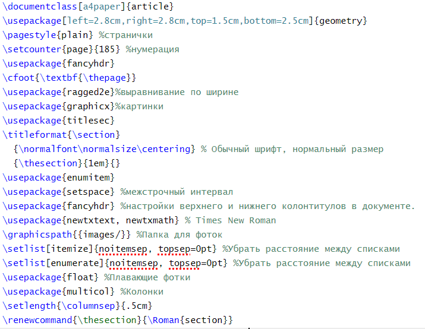
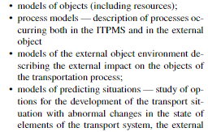
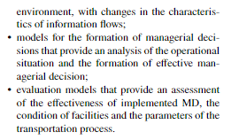
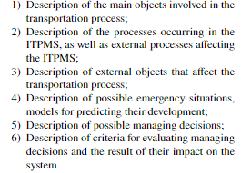

<h1 align="center"> Работа с Latex</h1>

### Регистрация

<a href="https://ru.overleaf.com/register">Регистрация на overleaf</a>

### Для начала проекта нужно нажать на кнопку
<p>


### Для начала работы мы загружаем кантибулы:
```
\documentclass[a4paper]{article}
\usepackage[left=2.8cm,right=2.8cm,top=1.5cm,bottom=2.5cm]{geometry}
\pagestyle{plain} %странички
\setcounter{page}{185} %нумерация
\usepackage{fancyhdr}
\cfoot{\textbf{\thepage}}
\usepackage{ragged2e}%выравнивание по ширине
\usepackage{graphicx}%картинки
\usepackage{titlesec}
\titleformat{\section}
  {\normalfont\normalsize\centering} % Обычный шрифт, нормальный размер
  {\thesection}{1em}{}
\usepackage{enumitem}
\usepackage{setspace} %межстрочный интервал
\usepackage{fancyhdr} %настройки верхнего и нижнего колонтитулов в документе.
\usepackage{newtxtext, newtxmath} % Times New Roman
\graphicspath{{images/}} %Папка для фоток
\setlist[itemize]{noitemsep, topsep=0pt} %Убрать расстояние между списками
\setlist[enumerate]{noitemsep, topsep=0pt} %Убрать расстояние между списками
\usepackage{float} %Плавающие фотки
\usepackage{multicol} %Колонки
\setlength{\columnsep}{.5cm}
\renewcommand{\thesection}{\Roman{section}}

```
<p align="center"></p>

### Работа c обычными списками

```
\begin{flushright}
\begin{itemize}
    \item models of objects (including resources);
    \item process models — description of processes occurring both in the ITPMS and in the external object
    \item models of the external object environment describing the external impact on the objects of the transportation process;
    \item models of predicting situations — study of options
    for the development of the transport situation with
    abnormal changes in the state of elements of the
    transport system, the external environment, with changes in the characteristics of information flows;
    \item models for the formation of managerial decisions
that provide an analysis of the operational situation
and the formation of effective managerial decision;
\item evaluation models that provide an assessment of the
effectiveness of implemented MD, the condition of
facilities and the parameters of the transportation
process.
\end{itemize}
\end{flushright}
```
Как это отображается в редакторе:
<p align="center"></p>
<p align="center"></p>

### Работа с нумеруемыми списками
```
\begin{enumerate}[label=\arabic*)]

    \item Description of the main objects involved in the
transportation process;
    \item Description of the processes occurring in the
ITPMS, as well as external processes affecting the
ITPMS;
    \item Description of external objects that affect the transportation process;
    \item Description of possible emergency situations, models for predicting their development;
    \item Description of possible managing decisions;
    \item Description of criteria for evaluating managing
decisions and the result of their impact on the
system.
\end{enumerate}
```
Как это выглядит в редакторе:
<p align="center"></p>

### Нумерация заголовков римскими цифрами
```
\renewcommand{\thesection}{\Roman{section}}%Римские цифры
\begin{enumerate}[label=\arabic*),start=4]%Начинаем нумерацию с 5(1+4)
\section{Conclusion}   
```
Как это выглядит в редакторе

 <p  align="center"></p>

### Создание списка литературы:
```
\begin{thebibliography}{2}
\fontsize{8}{5}\selectfont
\setlength{\parindent}{0.0cm}
\setlength{\parskip}{0.0cm}
    \bibitem [1]{} {A. A. Erofeev Intelectualnaya sistema upravlenia perevozochnim
processom [Intelligent control system for the transportation process in railway transport]. The Ministry of Education of the Republic. Belarus, Belarusian state University of Transport. Gomel,
BSUT, 2022, P. 407}
    \bibitem[2]{} {A. P. Badeckii, O. A. Medved Ontologicheskii podhod k
razrabotke edinoi basi znanii multimodalnih perevozok [An ontological approach to the development of a unified knowledge base
}
\end{thebibliography}
```
 
 ### Основные команды:

<p>1. Проверка стасуса</p>

 ```
 git status
 ```
<p>2. Добавление файлов</p>

```
git add .
```
<p>3. Создание коммита</p>

```
git commit -m "message"
```
<p>4. Загрузка на определенную ветку в GitHub</p>

```
git push origin <название ветки>
```
<p>5. Создание нового репозитория<p>
  
```
gh repo create
```
<p>6.Клонирование репозитория</p>

```
gh repo clone
```
<p>7. Создание Pull Request</p>

```
gh pr create
```
<p>8.Инициализация нового репозитория Git в текущей директории</p>

```
bash
   git init
   
```

<p>9.Клонирование существующего репозитория из удаленного источника</p>

```
bash
   git clone https://github.com/username/repo.git
```

<p>10.Добавление файла в индекс для следующего коммита</p>

```
bash
   git add filename.txt
```

<p>11.Отправка изменений из локального репозитория в удаленный (например, GitHub)</p>

```
bash
   git push origin main
```

<p>12.Переключение на указанную ветку</p>

```
bash
   git checkout feature-branch
   
```

<p>13.Сброс текущего состояния репозитория до указанного коммита. Будьте осторожны с этой командой, так как она может изменить историю.</p>

```
bash
    git reset --hard HEAD~1
```

### Цель лабараторной работы №3:

```
Целью лабараторной работы является научиться работать с GitHub.
```

### Ресурсы для обучения
<a href="https://habr.com/ru/articles/541258/">Работа с git</a>
