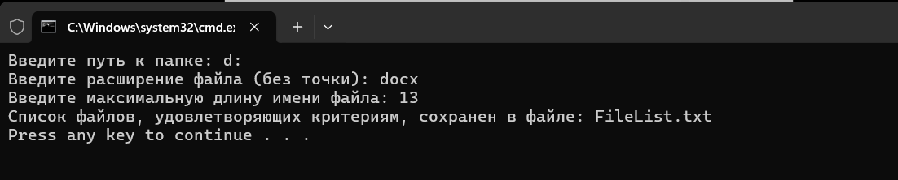

# Лабораторная работа 5
 
### Цель: 
 
Освоить командные оболочки shell (для OS семейства Unix) и cmd (для OS семейства MS Windows):
+ изучить основные встроенные команды,
+ научиться писать файлы сценариев,
+ научиться соотносить командные оболочки для разных OS.
+ Освоить командное окружение для OS семейства Unix(утилиты из пакета GNU Core Utilities), и соответствующие им утилиты для OS семейства MS Windows.
### Условия задания
Вариант 34: Создать файл sh и bat, который выполняет следующее: 
На вход пакетному файлу приходит путь к каталогу (как параметр пакетного файла). Если такой папки нет, то писать “Данной папки нет” и завершить выполнение программы. Если такая папка есть, то в ней создать файл, содержащий список имен всех файлов указанной папки, имеющих заданное расширение и длину имени в символах не больше заданного (расширение и длина имени задать как параметр пакетного файла). Отсортировать полученный список по алфавиту
## Batch файл
- ### Код программы :computer:
```batch
@echo off
chcp 65001 > nul
setlocal enabledelayedexpansion

set /p "directory=Введите путь к папке: " 
set /p "extension=Введите расширение файла (без точки): "
set /p "max_length=Введите максимальную длину имени файла: " 

set "output_file=FileList.txt"

if not exist "%directory%" (
  echo Данной папки нет
  pause
  exit /b
)

cd /d "%directory%"
> "%output_file%" (
  for /r %%F in (*.%extension%) do (
    set "filename=%%~nxF"
    set "shortname=!filename:~0,%max_length%!"
    if "!shortname!"=="!filename!" (
      echo %%~nxF
    )
  )
)

sort "%output_file%" > nul

echo Список файлов, удовлетворяющих критериям, сохранен в файле: %output_file%
pause
exit /b
```
### Пример работы кода


## Bash файл
- ### Код программы :computer:
```bash
#!/bin/bash

directory=$1
extension=$2
max_length=$3
output_file="FileList.txt"

if [ ! -d "$directory" ]; then
  echo "Данной папки нет" 
 exit 1
fi

cd "$directory"

find . -type f -name "*.$extension" -printf "%f\n" | awk -v len="$max_length" 'length($0) <= len' | sort > "$output_file"

echo "Список файлов, удовлетворяющих критериям, сохранен в файле: $output_file"
```

### Пример работы кода


### Выводы: 
 В ходе выполнения лабораторной работы по освоению командных оболочек cmd (для операционных систем семейства MS Windows) и shell (для операционных систем семейства Unix) были получены практические навыки работы с консольными программами и командами в различных операционных системах. 
