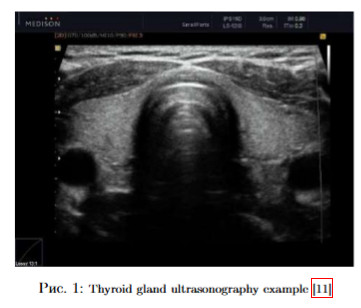
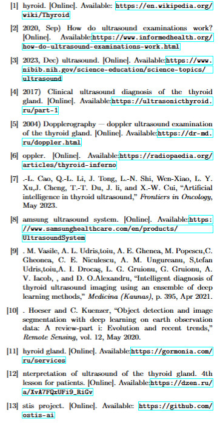

# Работа с LaTeX 

Для выполнения L1
Был использован Overleaf

Для регистрации можно перейти по ссылке:
[OverLeaf](https://www.overleaf.com)

*OverLeaf — онлайн редактор Latex* 

## Использованные пакеты Latex

Для корректной работы в LaTeX нужно подключить специальные пакеты, в данной работе были использованы следующие:

```\usepackage{fontspec} — Управляет шрифтом документа
\usepackage{multicol} — Даёт возможность разделить страницу на 2 и более коллонны
\usepackage{hyperref} — Подключение ссылкок 
\usepackage{enumitem} — Доп. настройки нумерации
\usepackage{graphicx} — В данном случае для управления картинками 
\usepackage{parcolumns} — Дополнительные настройки коллонок 
\usepackage{titlesec} — Гибкая настройка заголовков 
\usepackage[top=2cm, left=2cm, right=2cm,bottom=2cm]{geometry} — Настройка геометрии страницы
```

## Вставка фото

```\includegraphics[width=1\linewidth]{image1.jpg}```

вид в **pdf**
  <p  align="center"></p>

## Римские цифры
Команда была изменена для нумерации заголовков с помощью римских цифр

```\renewcommand{\thesection}{\textnormal{\Roman{section}.}}```

## Ссылка на фото

```
\ref{Figure 1}
```

## Создание списка
\begin{itemize}
\item  Improving system performance and especially accelerating system response time to user requests.
It is connect with productivity and overall user
satisfaction.

\item Continuous updating and refactoring ontological
models (further formalization of missing concepts,
fix typos and etc.);
\end{itemize}

вид в **pdf**
  <p  align="center"></p>

## Выделение текста

```
\textbf{text}
```

## Подчеркивание текста

```
\underline{text}
```

## Вертикальный отступ между строками 

```
\vspace{2 mm}
```

## Переход на новую страницу
```
\newpage
```


<h1 align="center"> Лабораторная работа №3 </h1>

## Цель: работа с Git и GitHub

 <p><b>Git</b> (произносится «гит») — распределённая система управления версиями.</p>

 [Git](https://git-scm.com/)

 <a href="https://github.com/">GitHub</a>
 
 ### Основные команды:

<p>1. Проверка стасуса</p>

 ```
 git status
 ```
<p>2. Добавление файлов</p>

```
git add .
```
<p>3. Создание коммита с комментарием к нему</p>

```
git commit -m "message"
```
<p>4. Загрузка на определенную ветку в GitHub</p>

```
git push origin <название ветки>
```

### Выводы: 
Git позволяет сохранять изменения локально и при необходимости возвращаться к предыдущим версиям проекта. Также можно создать удалённую копию на хостинг-платформе, которая работает с Git, и поделиться результатом с другими, что упрощает работу в команде. За ввполнение лабораторной работы были изучены принципы работы с Git и GitHub, в том числе написание документации README
