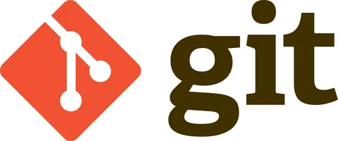

# ЛР1. Работа с LaTex

    

Цель ЛР1 - сверстать страницы сборника средствами LaTeX.

Для выполнения поставленной задачи можно использовать сайт OverLeaf.

1) Для работы с latex необходимо подключить следующие пакеты:
\documentclass[8pt,a4paper]{article}
\usepackage{CJKutf8}
\usepackage{hyperref} % гиперссылки
\usepackage[utf8]{inputenc} %сообщает латеху какая кодировка используется
\usepackage{multicol} %колонки
\usepackage{setspace} %межстрочный интервал
\usepackage{ragged2e} %выравнивания текста по ширине в документе.
\usepackage{fancyhdr} %настройки верхнего и нижнего колонтитулов в документе.
\usepackage{titlesec} %стилей заголовков разделов в документе.
\usepackage{enumitem} %настройки списков в документе.
\usepackage{graphicx} %Вставка картинок правильная
\usepackage{float} %"Плавающие" картинки
\usepackage{wrapfig} %Обтекание фигур (таблиц, картинок и прочего)
\usepackage[left=1.9cm, right=1.9cm, top=2.2cm, bottom=2cm]{geometry}

2) Вставка изображений в LaTex
Предварительно необходимо загрузить изображение на сам сайт overleaf:

    

После чего можно добавить свое изображение:

\begin{figure}[H]
    \centering
    \includegraphics[width=16cm]{Screen 1.png}
    \caption{\small{ Fragment of medical record ontology}}
    \label{fig:example-a}
\end{figure}
Это будет выглядеть так:

    

3) Работа со списками в latex:

   \begin{multicols}{2}
\setlength{\parindent}{0.8cm}
\setlength{\parindent}{0.4cm}
\fontsize{10}{15}\selectfont  
\begin{enumerate}

    \item  ArchiMed+ is a versatile medical software that
is suitable for private physicians, medical centers,
dental offices, and chain clinics. ArchiMed+ is
easily scalable, offers many integrations including
third-party labs, labeling system, telemedicine and
more.
  \item  Medesk — this cloud-based medical information
system is used in more than 20 countries around
the world and in 72 regions of Russia. It is suitable
for healthcare institutions of any size, from private
clinics to networks. electronic medical records,
CRM, telemedicine and solutions for managers and
physicians are available in Medesk.
 \item  KMIS is a complex MIS suitable for automation
of any medical institutions, the feature of which is
integration with Federal systems.
 \item  MEDMIS is a relatively young MIS that entered
the market in 2017. In 4 years, MEDMIS has
been used by more than 200 medical organizations.
MEDMIS is constantly evolving and gaining momentum: updates are released once a week.
 \item  MedAngel is an MIS with the possibility of individual customization for the specifics of the clinic’s
work. There is only a boxed version of the program
with open code. The system is modular, you can
assemble a personalized kit.
\end{enumerate}
Это будет выглядеть так:

    

4) Работа с римскими цифрами:

\setcounter{section}{1} %устанавливает стиль нумерации разделов в виде заглавных римских цифр.
\begin{multicols}{2}
\section {Proposed approach}
\end{multicols}

Как это выглядит:

    

ЛР 3
Цель - Изучить систему управления версиями Git и веб-сервис GitHub.

    

Что такое git?

Git - это консольная утилита, для отслеживания и ведения истории изменения файлов, в вашем проекте. Чаще всего его используют для кода, но можно и для других файлов. Например, для картинок - полезно для дизайнеров.
С помощью Git-a вы можете откатить свой проект до более старой версии, сравнивать, анализировать или сливать свои изменения в репозиторий.
Основные команды Git:
git init - создание пустого репозитория
git add <имя файла> - добавление файла в репозиторий
git add . - добавление всех файлов в репозиторий
git branch - создание ветки
git status - проверка статуса
git commit -m "message" - создание коммита
git push origin <название ветки> - загрузка на определенную ветку в Github
git checkout  - переход к ветке
Вывод:
В ходе данной лабораторной работы я познакомилась с системой контроля версий Git, изучил основы ее применения, а также научилась работать с репозиториями GiHub.
