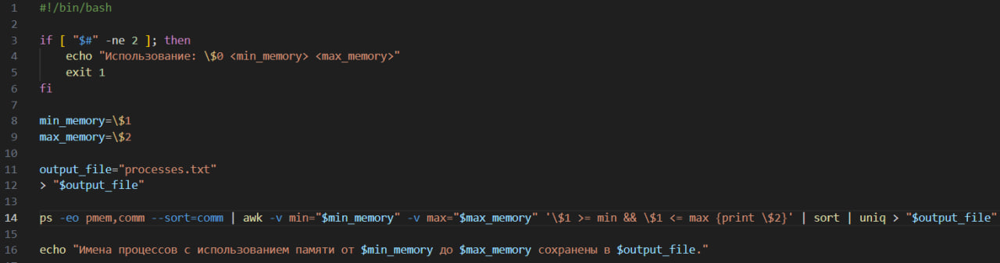

# ЛР5
Вариант 49
Создать файл sh и bat, который выполняет следующее:

На вход пакетному файлу приходит два числа (как параметры пакетного файла). Создать файл, в который записать все имена процессов в алфавитном порядке, размер используемой памяти которых находится в заданном диапазоне.
## Цель работы:
---
1) Освоить командные оболочки shell (для OS семейства Unix) и cmd (для OS семейства MS Windows):

изучить основные встроенные команды,

научиться писать файлы сценариев,

научиться соотносить командные оболочки для разных OS.

2) Освоить командное окружение для OS семейства Unix(утилиты из пакета GNU Core Utilities), и соответствующие им утилиты для OS семейства MS Windows.
## Ход работы:
---
Используя материалы в интернете, я написала скрипты под windows и linux.
*Для Linux:*

    

Основные использованные команды:
**#!/bin/bash** : Указывает, что скрипт должен выполняться с помощью интерпретатора bash.

**if [ "$#" -ne 2 ]; then ... fi** : Проверяет, переданы ли два аргумента. Если нет, выводит сообщение об использовании и завершает выполнение.

**min_memory=\$1 и max_memory=\$2**: Присваивает значения аргументов переменным min_memory и max_memory.
**output_file="processes.txt"** : Устанавливает имя выходного файла.
**"$output_file"** : Очищает файл, если он уже существует, или создает новый.

**ps -eo pmem,comm** : Получает список всех процессов с их использованием памяти (в процентах) и именем.

**awk -v min="$min_memory" -v max="$max_memory" '\$1 >= min && \$1 <= max {print \$2}'** : Фильтрует процессы по диапазону использования памяти и выводит только имена процессов.

**sort | uniq** : Сортирует имена процессов в алфавитном порядке и удаляет дубликаты.

**"$output_file"** : Записывает результат в файл processes.txt.

**echo ...** : Выводит сообщение о завершении работы скрипта.
Для запуска скрипта на Linux необходимо выполнить следующие действия:

---
- Открыть терминал
  
- Перейти в директорию, содержащую данный скрипт (cd путь/к/папке)
  
- Воспользоваться следующей командой: bash "название_скрипта.sh" "передаваемые_параметры" (если таковы необходимы)

---
*Для Windows:*

    

Основные использованные команды:

**@echo off**: Отключает отображение команд в окне командной строки. Символ @ перед командой echo off предотвращает вывод самой команды. Это делает вывод скрипта более чистым, показывая только результаты выполнения, а не сами команды.

**if "%~2"==""**: Проверяет, был ли передан второй аргумент (параметр командной строки). "%~2" извлекает второй аргумент, а =="" проверяет, пустой ли он.

**echo Not enough arguments. Please specify a memory range.**: Если второй аргумент отсутствует, выводит сообщение об ошибке.

**goto :eof**: Переходит к метке :eof, которая обозначает конец файла (end of file). Это завершает выполнение скрипта.

**set lower=%1**: Устанавливает переменную lower равной первому аргументу, переданному в скрипт.

**set upper=%2**: Устанавливает переменную upper равной второму аргументу.

**set tempfile="%TEMP%\processes.txt"**: Определяет переменную tempfile, которая указывает путь к временной папке пользователя (используя переменную среды %TEMP%) и задает имя файла processes.txt.

**tasklist**: Команда, которая отображает список запущенных процессов.

**/FO TABLE**: Указывает формат вывода (TABLE - таблица).

**/FI "STATUS eq RUNNING"**: Фильтрует список процессов, чтобы показать только те, которые находятся в состоянии "RUNNING" (работающие).

**/FI "MEMUSAGE ge %lower%"**: Фильтрует процессы по использованию памяти, показывая только те, которые используют память больше или равную значению переменной lower.

**/FI "MEMUSAGE le %upper%"**: Фильтрует процессы по использованию памяти, показывая только те, которые используют память меньше или равную значению переменной upper.

**> %tempfile%**: Перенаправляет вывод команды tasklist в файл, указанный в переменной tempfile.

**for /F**: Цикл, который обрабатывает строки из файла.

**"usebackq tokens=1,5 delims= "**: Указывает, что нужно использовать обратные кавычки для указания имени файла и разбивает строки на токены (части) по пробелам. tokens=1,5 означает, что будут извлечены первый и пятый токены.

**%%i**: Переменная цикла, которая будет содержать значение первого токена (имя процесса).

**%%j**: Переменная цикла, которая будет содержать значение пятого токена (использование памяти).

**echo(%%~i %%jK >> temp.txt**: Выводит имя процесса и его использование памяти в файл temp.txt. %%~i убирает кавычки из имени процесса, а %%jK добавляет букву "K" к значению использования памяти.

**more +2 temp.txt**: Пропускает первые две строки файла temp.txt (обычно это заголовки таблицы) и выводит оставшиеся строки.

**> %tempfile%**: Перенаправляет вывод обратно в файл processes.txt.

**sort %tempfile%**: Сортирует содержимое файла processes.txt.

**> sorted.txt**: Перенаправляет отсортированный вывод в файл sorted.txt.

**del %tempfile%**: Удаляет временный файл processes.txt.

**del temp.txt**: Удаляет временный файл temp.txt.

**start notepad.exe sorted.txt**: Открывает файл sorted.txt в текстовом редакторе Notepad.

---
Запуск скрипта bat:
Для того, чтобы запустить скрипт bat необходимо выполнить следующие действия:

- Нажать сочетание клавиш Win + R;
- В появившемся окне написать cmd и нажать enter;
- В открывшейся консоли перейти к папке, в которой хранится скрипт (cd путь\к\папке)
- Вписать "название_скрипта.bat", пробел, через пробел ввести диапазон значение, в зависимости от того, какой диапазон памяти мы хотим просмотреть

---
Вывод:
В результате данной лабораторной работы мне удалось выполнить свой вариант на bat и sh, а также узнать основную информацию о скриптах.
