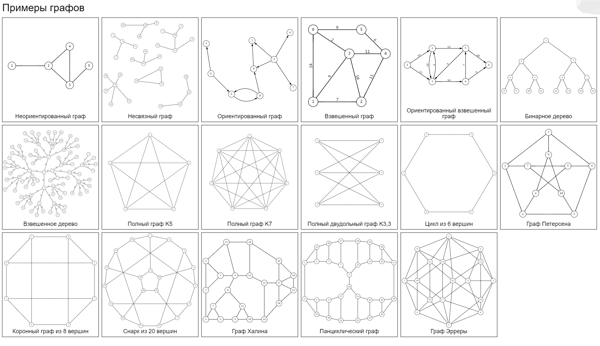

# 🎓 Отчёт по расчётной работе
### Теория графов

---

## 🎯 Цели
- 🔍 Ознакомиться с основными понятиями в теории графов.
- 🧠 Научиться различать различные типы графов.
- ⚙️ Овладеть основными алгоритмами при работе с графами.
- 💻 Реализовать решение на языке программирования C++.

---

## 📘 Основные понятия

### ❓ Что такое граф?
Граф — математическая абстракция реальной системы любой природы, объекты которой обладают парными связями. Граф как математический объект есть совокупность двух множеств — множества самих объектов, называемого множеством вершин, и множества их парных связей, называемого множеством рёбер

Граф — это **математическая модель**, состоящая из набора **вершин** (узлов) и **рёбер** (связей между вершинами).

> Пример:
> - **Вершины**: города
> - **Рёбра**: дороги между городами

---

### 🔁 Ориентированный граф
Граф, где рёбра имеют направление, т.е. связь идёт только в одну сторону.

**Пример:** граф взаимодействий пользователей в социальной сети (кто лайкнул пост).

---

### 🔸Неориентированный граф
Граф, в котором рёбра не имеют направления, т.е. связь работает в обе стороны.

**Пример:** граф дорожной сети с двусторонними улицами.

---

### 🔹 Вершины
**Вершина** — это основной элемент графа, обычно обозначается как точка или узел.

---

### 🔸 Рёбра
**Ребро** — это связь между двумя вершинами графа.

---

### 🧮 Матрица инцидентности
**Матрица инцидентности** отражает связь вершин с рёбрами. Строки матрицы — это вершины, столбцы — рёбра. Значения:
- `1` — вершина и ребро связаны
- `0` — вершина и ребро не связаны

---

### 🔗 Матрица смежности
**Матрица смежности** отражает наличие связи между вершинами. Если вершина `i` соединена с вершиной `j`, то соответствующий элемент матрицы равен `1`.

---

### Виды графов

----------


## 📝 Задание

**Вариант 4.13**

> Построить граф смежностей для неориентированного графа с использованием матрицы инцидентности.

---

## 🧑‍💻 Алгоритм для преобразования матрицы инцидентности в матрицу смежности

### 1. Матрица инцидентности


---

### 2. Матрица смежности


### Как найти матрицу смежности из матрицы инцидентности?
Пример расчёта


1. Создать квадратную матрицу размера `N x N`, где `N` — количество вершин.
2. Заполнить матрицу нулями.
3. Для каждого ребра проверить, какие вершины связаны с ним (по столбцу матрицы инцидентности).
4. Если вершины `i` и `j` связаны одним ребром, установить элементы `[i][j]` и `[j][i]` равными `1`.

---

## 💻 Реализация кода на C++

Код доступен по ссылке: [Code](/cpp/./RR.cpp)

---

## 🧮 Примеры

### Пример 1:
**Матрица инцидентности:**
```
Вершина 1: 1 1 0
Вершина 2: 1 0 1
Вершина 3: 0 1 1
```
**Матрица смежности:**
```
0 1 1
1 0 1
1 1 0
```


### Пример 2:
**Матрица инцидентности:**
```
Вершина 1: 1 0 0 1
Вершина 2: 1 1 0 0
Вершина 3: 0 1 1 0
Вершина 4: 0 0 1 1
```
**Матрица смежности:**
```
0 1 0 1
1 0 1 0
1 1 0 1
1 0 1 0
```

### Пример 3:
**Матрица инцидентности:**
```
Вершина 1: 1 1 1
Вершина 2: 1 0 0
Вершина 3: 0 1 0
Вершина 4: 0 0 1
```
**Матрица смежности:**
```
0 1 1 1
1 0 0 0
1 0 0 0
1 0 0 0
```


### Пример 4:
**Матрица инцидентности:**
```
Вершина 1: 1 0 0
Вершина 2: 1 1 0
Вершина 3: 0 1 1
Вершина 4: 0 0 1
```
**Матрица смежности:**
```
0 1 0 0
1 0 1 0
0 1 0 1
0 0 1 0
```


### Пример 5:
**Матрица инцидентности:**
```
Вершина 1: 1 0 0 0
Вершина 2: 1 1 0 0
Вершина 3: 0 1 0 0
Вершина 4: 0 0 1 0
Вершина 5: 0 0 1 1
```
**Матрица смежности:**
```
0 1 0 0 0
1 0 1 0 0
0 1 0 0 0
0 0 0 0 1
0 0 0 1 0
```

---

-------------


**Литературные источники:**
[programforyou.ru](https://programforyou.ru)
[medium.com](https://medium.com/nuances-of-programming/%D0%B3%D1%80%D0%B0%D1%84%D1%8B-%D0%BE%D1%81%D0%BD%D0%BE%D0%B2%D1%8B-%D1%82%D0%B5%D0%BE%D1%80%D0%B8%D0%B8-%D0%B0%D0%BB%D0%B3%D0%BE%D1%80%D0%B8%D1%82%D0%BC%D1%8B-%D0%BF%D0%BE%D0%B8%D1%81%D0%BA%D0%B0-b93672f59747)
[habr.com](https://habr.com/ru/companies/otus/articles/568026/)


**Вывод:**
В ходе выполнения расчетной работы я познакомилась с такой структурой данных, как графы, и научилась работать с ними. Также я освоила построение графа смежностей для неориентированного графа с использованием матрицы инцидентности.


