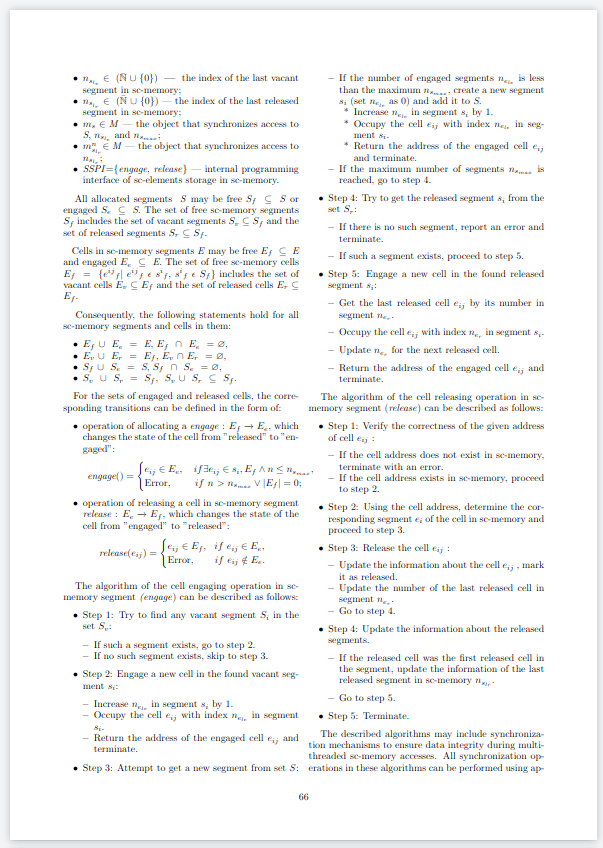

# Лабораторная работа №1. Работа с текстовым редактором.

## Цель работы:
- Познакомиться с системой верстки текстов TeX, языком верстки TeX, издательской системой LaTeX.
- Выполнить вариант индивидуального задания.


## Ход работы:
- Сверстать три страницы научной статьи с использованием системы верстки текстов TeX.
    - На [странице](https://proc.ostis.net/proc/Proceedings%20OSTIS-2024.pdf) необходимо взять доклад, соответствующий варианту индивидуального задания.
    - Доклад представлен в форме статьи в формате *.pdf.
    - Для написания формального текста предлагается воспользоваться пакетом макросов “scn-latex”.

Для выполнения данной лабораторной работы необходимо было:
1. Набирать текст на английском языках.

2. Писать текст в 2 столбца. Чтобы сделать это необходимо было подключить пакет multicol
```LaTeX
\usepackage{multicol}
```
и заключить текст, который выводится в 2 колонки в этот блок:
```LaTeX
\begin{multicols}{2}
    % здесь будет текст, который необходимо вывести в 2 колонки...
\end{multicols}
```
Тогда текст будет выглядеть следующим образом:


3. Мой вариант начинается с 66 страницы, поэтому необходимо установить счётчик страниц на начальное значение 66. За это отвечает следующая команда:
```LaTeX
\setcounter{page}{66}
```

4. При выполнении работы также появилась необходимость в использовании использовать подсписки. Для этого было необходимо ввести следующую команду:
```LaTeX
begin{itemize}
    \item Step 1: Try to find any vacant segment \(S_i\) in the set \(S_v\):
    \begin{enumerate}[label=\textbf{--}, leftmargin=*, listparindent=2em, noitemsep,topsep=0pt,parsep=0pt,partopsep=0pt]
        \item If such a segment exists, go to step 2.
```
Данная команда создат подсписок, начинающийся с "-" в списке, начинающемся с точки.

5. В моем варианте необходимо было использовать математические выражения. Для этого можно искользовать "$" для выделения одной команды либо же "\[ \]", для выделения целой строки:
```LaTeX
  $e_{ij}$
```
   или
   
 ```LaTeX
  \[
  (\forall\textit{e} \in E : (e \in E_{e}) \vee (e \in E_{f})).
  \]
```

## Выводы:
В результате этой работы был создан один pdf файл и один tex файл с исходниками статьи. В ходе из создания я:
- Познакомился с системой верстки текстов TeX, языком верстки TeX, издательской системой LaTeX.
- Познакомился с online-редактором [overleaf](https://www.overleaf.com).
