# ЛАБА 1

### ЦЕЛЬ

- Познакомиться с системой верстки текстов TeX, языком верстки TeX, издательской системой LaTeX.Выполнить вариант индивидуального задания.

### УСЛОВИЕ

- Сверстать три страницы научной статьи с использованием системы верстки текстов TeX.
- На странице [OSTIS Research Papers Collection (246-248)](https://proc.ostis.net/proc/Proceedings%20OSTIS-2024.pdf) необходимо взять доклад, соответствующий варианту индивидуального задания.

### [РЕЗУЛЬТАТ](lab1/LAB1.pdf)

# ЛАБА 3
### ЦЕЛЬ

- Познакомиться с программами git, освоить их программные аргументы.

### ВЫВОДЫ

- Научился на практике выполнять всевозможные действия с репозиторием и отвечать на теоретические вопросы из списка заданий.
- Получил практические навыки работы в консоли, использования консольных команд.

## ОТЧЁТ
1. git init  
2. git status  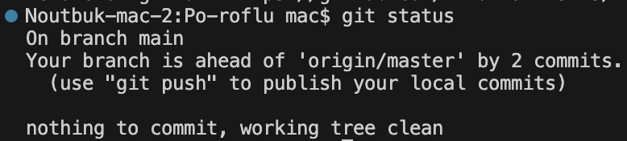  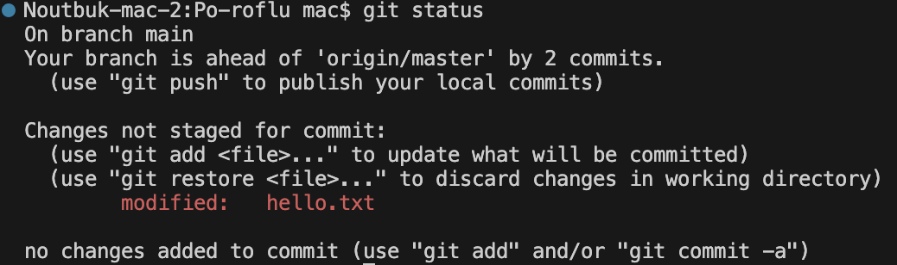  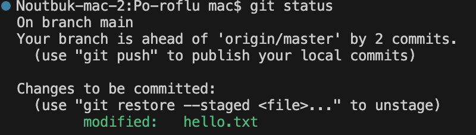
3. последовательность коммитов, master   /   main  
4. git add {file}  
5. git commit -m "comment"  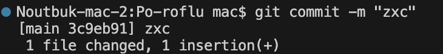
6. git commit -am "comment"  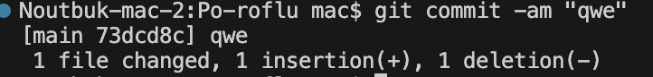
7. git log  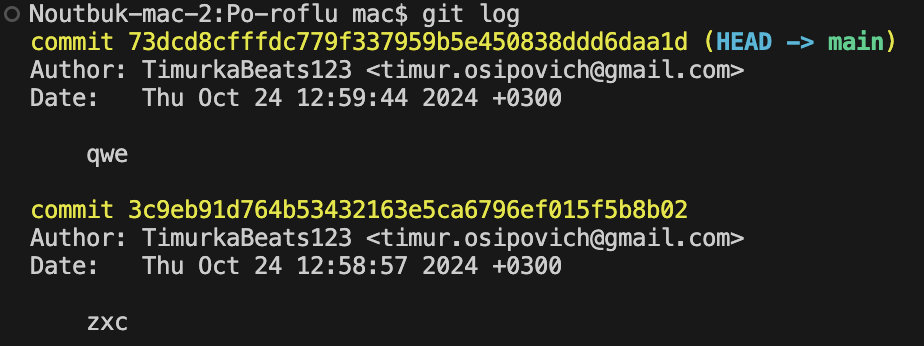
8. git config --list  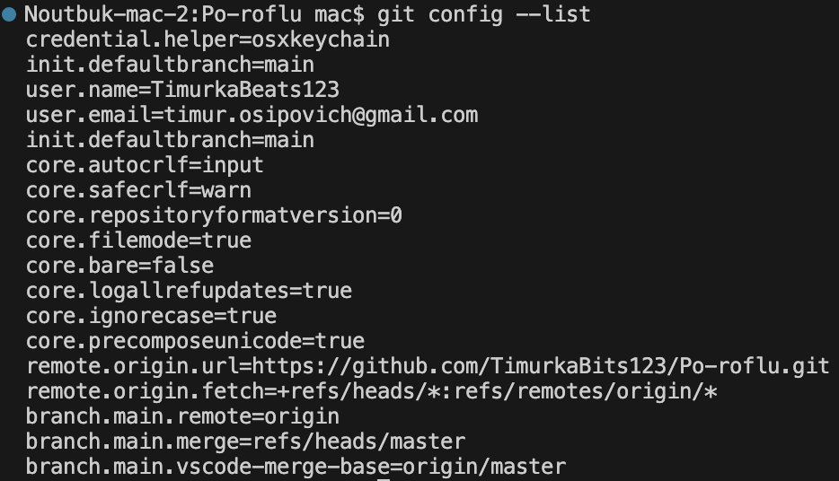
9. git restore --staged {file}   /   git reset  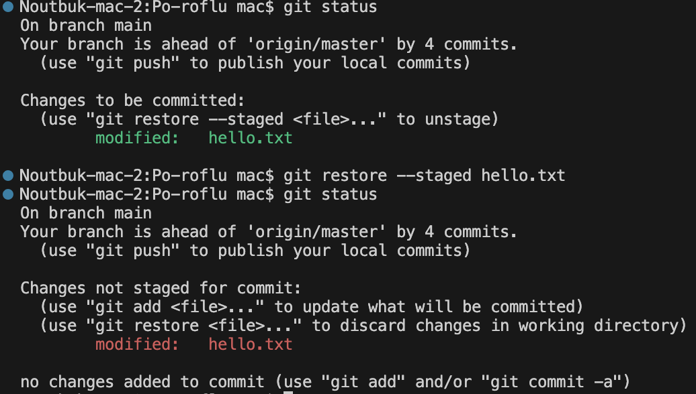
10. git diff {file}  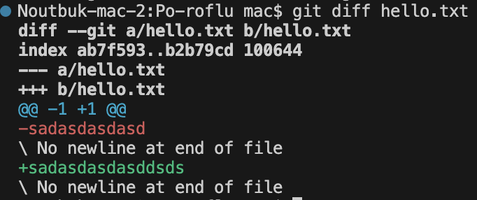
11. git checkout {file}  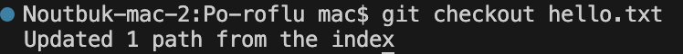
12. git add --all   /   git add .  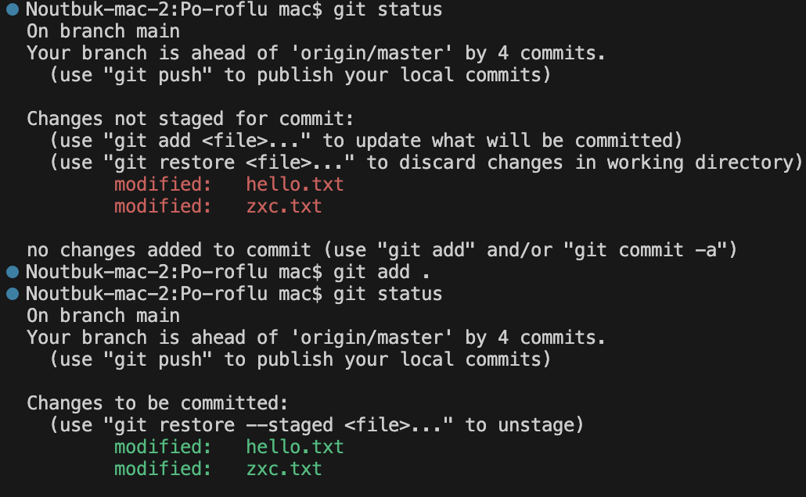
13. git config --global  
14. git config --global [user.name](http://user.name) {name}  
15. git branch  
16. git branch {name}  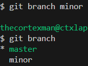
17. git checkout {name} / git switch {name}  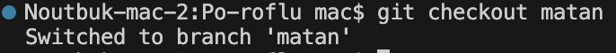  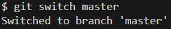
18. git checkout -b {name}  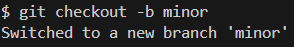
19. git branch -d {name}  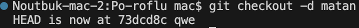
20. git merge {name}  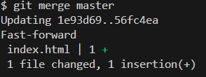
21. конфликт в случае слияния веток с разными изменениями в одном файле  
22. git merge → git status  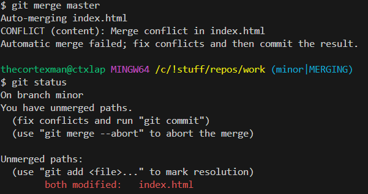
23. устранить конфликт вручную изменив файл до удовлетворительного состояния  
24. git checout {hash}  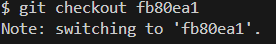
25. git rebase {name}  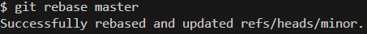
26. устранить конфликт → git add {file} → git rebase --continue      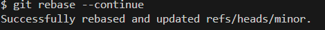
27. git rebase --abort  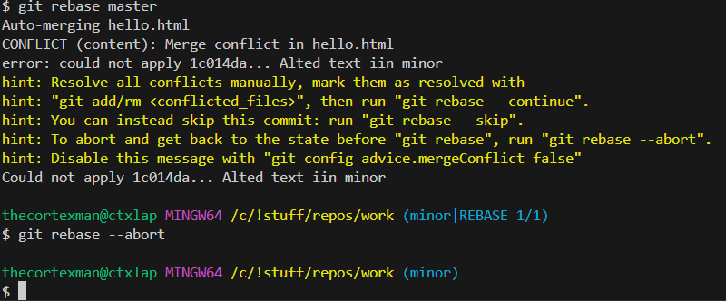
28. git rebase --skip  
29. git push  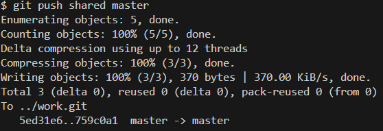
30. git fetch → git merge  /  git pull  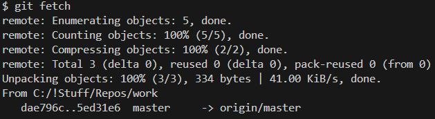
31. git pull origin {name}  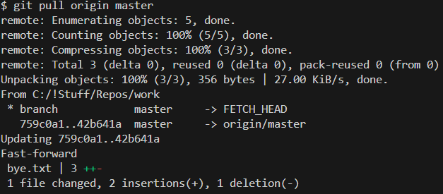
32. git clone {name} {name}  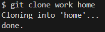
33. git commit --amend -m “comment”  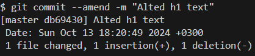
34. git rebase -i HEAD~n  
35. git revert HEAD  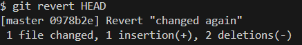