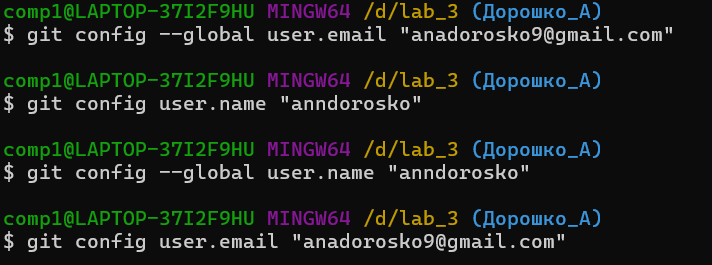

## Лабораторная работа №1
### ЦЕЛЬ
- Познакомиться с системой верстки текстов TeX, языком верстки TeX, издательской системой LaTeX.Выполнить вариант индивидуального задания.
### Условие
- Сверстать три страницы научной статьи с использованием системы верстки текстов TeX.
- На странице OSTIS [Research Papers Collection (102-104)](https://proc.ostis.net/proc/Proceedings%20OSTIS-2024.pdf) необходимо взять доклад, соответствующий варианту индивидуального задания.
## [РЕЗУЛЬТАТ](lab_1/lab1.pdf)

## Лабораторная работа №3
### ЦЕЛЬ
- Познакомиться с программами git, освоить их программные аргументы.
### ВЫВОДЫ
- Научился на практике выполнять всевозможные действия с репозиторием и отвечать на теоретические вопросы из списка заданий.
Получил практические навыки работы в консоли, использования консольных команд.
## Отчёт
1. создать локальный репозиторий в текущей папке  
2. посмотреть статус текущего репозитория  
3. что такое ветка и какая ветка является обычно основной: последовательность коммитов, main
4. добавить файл в контекст, который будет коммититься  
5. cоздать коммит на основе текущего контекста и указать для него комментарий  
6. создать коммит, включающий изменения всех наблюдаемых файлов и указать для него комментарий  
7. посмотреть протокол(лог) коммитов  
8. посмотреть информацию о текущих настройках  
9. убрать файл из контекста  
10. посмотреть изменения в файле по сравнению с последним коммитом  
11. убрать изменения относительно последнего коммита из файла  
12. добавить в контекст коммита все измененные и созданный файлы  
13. изменить глобальные/локальные настройки  
14. переписать имя пользователя  
15. просмотреть существующие ветки  
16. создать новую ветку  
17. переключиться на другую ветку  
18. создать новую ветку и сразу же переключиться на неё  
19. удалить ветку/удалить ветку, даже если она не примержена  
20. примержить изменения из указанной ветки в текущую  
21. в каком случае могут появиться конфликты? сделать конфликт
22. как посмотреть в каких файлах конфликты
23. как устранить конфликты
24. как переключиться на указанный коммит
25. сделать ребазирование(rebase) текущей ветки
26. устранение конфликтов во время ребазирования
27. отменить ребазирование во время конфликтов
28. пропустить текущий конфликтный коммит и перейти к следующему
29. отправить изменения из локального репозитория для указанной ветки в удалённый(дистанционный) репозиторий
30. забрать изменения из репозитория, для которого были созданы удалённые ветки по умолчанию
31. забрать изменения удалённой ветки из репозитория по умолчанию, основной ветки
32. создание копии репозитория
33. переименовать последний коммит
34. переименовать не последний коммит
35. скрыть изменения по сравнению с последним коммитом
