# ЛАБА 1

### ЦЕЛЬ
- Познакомиться с системой верстки текстов TeX, языком верстки TeX, издательской системой LaTeX.Выполнить вариант индивидуального задания.

## Основные библиотеки 
### УСЛОВИЕ

- Сверстать три страницы научной статьи с использованием системы верстки текстов TeX.
- На странице [OSTIS Research Papers Collection (246-248)](https://proc.ostis.net/proc/Proceedings%20OSTIS-2024.pdf) необходимо взять доклад, соответствующий варианту индивидуального задания.

### [РЕЗУЛЬТАТ](lab1/LAB1.pdf)

# ЛАБА 3
### ЦЕЛЬ

- Познакомиться с программами git, освоить их программные аргументы.

### ВЫВОДЫ

- Научился на практике выполнять всевозможные действия с репозиторием и отвечать на теоретические вопросы из списка заданий.
- Получил практические навыки работы в консоли, использования консольных команд.

## ОТЧЁТ
1. git init  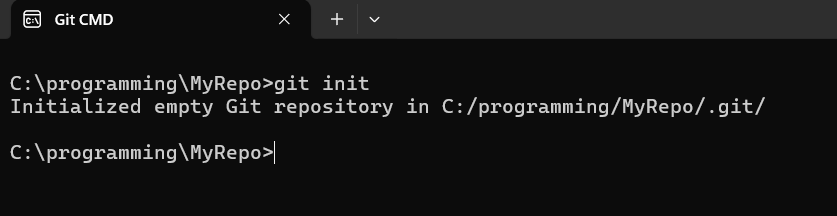
2. git status  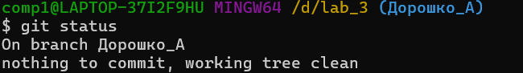
3. ветка в Git-это линия разработки. Обычно основной веткой является main или master.
4. echo Kirito>SAO.txt {file}  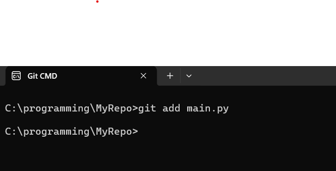
5. git commit -m "comment"  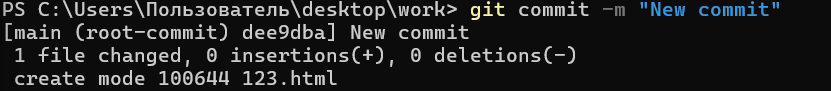
6. git commit -a -m "comment"  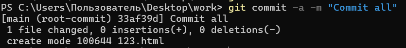
7. git log  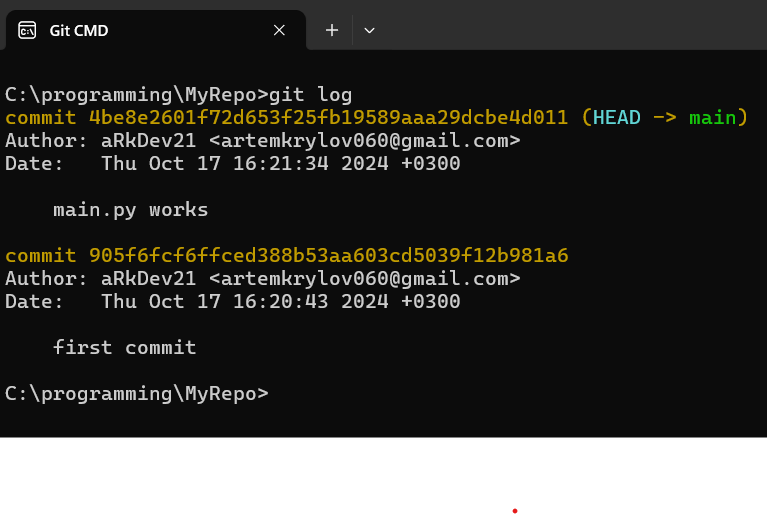
8. git config --list  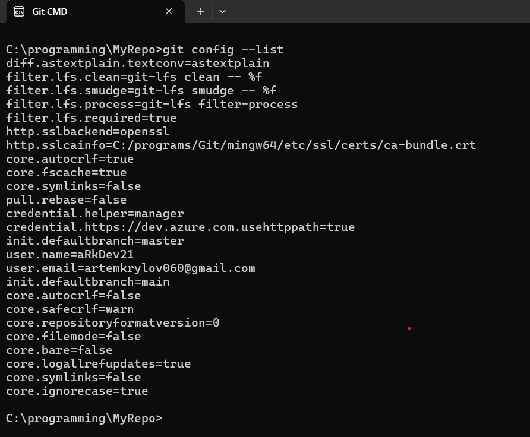
9. убрать файл из контекста   /   git reset  
10. посмотреть изменения в файле по сравнению с последним коммитом  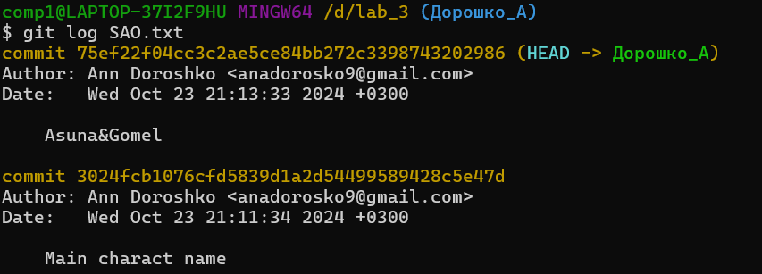
11. убрать изменения относительно последнего коммита из файла  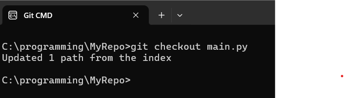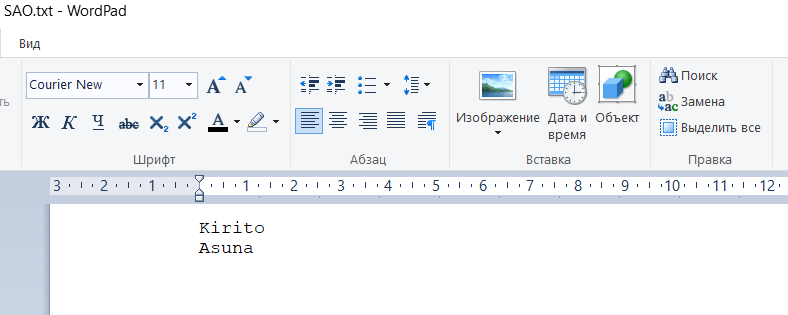  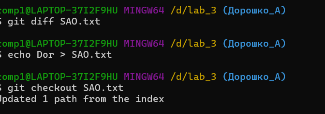 
12. git add .  
13. git config --global  
14. переписать имя пользователя [user.name](http://user.name) {name}  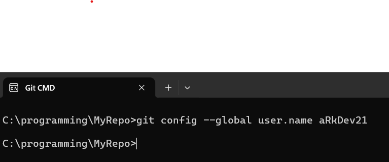
15. посмотреть существующие ветки  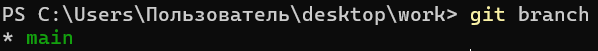
16. создание новой ветки  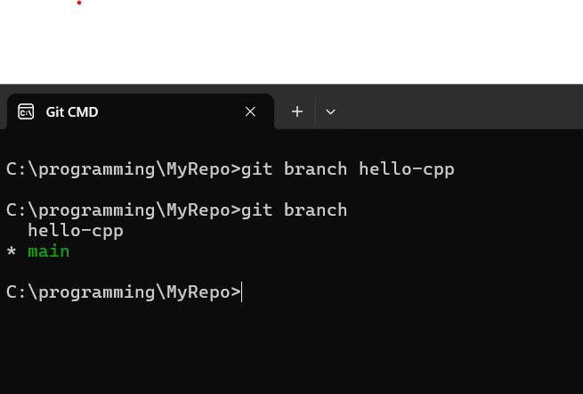
17. переключиться на другую ветку  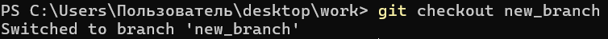
18. git checkout -b {name}  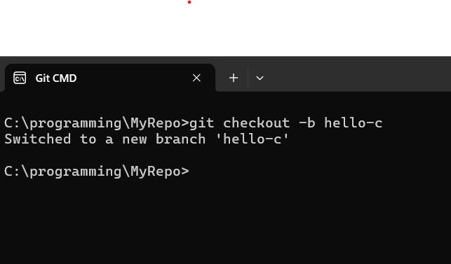
19. git branch -d {name}  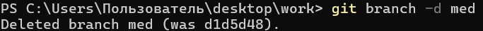
20. примержить изменения из указанной ветки в текущую  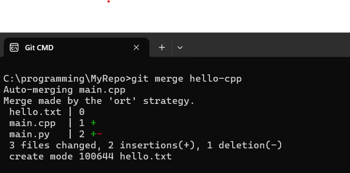
21. конфликт в случае слияния веток с разными изменениями в одном файле  
22. посмотреть в каких файлах конфликты  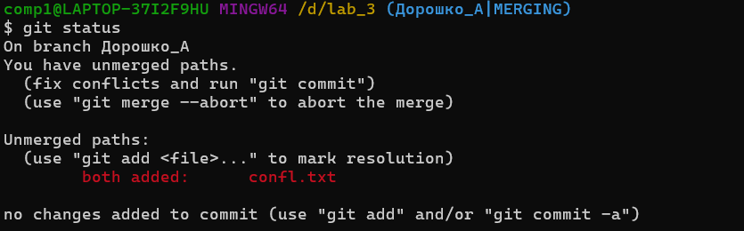
23. устранить конфликт   
25. ребазирование текущей ветки  
27. git rebase --abort  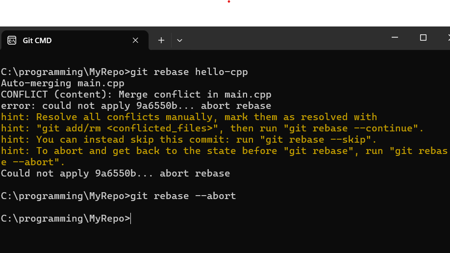
28. git rebase --skip  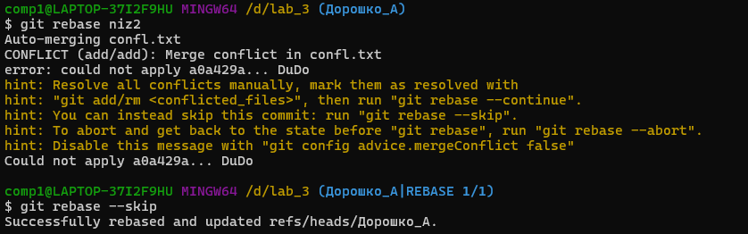
29. отправить изменения из локального репозитория для указанной ветки в удалённый репозиторий  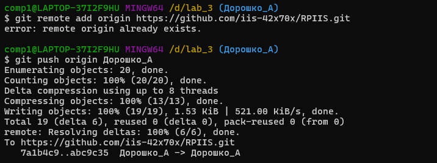
30. git fetch  
31. git fetch origin master {name}  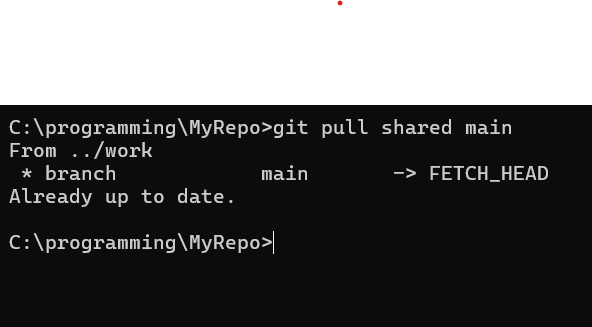
32. git clone {name} {name}(создание копии репозитория)  
33. git rm/mv {name} (удаление/переименование файла)  
34. git rebase -i HEAD~n  
35. git revert HEAD  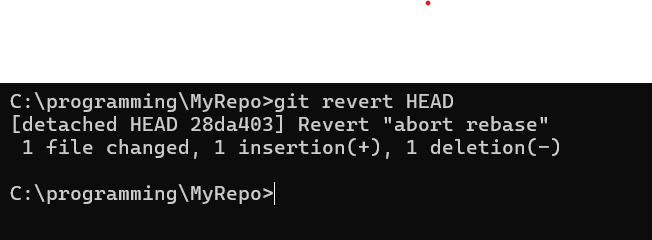
34. git rebase -i HEAD~n  
35. git revert HEAD  
