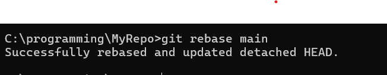
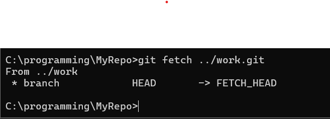
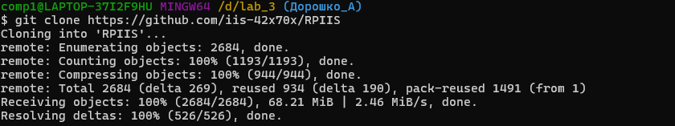
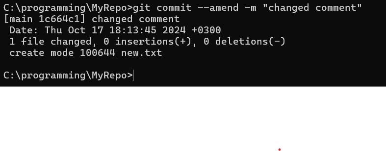

# Лабораторная работа №1
### ЦЕЛЬ
- Познакомиться с системой верстки текстов TeX, языком верстки TeX, издательской системой LaTeX.Выполнить вариант индивидуального задания.
### Условие
- Сверстать три страницы научной статьи с использованием системы верстки текстов TeX.
### ВЫВОД
- Науучился пользоваться языком версти TeX и издательской системой LaTeX.
# Работа с LaTeX 

Для выполнения L1
Был использован Overleaf

Для регистрации можно перейти по ссылке:
[OverLeaf](https://www.overleaf.com)

*OverLeaf — онлайн редактор Latex* 
## Использованные пакеты Latex

Для работы в LaTeX нужно подключить специальные пакеты, в данной работе были использованы следующие:

```\usepackage{multicol} — Даёт возможность разделить страницу на 2 и более коллонны
\usepackage[left=2cm,right=2cm,top=1cm,botton=3cm]{geometry} — Настройка геометрии страницы
\usepackage{multicol} - Дает возможность создать колонки.
\usepackage{float} - Дает возможность вставить плавающие объекты.
\usepackage{parskip} - Вертикальный отступ.
```
## Лабораторная работа №3
### ЦЕЛЬ
- Познакомиться с программами git, освоить их программные аргументы.
### ВЫВОД
- Научился на практике выполнять действия с репозиторием и отвечать на теоретические вопросы из списка заданий.
  ## Отчёт
1. создать локальный репозиторий в текущей папке <br>!
)
2. посмотреть статус текущего репозитория <br>!
)
3. что такое ветка и какая ветка является обычно основной: ветка в Git — это набор коммитов, расположенных в хронологическом порядке.
4. добавить файл в контекст, который будет коммититься <br>!
)
5. cоздать коммит на основе текущего контекста и указать для него комментарий <br>!

6. создать коммит, включающий изменения всех наблюдаемых файлов и указать для него комментарий <br>!

7. посмотреть протокол(лог) коммитов <br>!

8. посмотреть информацию о текущих настройках <br>!

9. убрать файл из контекста <br>!

10. посмотреть изменения в файле по сравнению с последним коммитом <br>!

11. убрать изменения относительно последнего коммита из файла <br>!

12. добавить в контекст коммита все измененные и созданный файлы <br>!

13. изменить глобальные/локальные настройки <br>


14. переписать имя пользователя <br>

15. просмотреть существующие ветки <br>!

16. создать новую ветку <br>

17. переключиться на другую ветку <br>

18. создать новую ветку и сразу же переключиться на неё <br>

19. удалить ветку/удалить ветку, даже если она не примержена <br>

20. примержить изменения из указанной ветки в текущую <br>
21. в каком случае могут появиться конфликты? сделать конфликт: Конфликт возникает, когда в двух ветках была изменена одна и та же строка в файле или когда некий файл удален в одной ветке и отредактирован в другой. Как правило, конфликты возникают при работе в команде. <br>

22. как посмотреть в каких файлах конфликты<br>

23. как устранить конфликты: <br>!


24. как переключиться на указанный коммит <br>
25. сделать ребазирование(rebase) текущей ветки <br>
26. устранение конфликтов во время ребазирования: устранить конфликт → git add {file} → git rebase --continue.
27. отменить ребазирование во время конфликтов: git rebase --abort.
28. пропустить текущий конфликтный коммит и перейти к следующему: git rebase --skip.
29. отправить изменения из локального репозитория для указанной ветки в удалённый(дистанционный) репозиторий: git push shared main.
30. забрать изменения из репозитория, для которого были созданы удалённые ветки по умолчанию <br>
31. забрать изменения удалённой ветки из репозитория по умолчанию, основной ветки: git pull origin {name}.
32. создание копии репозитория <br>
33. переименовать последний коммит <br>
34. переименовать не последний коммит: git rebase -i HEAD~n.
35. скрыть изменения по сравнению с последним коммитом: git revert HEAD.
- Получил практические навыки работы в консоли, использования консольных команд.
Получил практические навыки работы в консоли, использования консольных команд.
