Условие для ЛР 1:  
В рамках ЛР 1 необходимо сверстать страницу сборника средствами LaTeX. Вариант выдаётся преподавателем  

Цель работы ЛР 3:  
Познакомиться с программами git, освоить их программные аргументы.   

Вывод работы ЛР 3:  
В рамках ЛР 3 я изучил способы сохдания .md файла и его разметку,ознакомился с системой контроля весрий - git,познакомился с программама git,освоил мх програмные аргументы.

1. создать локальный репозиторий в текущей папке  
 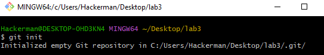
2. посмотреть статус текущего репозитория  
 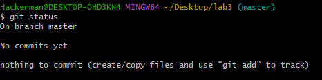
3. что такое ветка и какая ветка является обычно основной
	 Ветка – набор коммитов, расположенных в хронологическом порядке. Основная ветка – main (или master) 
4. добавить файл в контекст, который будет коммититься  
 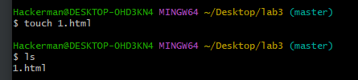
5. создать коммит на основе текущего контекста и указать для него комментарий  
 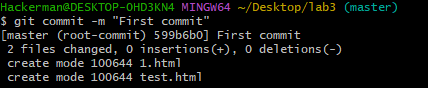
6. создать коммит, включающий изменения всех наблюдаемых файлов и указать для него комментарий  
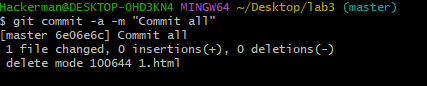
7. посмотреть протокол(лог) коммитов  
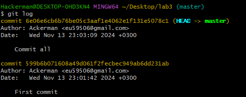
8. посмотреть информацию о текущих настройках  
 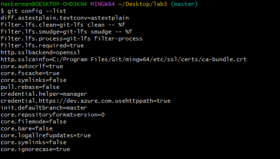
9. Убрать файл из контекста  
 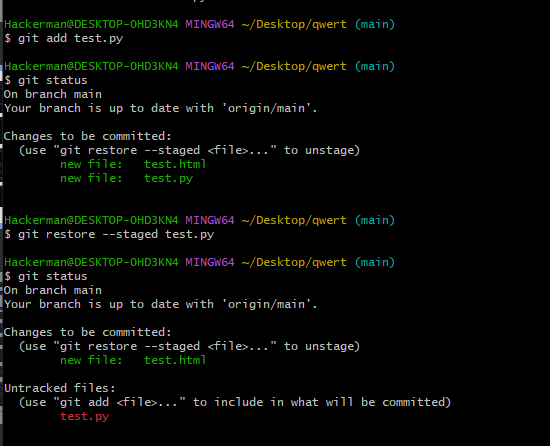
10.  посмотреть изменения в файле по сравнению с последним коммитом  
 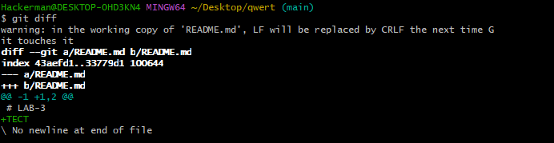
11. убрать изменения относительно последнего коммита из файла  
 
12. добавить в контекст коммита все измененные и созданный файлы  
 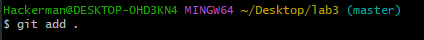
13. изменить глобальные/локальные настройки  
Глобальные: git –global user.name Ackerman
Локальные: git user.name Ackerman
14. переписать имя пользователя  
 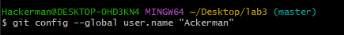
15. просмотреть существующие ветки  
 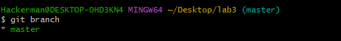
16. создать новую ветку  
 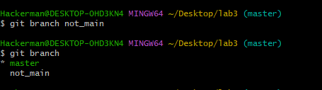
17. переключиться на другую ветку  
 
18. создать новую ветку и сразу же переключиться на неё  
 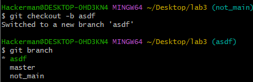
19. удалить ветку/удалить ветку, даже если она не примержена  
 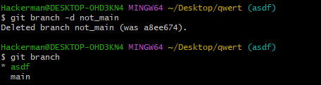
20. примержить изменения из указанной ветки в текущую  
 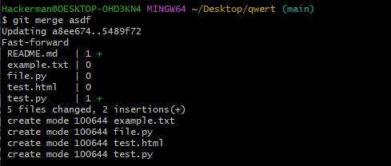
21. в каком случае могут появиться конфликты? сделать конфликт  
При слиянии веток с разными изменениями в одном и том же файле  
 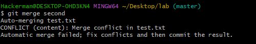
22. как посмотреть в каких файлах конфликты  
 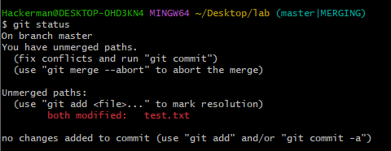
23. как устранить конфликты  
Вручную изменив файл, оставить один из вариантов (или объединить их)
24. как переключиться на указанный коммит  
 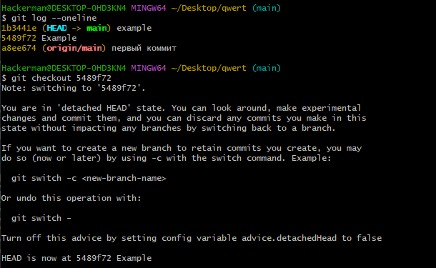
25. сделать ребазирование(rebase) текущей ветки  
 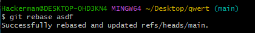 
26. устранение конфликтов во время ребазирования  
Вручную изменить файлы, готовые файлы добавить в индекс и продолжить ребазирование командой git rebase --continue
27. отменить ребазирование во время конфликтов  
git rebase --abort
28. пропустить текущий конфликтный коммит и перейти к следующему  
git rebase --skip
29. отправить изменения из локального репозитория для указанной ветки в удалённый(дистанционный) репозиторий  
 
30. забрать изменения из репозитория, для которого были созданы удалённые ветки по умолчанию  
git pull
31. забрать изменения удалённой ветки из репозитория по умолчанию, основной ветки  
git pull origin main
32. создание копии репозитория  
 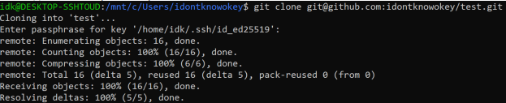
33. переименовать последний коммит  
 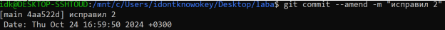
34. переименовать не последний коммит  
git rebase -i HEAD~n
35. скрыть изменения по сравнению с последним коммитом  
git revert HEAD
