 <h1 align="center">Рассчетная работа.Теория Графов.</h1>

## Цели:
* Изучить основные понятия в теории графов 
* Научиться различать виды графов
* Уметь использовать основные алгоритмы при работе с графами 

## Задачи:
* Выполнить свой вариант рассчетной работы
* Перенести получившееся решение на язык программирования С++
* Ознакомиться с оновными алгоритмами по работе с графами

 ## Вариант 
Для рассчетной работы мне был выдан вариант **5.29**. Для хранения графов нужно использовать списки смежности,  а также граф должен быть взвешенным и неориентированным.
### Базовые сведения о графах, которые нужны для выполнения рассчетной работы ###

<p >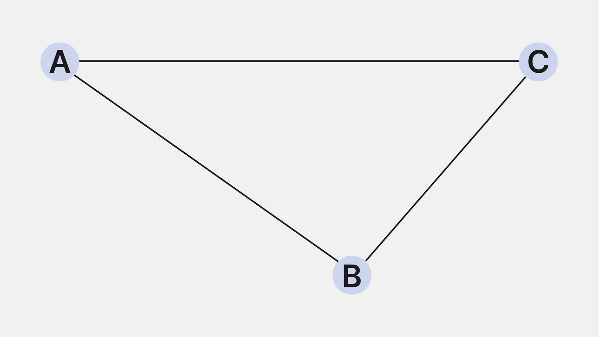</p>

<b>Граф</b> — математическая абстракция реальной системы любой природы, объекты которой обладают парными связями. Граф как математический объект есть совокупность двух множеств — множества самих объектов, называемого множеством вершин, и множества их парных связей, называемого множеством рёбер.

 **Ориентированный граф** - граф, рёбрам которого присвоено направление. Направленные рёбра именуются также дугами, а в некоторых источниках и просто рёбрами.

**Неориентированный граф** - граф, в котором рёбра не указывают направление. Это значит, что из любой вершины можно попасть в любую точку графа.

**Связный граф** — граф, в котором существует путь между любой парой вершин. Из каждой вершины по рёбрам можно добраться до любой другой вершины. В связном графе нет изолированных вершин или групп, которые не связаны с остальными частями графа.


**Взвешенный граф** — граф, в котором каждому ребру присвоено числовое значение — вес. Это может быть расстояние, время, стоимость, мощность или другая характеристика, связанная с соединением вершин.


### Основные алгоритмы для работы с графами 


**Обход в ширину**

Под обходом понимается последовательное посещение (обработка) вершин графа в определённом порядке. Одним из двух часто использующихся способов обхода является обход в ширину, или BFS (англ. breadth-first search, поиск в ширину). Его иногда также называют волновым, по аналогии с распространяющейся волной.

Суть BFS достаточно проста. Обход начинается с посещения определённой вершины (для обхода всего графа часто выбирается произвольная вершина). Затем алгоритм посещает соседей этой вершины. За ними - соседей соседей, и так далее.

Более формально, пусть d[i]
 расстояние от начальной вершины до вершины с номером i
 (длина кратчайшего пути в рёбрах). BFS посещает вершины в порядке возрастания d[i]
: от наименее до наиболее отдалённых.

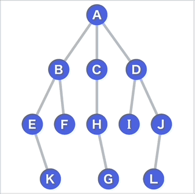

В частности для выполнения рассчетной работы необходимо ознакомиться с алгоритмом Дейкстры.
## Алгоритм Дейкстры

Классический алгоритм для поиска кратчайших путей во взвешенном графе - алгоритм Дейкстры (по имени автора Эдгара Дейкстры). Он позволяет найти кратчайший путь от одной вершины графа до всех остальных за O(MlogN)
 (N,M
 - количество вершин и рёбер соответственно).

Принцип работы алгоритма напоминает принцип работы BFS: на каждом шаге обрабатывается ближайшая ещё не обработанная вершина (расстояние до неё уже известно). При её обработке все ещё не посещённые соседи добавляются в очередь для посещения (расстояние до каждой из них рассчитывается как расстояние до текущей вершины + длина ребра). Главное отличие от BFS заключается в том, что вместо классической очереди используется очередь с приоритетом. Она позволяет нам выбирать ближайшую вершину за O(logN)
.

Анимация выполнения алгоритма Дейкстры для поиска кратчайшего пути из вершины a
 в вершину b
:


### Область применения алгоритма Дейкстры
Алгоритм Дейкстры является оптимальным для поиска пути практически 
в любых графах, но он имеет одно ограничение. Алгоритм Дейкстры неприменим для 
графов, содержащих рёбра с отрицательным весом. Для поиска кратчайшего пути в 
таких графах обычно используют алгоритм Форда-Беллмана.

## Выполнение рассчетной работы

### Способ хранения графа

Для выполнения рассчетной работы граф хранился с помощью **списка смежности**

вот пример кода 

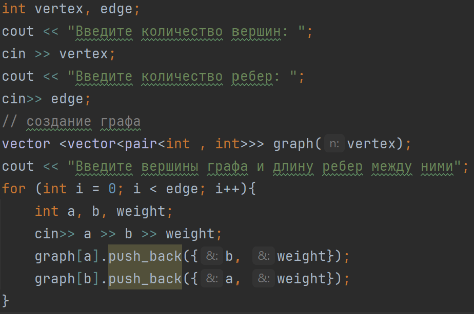

* Как видно  в коде, для того создать граф  необходимо задать количество вершин и ребер.

* Чтобы заполнить граф, необходимо пройтись циклом **for**  по всем ребрам и задать *начальную* и  *конечную* вершину ,  а также вес каждого ребра.

*  В этом же цикле в начальную  вершину добавляем  пару (конечная вершина, вес ребра),  аналогично поступаем с конечной вершиной.


### План написания кода 

```
dist = массив расстояний от начальной вершины до каждой.
      изначально заполнен бесконечностями (ещё не достигнута).

dist[start] = 0

q = очередь с приоритетом, хранящая пары (d, v),
    где d - предполагаемое расстояние до v

добавить (0,start) в q

пока q не пуста:
    (d, v) = первая вершина в очереди (с минимальным расстоянием), и расстояние до неё
    извлечь (d, v) из очереди

    если dist[v] < d:   //мы уже обработали эту вершину, используя другой путь
        перейти к следующей вершине

    для каждой v -> to:
     прохождении через v
        если dist[v] + weight< dist[to]:        //если мы можем улучшить ответ
            dist[to] = dist[v]+ weight;
            добавить (dist[to], to) в q
```

### Сам код

* **Создание нужных массивов для хранения расстояний, путей, очереди:**
<p text-align="center">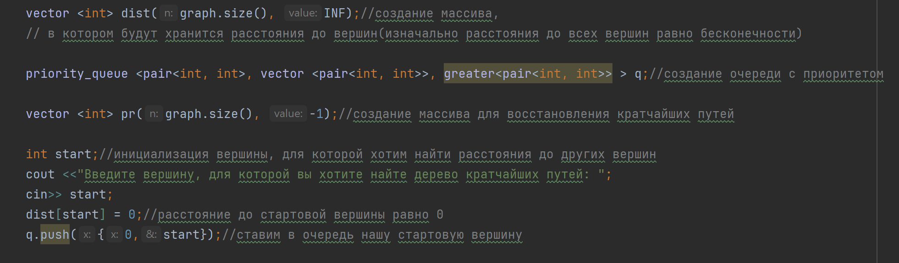</p>

* **Основная часть**.
Улучшение расстояний до вершин (поиск самого короткого пути)

<p text-align="center">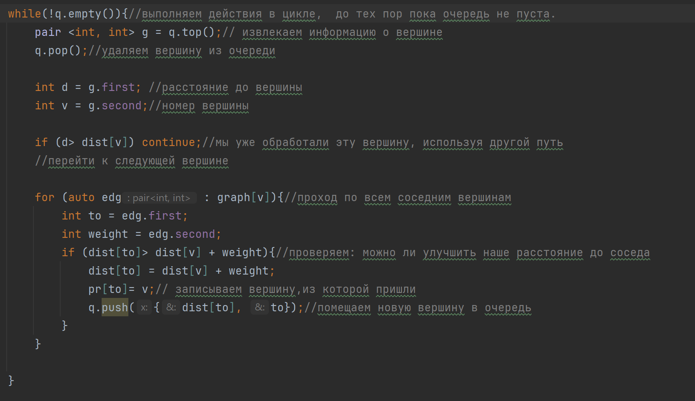</p>

* **Дерево кратчайших путей**. Для того, чтобы вывести кратчайшие пути необходимо было создать массив **pr**, 
который мы изначально заполнили -1. Потом на этапе улучшения расстояний, при  успешном
уменьшении  расстояний записываем нужную вершину в массив. Далее создаем массив **path**,в который
будем записывать вершины до тех пор, пока не встретим -1(не кончится путь). Так как в массиве **path** путь 
будет хранится в обратном порядке, то создадим новый массив **new_path** который будет заполнен 
элементами массива **path**  в обратном порядке.

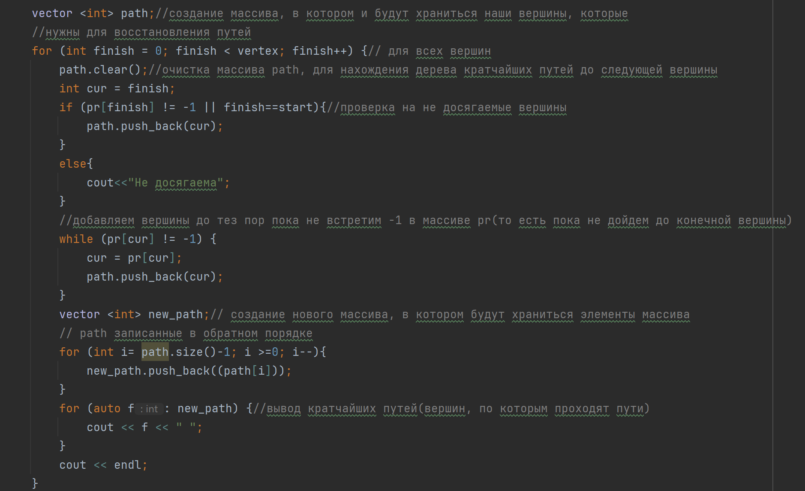

### Вывод значений путей

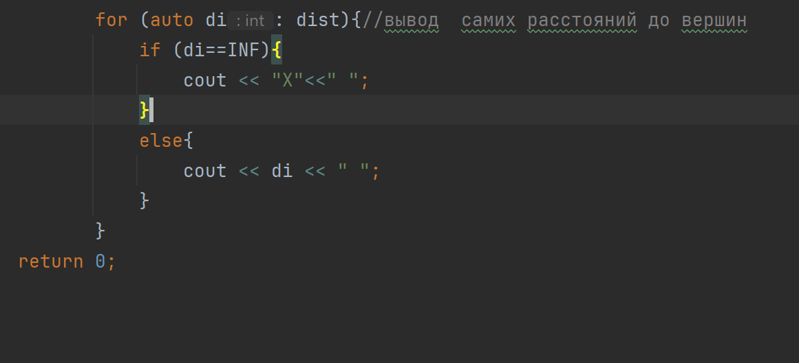


###  Тестовые значения

```
Test 1
5 4
0 1 15
0 2 7
0 3 3
1 2 6
3
```
**Наглядное изображение графа для теста 1:**

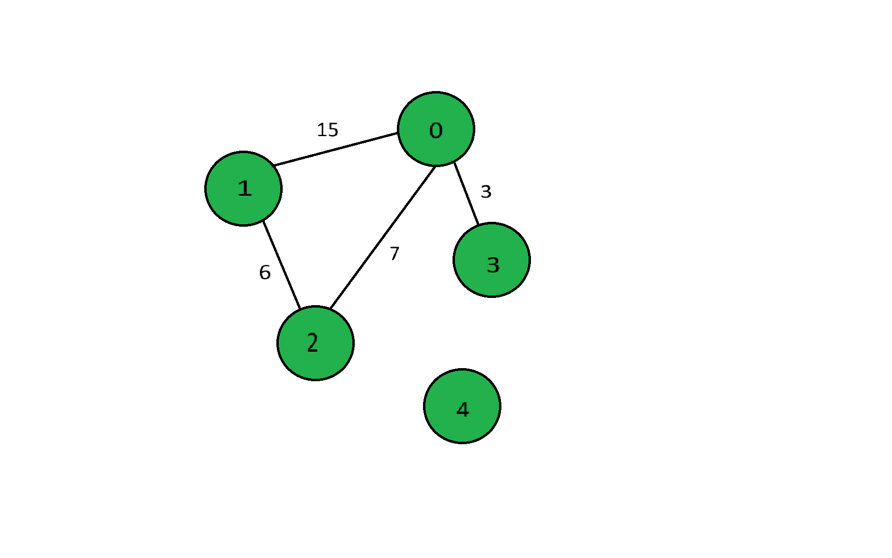

**Вывод консоли:**

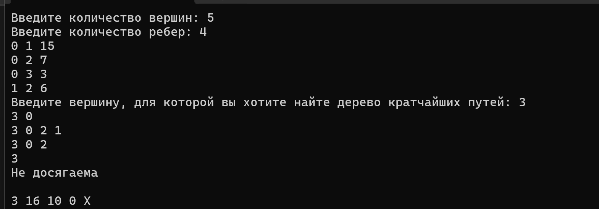


```
Test 2
7 8
0 1 18
0 2 3
1 2 11
1 3 6
2 4 19
3 4 3
4 5 5
5 6 7
5
```
**Наглядное изображение графа для теста 2:**


 
**Вывод консоли:**

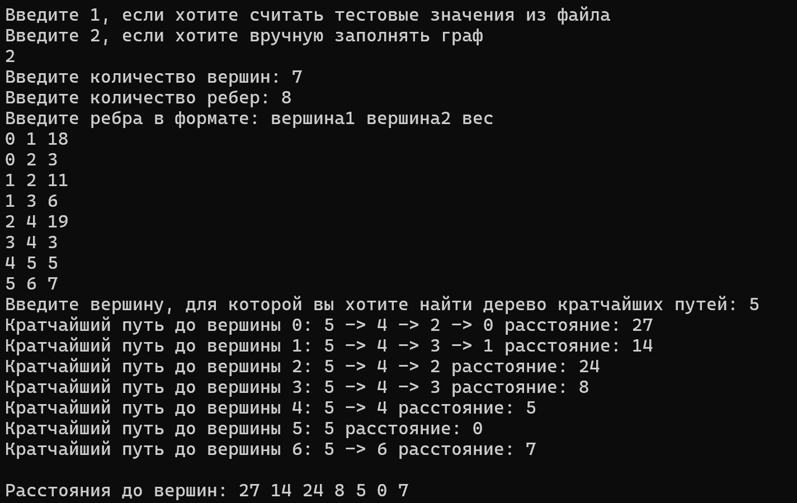

```
Test 3
4 4
0 3 6
0 2 17
1 2 3
1 3 2
1
```
**Наглядное изображение графа для теста 3:**

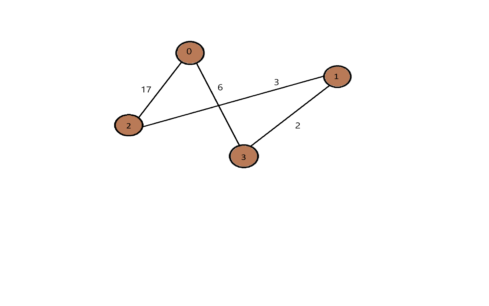
 
**Вывод консоли:**

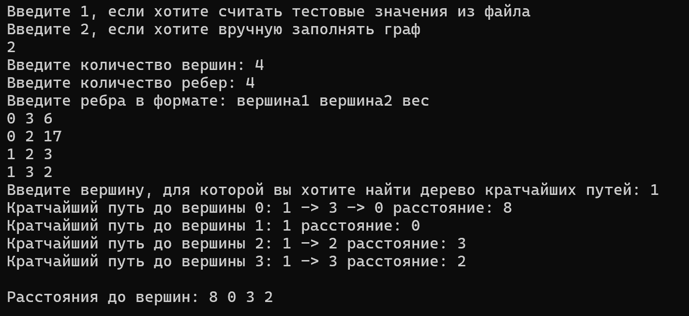


```
Test 4
3 3
0 1 3
0 2 7
1 2 1
2
```
**Наглядное изображение графа для теста 4:**

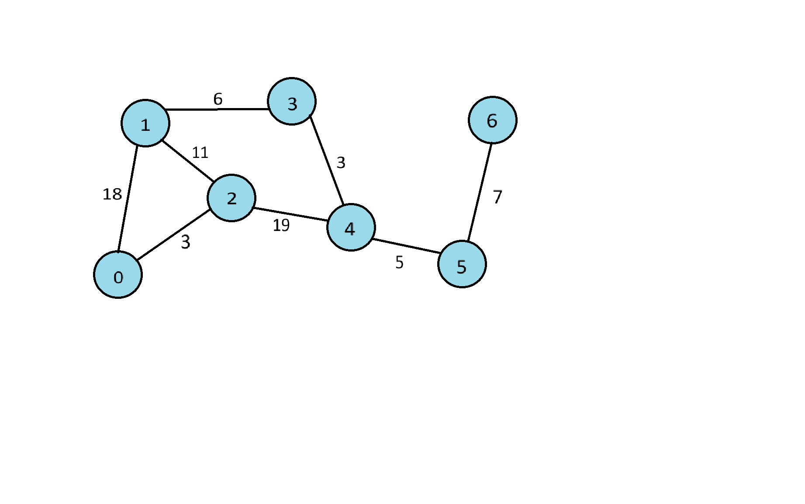
 
**Вывод консоли:**

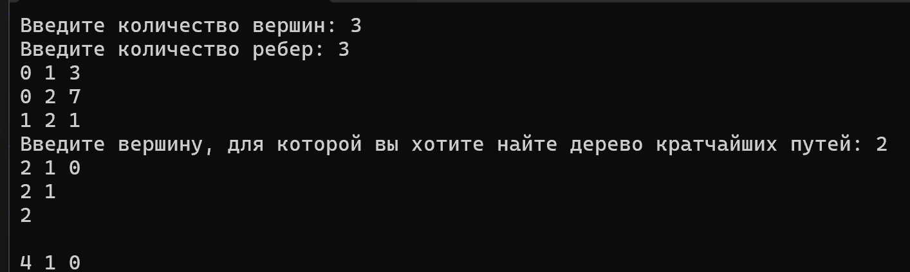

```
Test 5
8 10
0 2 3
0 7 6
0 5 4
1 7 9
1 6 5
1 2 12
3 4 19
4 7 11
4 5 8
6 7 7
7
```
**Наглядное изображение графа для теста 5:**

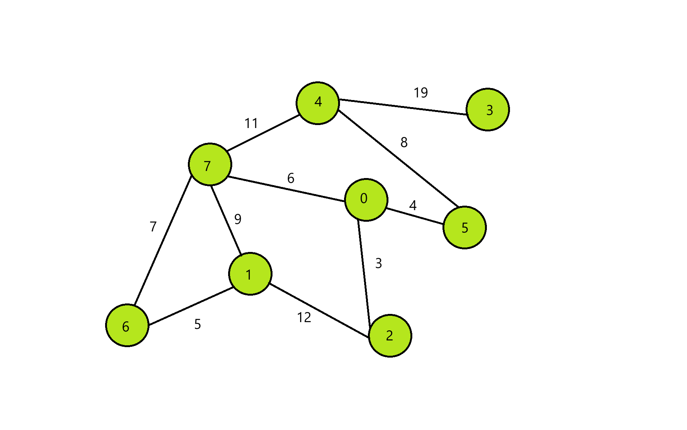
 
**Вывод консоли:**


## Вывод:

Во время выполнения рассчетной работы проделал вот такую работу:

Ознакомился с понятием графов.
Изучил, какие виды графов бывают (ориентированные/неориентированные, взвешенные/ невзвешенные).
Ознакомился   с таким способом представления графов в памяти компьютера, как список смежности.
Также в ходе выполнения рассчетной работы реализовал алгоритм Дейкстры на языке С++, проверил его работу .

## Используемые  источники

### Свободная энциклопедия "Википедия" [Электронный ресурс]-Режим доступа

* https://ru.m.wikipedia.org/wiki/

### Сайт "Олимпиадное программирование в Бресте и Беларуси" [Электронный ресурс]- режим доступа:
**Информация о графах и их представлении в памяти компбютера**
* https://brestprog.by/topics/graphs/

**Обход в ширину**
* https://brestprog.by/topics/bfs

**Алгоритм Дейкстры**
* https://brestprog.by/topics/dijkstra/