<h1 align = "center">Расчетная работа</h1>

<h3>Цель работы: </h3>

1) Изучить основные понятия в теории графов 

2) Научиться различать виды графов

 3) Уметь использовать основные алгоритмы при работе с графами 

<h3>Вариант расчетной работы:</h3>
В расчетной работе мне нужно было в неориентированном графе, представленным матрицей инцидентности, найти эйлеров цикл.

<h3>Теоритические сведения для выполнения расчетной работы:</h3>
Неориентированный граф - граф, в котором рёбра не указывают направление. Это значит, что из любой вершины можно попасть в любую точку графа.
 
 
Ориентированный граф - граф, рёбрам которого присвоено направление. Направленные рёбра именуются также дугами, а в некоторых источниках и просто рёбрами.
 
 
Эйлеров цикл - цикл в графе, который проходит по каждому ребру графа ровно один раз.
 
 
Связный граф — граф, в котором существует путь между любой парой вершин. Из каждой вершины по рёбрам можно добраться до любой другой вершины. В связном графе нет изолированных вершин или групп, которые не связаны с остальными частями графа.
 
 
Степень вершины - число ребер, которые соединяют данную вершину с другими.
<h3>Алгоритмы для выполнения расчетной работы:</h3>
Обход в глубину:
  
Стратегия поиска в глубину, как и следует из названия, состоит в том, чтобы идти «вглубь» графа, насколько это возможно. Алгоритм поиска описывается рекурсивно: перебираем все исходящие из рассматриваемой вершины рёбра. Если ребро ведёт в вершину, которая не была рассмотрена ранее, то запускаем алгоритм от этой нерассмотренной вершины, а после возвращаемся и продолжаем перебирать рёбра. Возврат происходит в том случае, если в рассматриваемой вершине не осталось рёбер, которые ведут в нерассмотренную вершину. Если после завершения алгоритма не все вершины были рассмотрены, то необходимо запустить алгоритм от одной из нерассмотренных вершин.

<h3>Алгоритм поиска Эйлерова цикла в графе:</h3>
На самом деле дл того, чтобы эйлеров цикл в графе существова, нам достаточно проверить, является ли граф связным и отсутствуют ли в нем вершины с нечетной степенью.
<h3>Реализация алгоритмов:</h3>
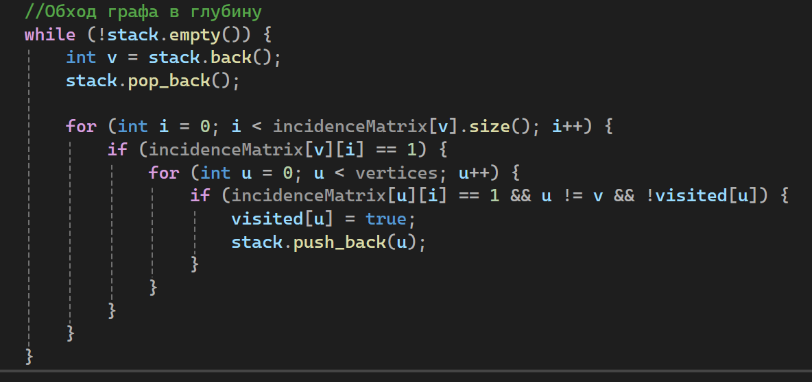
Алгоритм обхода в глубину реализова так, что программа проходится по всем вершинам графа и помечает их как посещенные(за это отвечает вектор visited).
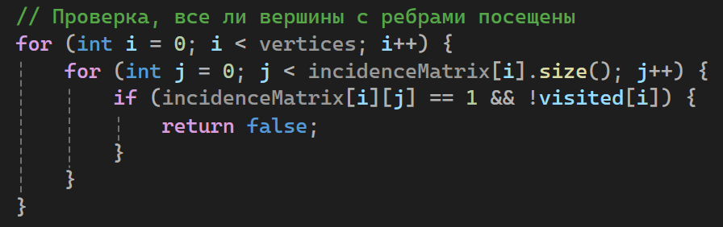
Затем программа проверяет все ли вершины посещены и если найдутся вершины, которые программа не поситила значит граф не связный и эйлеров цикл невозможен.
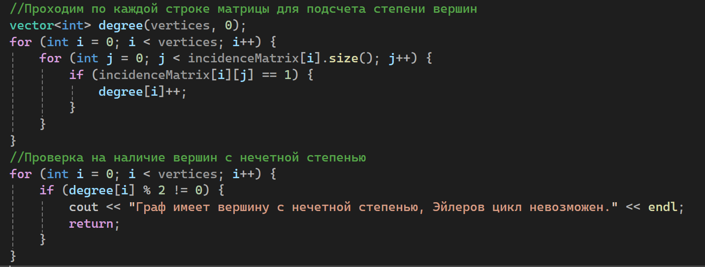
Этот блок кода считает все степени вершин графа, а затем проверяет есть ли среди этих степеней нечетные. Если есть, то эйлеров цикл невозможен.
<h2>Тесты программы</h2>
Первый тест: 
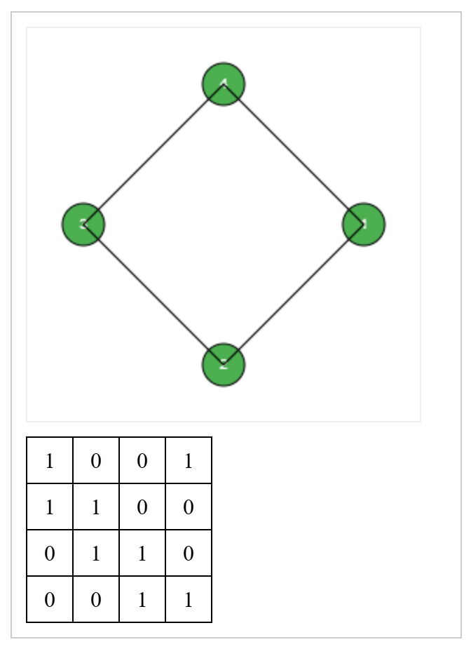
Вывод в консоль:
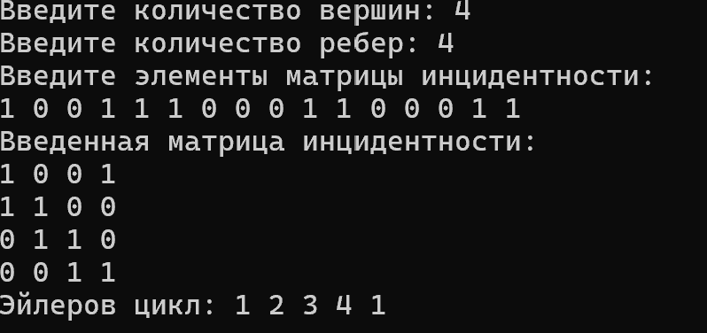

Второй тест: 
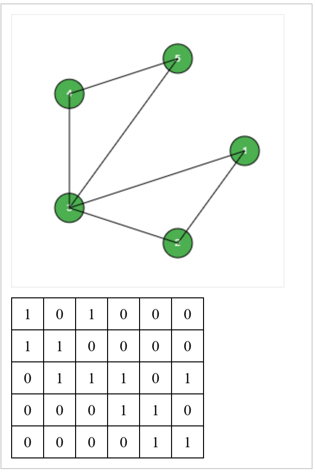
Вывод в консоль:
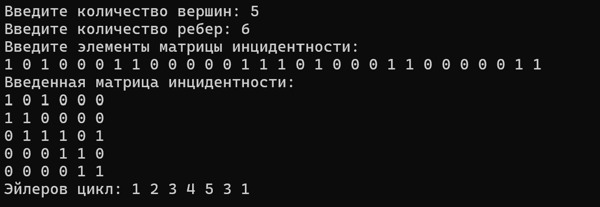

Третий тест: 
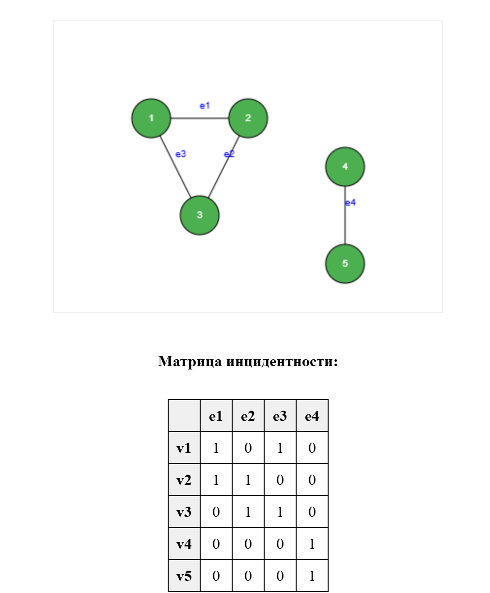
Вывод в консоль:
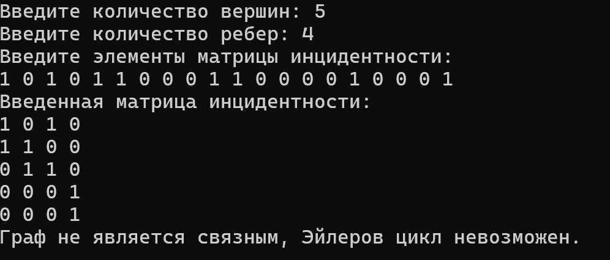
На этом примере видно, что программа отработала верно, т.к. граф действительно не является свяэным и имеет 2 компоненты связности

Четвертый тест: 
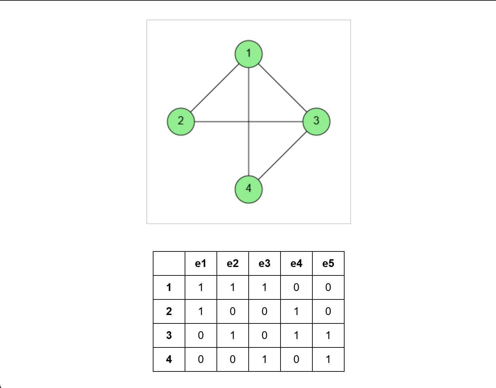
Вывод в консоль:
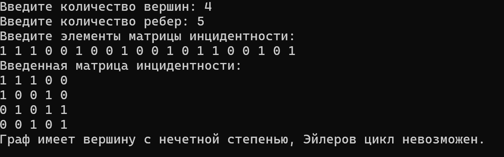
На этом примере видно, что вершины 1 и 3 имеют степень 3, поэтому Эйлеров цикл невозможен

Пятый тест: 
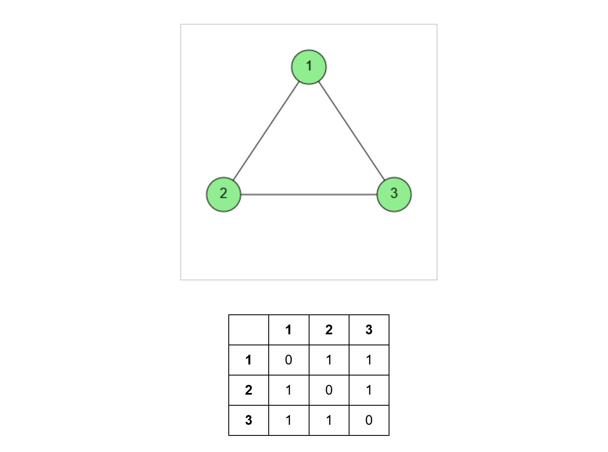
Вывод в консоль:
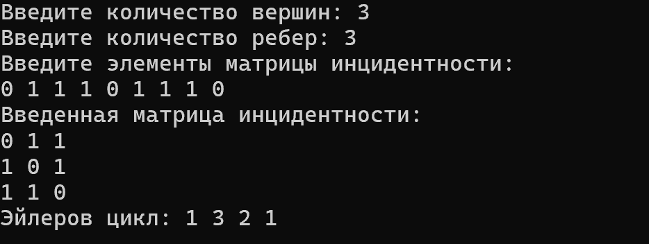

<h3>Вывод:</h3>
В ходе расчетной работы я ознакомился с понятием графа, узгал какие виды графов существуют, познакомился с алгоритмом обхода графа в глубину, а также реализовал алгоритм поиска Эйлерова цикла на языке программирования С++.