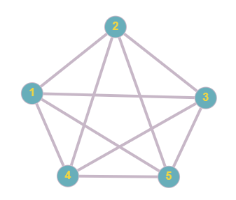
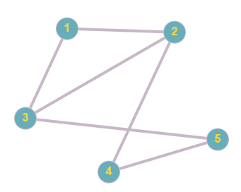

<h1 align= "center"> Рассчетная работа</h1>

### Работа с графами
Цель моей работы заключалась в том, чтобы научится работать с графами. Задача - определить число вершинной связности для неориентированного графа
### Ключевые понятия

Граф

~~~
Graph {
         vertices: V
         edges: E
     }

~~~

Вершина

```
Vertex {
         id: unique_identifier
         attributes: {key:value, ...}
     }
```

Ребро

~~~
Edge {
         source: vertex_id_1
         destination: vertex_id_2
         weight: value // если граф взвешенный
     }
~~~

Ориентировачный граф

~~~
DirectedGraph {
         vertices: V
         directed_edges: E
     }
~~~

Цикл

~~~
Cycle {
         vertices: V_cycle
         edges: E_cycle
     }
~~~
## Тестовые примеры
### Пример 1:
~~~
0 1 1 1
1 0 0 1
1 0 0 0
1 1 0 0
-------
ответ: 1
~~~


### Пример 2:
~~~
0 1 0 1
1 0 0 1
0 0 0 0
1 1 0 0
-------
ответ: 0
~~~


### Пример 3:
~~~
0 1 0 1 0
1 0 1 0 0
0 1 0 0 1
1 0 0 0 1
0 0 1 1 0
---------
ответ: 2
~~~


### Пример 4:
~~~
0 1 1 1 1
1 0 1 1 1
1 1 0 1 1
1 1 1 0 1
1 1 1 1 0
---------
ответ: 4
~~~


### Пример 5:
~~~
0 1 1 0 0
1 0 1 1 0
1 1 0 0 1
0 1 0 0 1
0 0 1 1 0
---------
ответ: 2
~~~

# Алгоритм

## Поиск числа вершинной связности
Алгоритм поиска числа вершинной связности реализован в функции vertexConnectivity. Мы используем модифицированный алгоритм Форда-Фалкерсона для нахождения минимального разреза в графе.

```
int vertexConnectivity(const vector<vector<int>>& matrix) 
{
    int n = matrix.size();
    // Начальное значение для минимального разреза ставим максимально большим
    int minCut = INT_MAX;

    for (int source = 0; source < n; ++source) 
    {
        for (int target = source + 1; target < n; ++target) 
        {
            // Копируем исходную матрицу
            vector<vector<int>> graph = matrix;
            // Вектор для хранения пути
            vector<int> parent(n, -1);
            // Вектор для хранения посещенных вершин
            vector<bool> visited(n, false);

            // Лямбда функция для BFS 
            auto bfs = [&](int s, int t) -> bool 
                {
                fill(visited.begin(), visited.end(), false);
                queue<int> q;
                q.push(s);
                visited[s] = true;
                parent[s] = -1;

                while (!q.empty()) 
                {
                    int u = q.front();
                    q.pop();

                    for (int v = 0; v < n; ++v) 
                    {
                        // Если вершина не посещена и есть ребро
                        if (!visited[v] && graph[u][v] > 0) 
                        {
                            if (v == t) 
                            {
                                parent[v] = u;
                                return true;
                            }
                            q.push(v);
                            parent[v] = u;
                            visited[v] = true;
                        }
                    }
                }
                return false;
                };

            int maxFlow = 0;
            
            while (bfs(source, target)) // Пока существует путь от источника к цели 
            {
                int pathFlow = INT_MAX;
                
                for (int v = target; v != source; v = parent[v]) // Нахожу минимальный поток в пути 
                {
                    int u = parent[v];
                    pathFlow = min(pathFlow, graph[u][v]);
                }
              
                for (int v = target; v != source; v = parent[v]) // Обновляю остаточную емкость ребер
                {
                    int u = parent[v];
                    graph[u][v] -= pathFlow;
                    graph[v][u] += pathFlow;
                }
                maxFlow += pathFlow;
            }
          
            minCut = min(minCut, maxFlow); // Обновляю минимальный разрез
        }
    }
    return minCut;
}
```

Основные шаги алгоритма:
Инициализация: Начальное значение minCut установлено в INT_MAX.

Двойной цикл: Проходим по всем парам вершин графа.

Копирование графа: Создаем копию графа для работы.

Инициализация вспомогательных векторов: parent для хранения пути и visited для отметки посещенных вершин.

Поиск в ширину (BFS): Определяем функцию bfs для поиска пути в остаточном графе.

Максимальный поток: Вычисляем поток для каждого найденного пути и обновляем остаточные емкости ребер.

Минимальный разрез: Обновляем значение minCut для каждой пары вершин.

## BFS и лямбда функция
В функции vertexConnectivity алгоритм BFS используется внутри лямбда-функции bfs, которая объявляется и вызывается внутри цикла while.
```
// Лямбда функция для BFS
auto bfs = [&](int s, int t) -> bool {
    fill(visited.begin(), visited.end(), false);
    queue<int> q;
    q.push(s);
    visited[s] = true;
    parent[s] = -1;
    
    while (!q.empty()) {
        int u = q.front();
        q.pop();
        
        for (int v = 0; v < n; ++v) {
            // Если вершина не посещена и есть ребро
            if (!visited[v] && graph[u][v] > 0) {
                if (v == t) {
                    parent[v] = u;
                    return true;
                }
                q.push(v);
                parent[v] = u;
                visited[v] = true;
            }
        }
    }
    return false;
};
```
### 1. Объявление и инициализация

Лямбда-функция bfs объявляется с параметрами s (source) и t (target) и возвращает значение типа bool. Она захватывает ссылки на внешние переменные (используя [&]), что позволяет использовать их внутри функции.

### 2. Инициализация вспомогательных структур
   
В начале функции все элементы вектора visited устанавливаются в false, что означает, что ни одна вершина не была посещена. Создается очередь q, и исходная вершина s добавляется в очередь. Вектор parent используется для хранения путей, где parent[s] устанавливается в -1, указывая на начало пути.

### 3. Основной цикл BFS

Функция входит в цикл while, который продолжается до тех пор, пока очередь не станет пустой.

### 4. Обход смежных вершин

Внутри цикла while, функция извлекает вершину u из начала очереди и проверяет все смежные вершины v (все вершины, с которыми u соединена).

### 5. Условия для добавления вершины в очередь

Для каждой вершины v выполняется проверка: 
Вершина v еще не была посещена (!visited[v]).
Существует ребро от u к v с ненулевой пропускной способностью (graph[u][v] > 0).
Если оба условия выполнены: 
Если вершина v является целевой вершиной t, устанавливается parent[v] = u и функция возвращает true, указывая на успешное нахождение пути.
В противном случае вершина v добавляется в очередь, устанавливается ее родитель parent[v] = u, и она отмечается как посещенная visited[v] = true.

### 6. Завершение поиска

Если очередь опустеет и целевая вершина t не будет найдена, функция возвращает false, указывая на отсутствие пути от s к t.
# Вывод
В ходе данной расчетной работы мной были изучены графы, алгоритм их инициализации и заполнения из файлов, был реализован алгоритм поиска числа вершинной связности на языке программирования с++.
# Список использованных источников
1. Берж К. Теория графов и её применение: монография. — Москва: Издательство иностранной литературы, 1962.

2. Белоусов А.В., Ткачев С.В. Дискретная математика: учебное пособие. — Москва: Издательство МГТУ им. Баумана, 2002.

3. Кормен Т.Х., Лейзерсон Ч.И., Ривест Р.Л., Штайн К. Алгоритмы: построение и анализ (3-е издание): учебное пособие. — Москва: Издательский дом «Вильямс», 2013.

4. Кристофидес Н. Теория графов: алгоритмический подход: монография. — Москва: Мир, 1977.

5. Майника Э. Алгоритмы оптимизации на сетях и графах: монография. — Москва: Мир, 1981.

6. Новиков А.A. Дискретная математика для программистов: учебное пособие. — Санкт-Петербург: Питер, 2001.

7. Уилсон Р. Введение в теорию графов: учебное пособие. — Москва: Мир, 1977.

8. Харари Ф. Теория графов: монография. — Москва: Мир, 1973.

9. [Сторонние работы на GitHub](https://github.com/)


