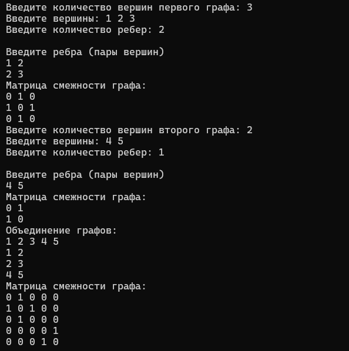
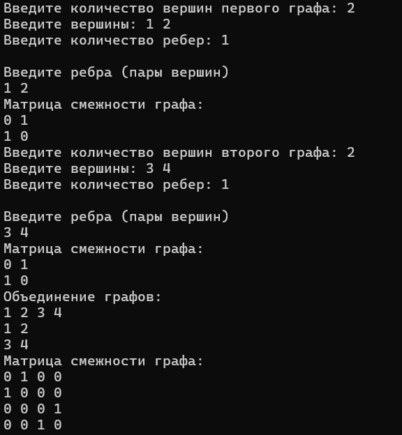
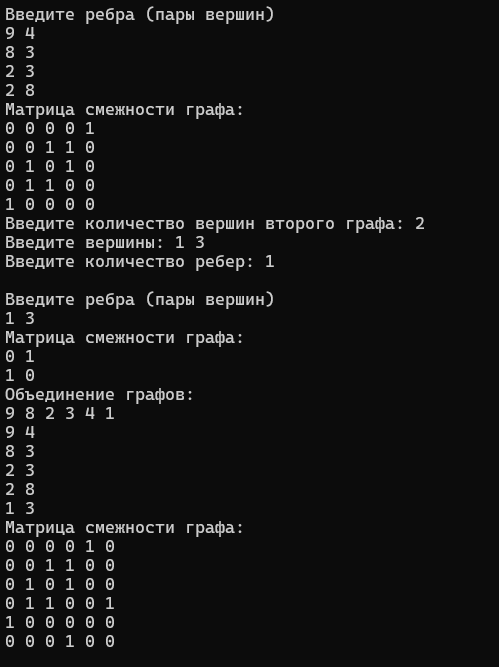
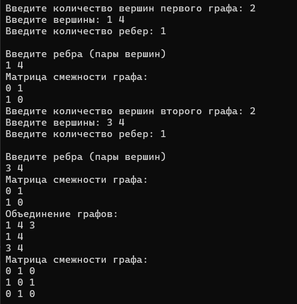

<h1>Рассчетная работа</h1>

<h3>Цель: реализовать объединение двух неориентированных графов, представленных в виде матрицы смежности.</h3>

<h3>Краткие теоретические сведения:</h3>

Граф — математическая абстракция реальной системы любой природы, объекты которой обладают парными связями.

Матрица смежности - это вид представления графа в виде матрицы, когда пересечение столбцов и строк задаёт дуги.

Объединение графов — операция над графами, в результате которой получается граф, множества вершин и рёбер которого являются объединениями множеств вершин и рёбер исходных графов.

<h3>Примеры выполнения задания:</h3>
</img>

</img>

</img>

</img>

</img>

<h3>Вывод:</h3>

В результате выполнения рассчетной работы я познакомился и научился работать с такой структурой данных, как графы, а также научился производить объединение графов.

<h3>Литературные источники:</h3>
<h4>Свободная энциклопедия "Википедия" [Электронный ресурс]-Режим доступа</h4>

<a href="https://ru.wikipedia.org/wiki/Граф_(математика)">https://ru.wikipedia.org/wiki/Граф_(математика)</a>

<h4>Теоретико-множественные операции над графами</h4>

<a href="https://neerc.ifmo.ru/wiki/index.php?title=Теоретико-множественные_операции_над_графами">https://neerc.ifmo.ru/wiki/index.php?title=Теоретико-множественные_операции_над_графами</a>

<h4>Работа с графами онлайн</h4>

<a href="https://graphonline.ru/wiki/Справка/МатрицаСмежности#:~:text=Матрица%20смежности%20-%20это%20вид%20представления,задать%20вес%20дуг%20и%20ориентацию.">https://graphonline.ru/wiki</a>

