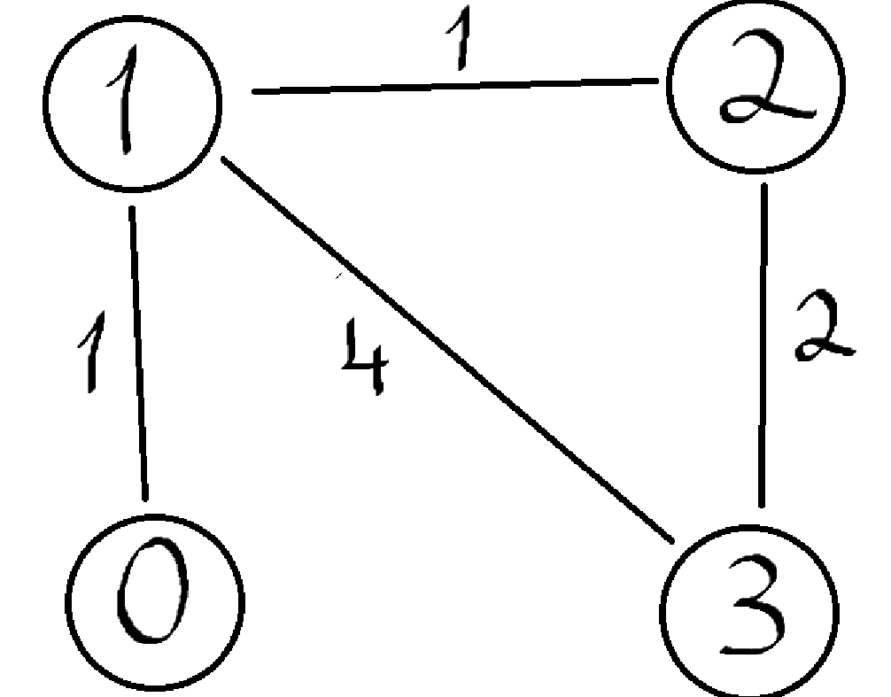
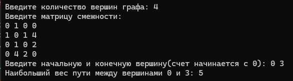
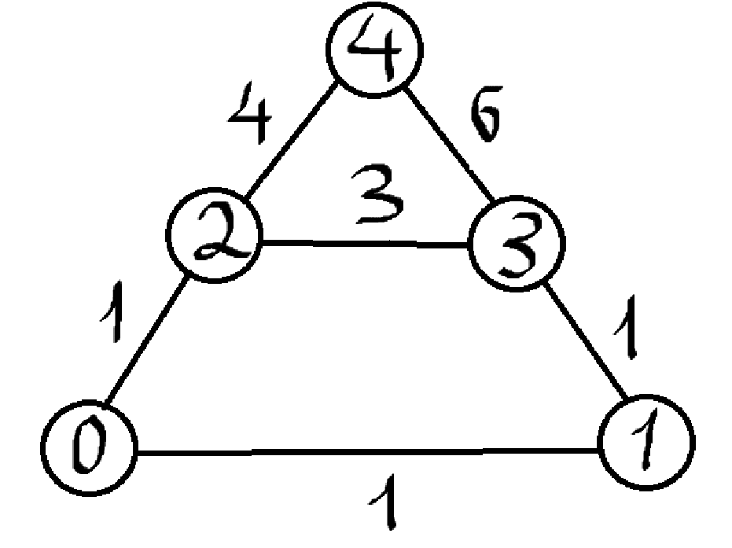
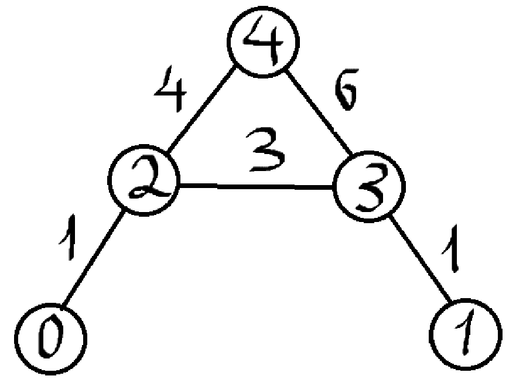

# Расчетная работа 

## Введение

### Цели: 
Научится работать и проводить различные операции с графами.

### Задача: 
Найти максимальный путь между заданными вершинами. 

### Вариант: 
5.18 (матрица смежности)

### Определения:

`Матрица смежности` — это квадратная целочисленная матрица размера n × n, в которой значение элемента a i, j равно числу рёбер из i-й вершины графа в j-ю вершину.

`Граф` — математическая абстракция реальной системы любой природы, объекты которой обладают парными связями. Граф как математический объект есть совокупность двух множеств — множества самих объектов, называемого множеством вершин, и множества их парных связей, называемого множеством рёбер. Элемент множества рёбер есть пара элементов множества вершин.

`Взвешенный граф` - граф, в котором ребра имеют определенное значение(вес).

`Неориентированный граф` - это граф, где рёбра не имеют направления, что делает связь между вершинами двусторонней.

### Алгоритм:
1. Определить количество вершин.
2. Создать и ввести матрицу инцидентности.
3. Запросить начальную и конечную точку.
3. Создать массив visited[] для отслеживания посещенных вершин.
5. Проверить граф на неориентированность.
6. Вызвать функцию, которая в глубину пройдется от начальной точки до конечной и вернет максимальный путь.
7. Проверить есть ли связь между данными точками и вывести результат.

## Код программы:
```cpp
#include <iostream>
#include <vector>
#include <limits.h>

using namespace std;

bool isneop(const vector<vector<int>>& graph) {
    int n = graph.size();
    for (int i = 0; i < n; ++i) {
        for (int j = 0; j < n; ++j) {
            if (graph[i][j] != graph[j][i]) {
                return false; 
            }
        }
    }
    return true; 
}

void poisk(int start, int endt, const vector<vector<int>>& graph, vector<bool>& visit, int now, int& maxp) {
    if (start == endt) {
        maxp = max(maxp, now);

        return;
    }

    visit[start] = true;

    for (int i = 0; i < graph.size(); i++) {
        if (!visit[i] && graph[start][i] > 0) { 
            poisk(i, endt, graph, visit, now + graph[start][i], maxp);
        }
    }

    visit[start] = false; 
}

int main() {
    setlocale(LC_ALL, "Russian");
    int n;
    cout << "Введите количество вершин графа: ";
    cin >> n;

    vector<vector<int>> graph(n, vector<int>(n));
    cout << "Введите матрицу смежности:" << endl;
    for (int i = 0; i < n; ++i) {
        for (int j = 0; j < n; ++j) {
            cin >> graph[i][j];
        }
    }
    if (!isneop(graph)) {
        cout << "Граф не является неориентированным." << endl;
        return 1;
    }
    int start, end;
    cout << "Введите начальную и конечную вершину(счет начинается с 0): ";
    cin >> start >> end;

    vector<bool> visited(n, false);
    int maxp = INT_MIN;

    poisk(start, end, graph, visited, 0, maxp);

    if (maxp == INT_MIN) {
        cout << "Нет пути между вершинами " << start << " и " << end << "." << endl;
    }
    else {
        cout << "Наибольший вес пути между вершинами " << start << " и " << end << ": " << maxp << endl;
    }

    return 0;
}
```
## Пример графа:

## Работа кода:


## Пример графа:

## Пример работы кода:


## Пример графа:

## Пример работы кода:


 ## Вывод
 В результате выполнения данной работы изучил и применил базовые алгоритмы для работы с графами.
  
