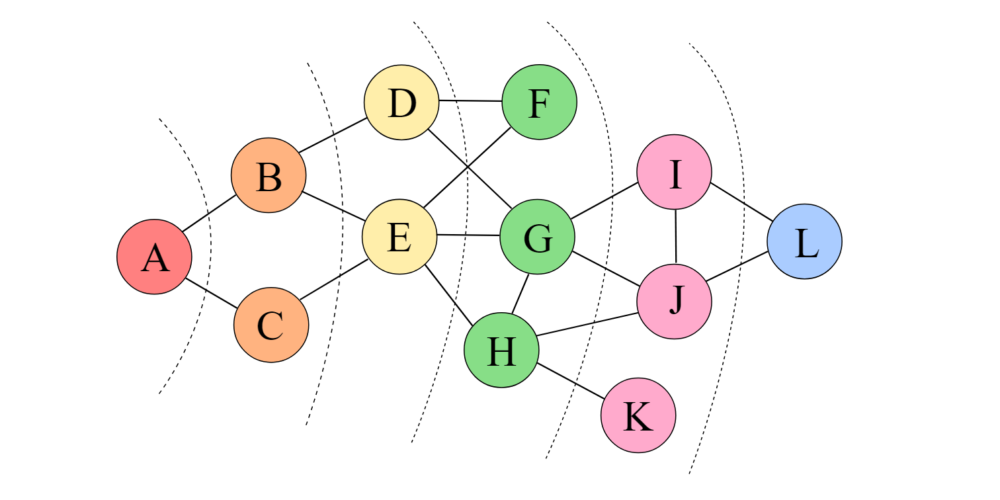
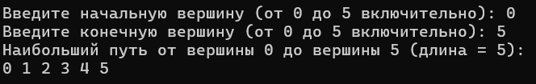
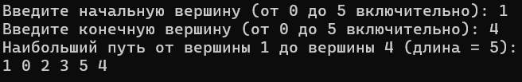

 <h1 align="center">Расчетная работа</h1>

## Цели:
* Изучить основные понятия в теории графов 
* Научиться различать виды графов
* Уметь использовать основные алгоритмы при работе с графами 

## Задачи:
* Выполнить свой вариант расчетной работы
* Перенести получившееся решение на язык программирования С++
* Ознакомиться с оновными алгоритмами по работе с графами

 ## Вариант 
Для расчетной работы мне был выдан вариант **5.18**. Для хранения графов нужно использовать матрицу инцидентности, а также граф должен быть невзвешенным и неориентированным. Задание: найти максимальный путь между заданными вершинами.
### Базовые сведения о графах, которые нужны для выполнения расчетной работы ###

<b>Граф</b> — математическая абстракция реальной системы любой природы, объекты которой обладают парными связями. Граф как математический объект есть совокупность двух множеств — множества самих объектов, называемого множеством вершин, и множества их парных связей, называемого множеством рёбер.

 **Ориентированный граф** - граф, рёбрам которого присвоено направление. Направленные рёбра именуются также дугами, а в некоторых источниках и просто рёбрами.

**Неориентированный граф** - граф, в котором рёбра не указывают направление. Это значит, что из любой вершины можно попасть в любую точку графа.

**Связный граф** — граф, в котором существует путь между любой парой вершин. Из каждой вершины по рёбрам можно добраться до любой другой вершины. В связном графе нет изолированных вершин или групп, которые не связаны с остальными частями графа.

**Невзвешенный граф** — граф, в котором рёбра и вершины не имеют никаких числовых значений, а только факт наличия или отсутствия связи между вершинами.

**Взвешенный граф** — граф, в котором каждому ребру присвоено числовое значение — вес. Это может быть расстояние, время, стоимость, мощность или другая характеристика, связанная с соединением вершин.

### Основные алгоритмы для работы с графами 

**Поиск в глубину**

Поиск в глубину (англ. Depth-first search, DFS) — один из методов обхода графа. Стратегия поиска в глубину, как и следует из названия, состоит в том, чтобы идти «вглубь» графа, насколько это возможно. 

Алгоритм поиска описывается рекурсивно: перебираем все исходящие из рассматриваемой вершины рёбра. Если ребро ведёт в вершину, которая не была рассмотрена ранее, то запускаем алгоритм от этой нерассмотренной вершины, а после возвращаемся и продолжаем перебирать рёбра. Возврат происходит в том случае, если в рассматриваемой вершине не осталось рёбер, которые ведут в нерассмотренную вершину. Если после завершения алгоритма не все вершины были рассмотрены, то необходимо запустить алгоритм от одной из нерассмотренных вершин [ссылка](https://ru.wikipedia.org/wiki/%D0%9F%D0%BE%D0%B8%D1%81%D0%BA_%D0%B2_%D0%B3%D0%BB%D1%83%D0%B1%D0%B8%D0%BD%D1%83).

**Поиск в ширину**

Под обходом понимается последовательное посещение (обработка) вершин графа в определённом порядке. Одним из двух часто использующихся способов обхода является обход в ширину, или BFS (англ. breadth-first search, поиск в ширину). Его иногда также называют волновым, по аналогии с распространяющейся волной.

Суть BFS достаточно проста. Обход начинается с посещения определённой вершины (для обхода всего графа часто выбирается произвольная вершина). Затем алгоритм посещает соседей этой вершины. За ними - соседей соседей, и так далее.

## Выполнение рассчетной работы

### Способ хранения графа

Для выполнения рассчетной работы граф хранился с помощью **матрицы инцидентности.**

### Тестовые примеры
~~~
1 0 0 0 0 1 0 1 0 0
1 1 0 0 0 0 0 0 0 0
0 1 1 0 0 1 1 0 0 1
0 0 1 1 0 0 0 0 1 0
0 0 0 1 1 0 0 0 0 1
0 0 0 0 1 0 1 1 1 0
~~~
От вершины 0 до вершины 5:

От вершины 1 до вершины 4:

### Ввод
На вход получена матрица инцидентности 6*10.
Количество ребер равно 10.
Количество вершин 10.

### Алгоритм
Мы используем vector\<bool\> для того,чтобы определить, какие графы мы посетили. Как только мы находим не посещенный граф, запускаем алгоритм поиска в глубину, который написан отдельной от главной функции функцией. После этого мы доходим до момента, когда все соседные вершины посещены, и если последняя вершина является концом заданного пути, мы сохраняем путь до этой вершины и длину пути (они становятся максимальными), которые обновляются, если алгоритм нашёл путь длинее максимального. И при новом запуске функции обнуляем vector\<bool\>.

## Вывод:

Во время выполнения рассчетной работы проделал следующую работу:
* Ознакомился с понятием графов.
* Изучил, какие виды графов бывают (ориентированные/неориентированные, взвешенные/ невзвешенные).
* Ознакомился с таким способом представления графов в памяти компьютера, как матрица инцидентности.
 Также в ходе выполнения рассчетной работы реализовал поиск в глубину на языке С++, проверил его работу .

## Используемые  источники

1. Берж К. Теория графов и её применение: монография. — Москва: Издательство иностранной литературы, 1962.
2. Белоусов А.В., Ткачев С.В. Дискретная математика: учебное пособие. — Москва: Издательство МГТУ им. Баумана, 2002.
3. Кормен Т.Х., Лейзерсон Ч.И., Ривест Р.Л., Штайн К. Алгоритмы: построение и анализ (3-е издание): учебное пособие. — Москва: Издательский дом «Вильямс», 2013.
4. Кристофидес Н. Теория графов: алгоритмический подход: монография. — Москва: Мир, 1977.
5. Майника Э. Алгоритмы оптимизации на сетях и графах: монография. — Москва: Мир, 1981.
6. Новиков А.A. Дискретная математика для программистов: учебное пособие. — Санкт-Петербург: Питер, 2001.
7. Уилсон Р. Введение в теорию графов: учебное пособие. — Москва: Мир, 1977.
8. Харари Ф. Теория графов: монография. — Москва: Мир, 1973.

