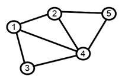
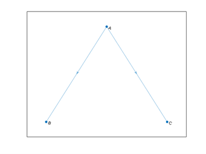
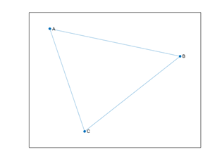
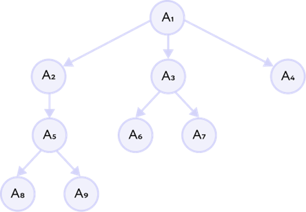
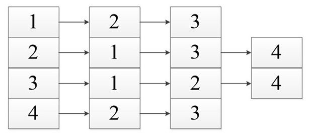
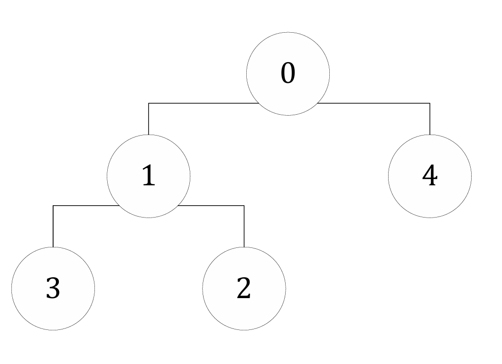

# Расчетная работа. Теория графов
## Цель:
 Ознакомиться с понятием графов.
- Выяснить, какие виды графов бывают.
- Ознакомиться со способами представления графов в памяти компьютера.
- Научиться решать теоретико-графовые задачи. 

## Задания
Вариант 1.1 Граф задается списком смежности (списком инцидентности). Необходимо определить является ли дерево графом.

Варианты можно найти [тут](https://drive.google.com/file/d/1-rSQZex8jW-2DlY2kko18gU1oUAtEGHl/view).

## Основные понятия:
- ** Граф — математическая абстракция реальной системы любой природы, объекты которой обладают парными связями. Граф как математический объект есть совокупность двух множеств — множества самих объектов, называемого множеством вершин, и множества их парных связей, называемого множеством рёбер.
  

  
- ** Ориентированный граф — это граф, на всех ребрах которого выбрано одно из двух направлений. Ребра в ориентированном графе часто называют дугами. Ориентированные графы имеют ребра с направлением. Ребра указывают на одностороннее отношение, в котором каждое ребро может только быть пересечено в одном направлении. Этот рисунок показывает простого ориентированного графа с тремя узлами и двумя ребрами.

- ** Неориентированные графы имеют ребра, которые не имеют направления. Ребра указывают на двухстороннее отношение, в котором каждое ребро может быть пересечено в обоих направлениях. Этот рисунок показывает простого неориентированного графа с тремя узлами и тремя ребрами.

- ** Деревья особый вид графов, в которых нет замкнутых областей, но между каждой парой вершин проложен путь.
 

  
- ** Поддерево — фрагмент дерева, который сам является деревом.
- ** Путь — последовательность связанных между собой узлов.
- ** Высота дерева — самая длинная последовательность узлов от корня до листа.
- ** Предок — узел верхнего уровня.
- ** Потомок — узел нижнего уровня.
- ** Смежностью вершин графа – называется отношение между двумя вершинами, в котором существует ребро их соединяющее. Инцидентность – это когда вершина a является началом или концом ребра t. Если мы добавим еще одну вершину b, то мы скажем, что вершина a и b инцидента ребру t. Кроме вершин, смежность присутствует и у рёбер.

В виде списка это будет выглядеть так:

  

## Тесты:

## Алгоритм:

### Описание алгоритма
#### Входные данные
На вход алгоритму подаются:

1. Колличество вершин графа.

2. Колличество рёбер графа.

3. Задаётся ориентированность графа.

#### Описание проверки
Пусть дан граф:

Входные данные для данного графа :

Колличество вершин : 5

Колличество рёбер : 4

Ориентированность графа : 0-неориентированный

На основе данных составляется список смежности размера. Если в графе есть ребро между двумя вершинами, то устанавливается связь между соответствующими вершинами.

#### Сначала выполняется DFS для исходного графа, для этого

- Определяем функцию, которая рекурсивно проверяет наличие цикла в графе.

- Помечаем текущую вершину как посещенную.

- Проверяем каждую соседнюю вершину текущей вершины.

- Если соседняя вершина не была посещена, рекурсивно проверяем её на наличие цикла.

- Если соседняя вершина была посещена и не является родительской вершиной, то найден цикл.
  
- Определяем функцию, которая проверяет, является ли граф деревом.

- Используем функцию проверки на наличие цикла, начиная с первой вершины.

- Если найден цикл, граф не является деревом.

- Проверяем, все ли вершины были посещены. Если какая-то вершина не была посещена, граф не является деревом.

- Если все вершины были посещены и цикл не найден, граф является деревом.

#### Завершение работы
Если при обходе не было найдено циклов и все вершины были посещены, граф является деревом. Если найден цикл или граф не связен, граф не является деревом. 
Данный граф является деревом.

## Вывод:

В ходе данной расчетной работы был реализован алгоритм решения задачи 1.1 и перенесен на ЯП C++.
Ознакомилася с понятием графов.
Изучила, какие виды графов бывают (ориентированные/неориентированные).
Ознакомилася с таким способом представления графов в памяти компьютера, как список смежности.

## Использованные источники:

Информация для работы с графами на C++ была взята [отсюда](https://brestprog.by/topics/) и  [отсюда](https://prog-cpp.ru/data-graph/);
Дополнительную информацию по теории графов можно найти [по ссылке](https://habr.com/ru/companies/otus/articles/568026/);
