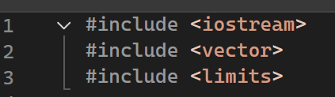
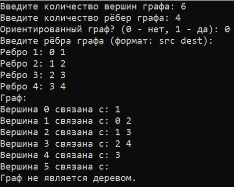
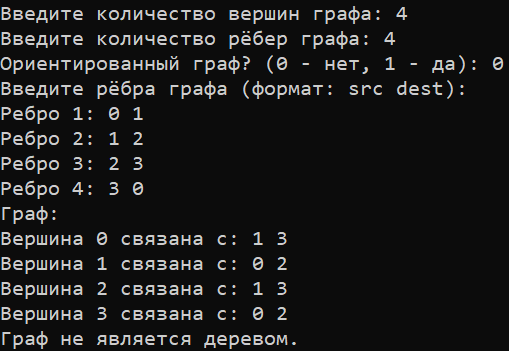
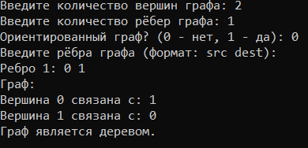
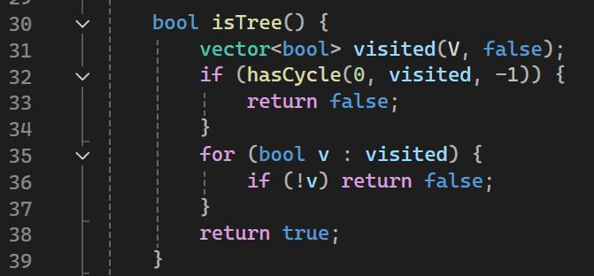
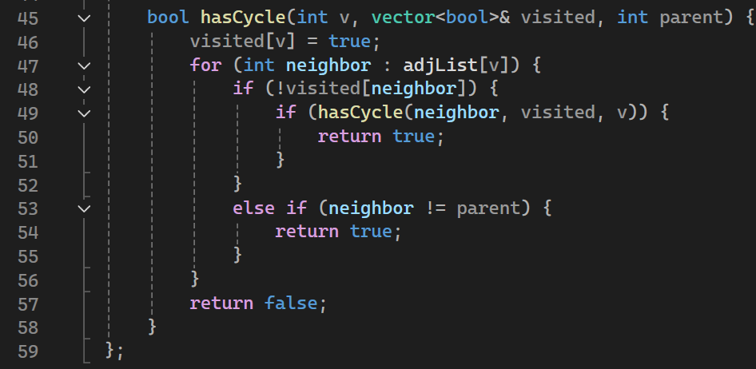
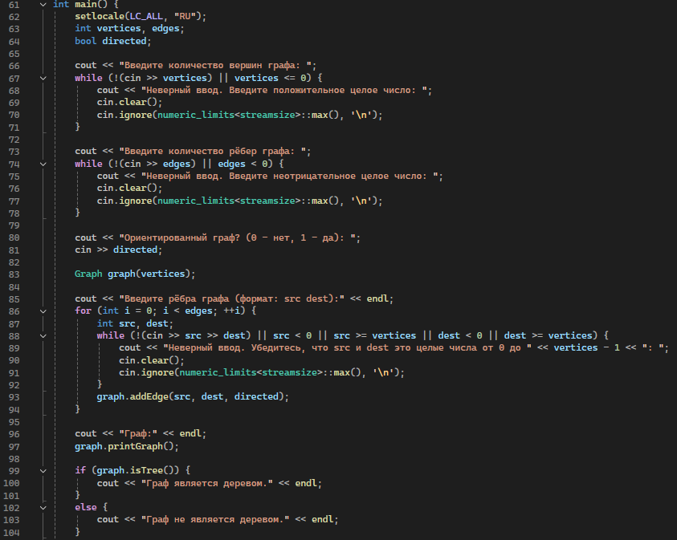
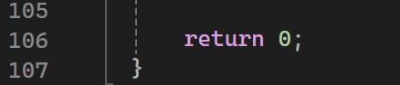

# Расчетная работа. Теория графов
## Цель:
 Ознакомиться с понятием графов.
- Выяснить, какие виды графов бывают.
- Ознакомиться со способами представления графов в памяти компьютера.
- Научиться решать теоретико-графовые задачи. 

## Вариант
Вариант 1.1 Граф задается списком смежности (списком инцидентности). Необходимо определить является ли дерево графом.

Варианты можно найти [тут](https://drive.google.com/file/d/1-rSQZex8jW-2DlY2kko18gU1oUAtEGHl/view).

## Используемые переменные:
-  int V - количество вершин графа.
-  vector<vector<int>> adjList - список смежности, представляющий граф, где каждый элемент - вектор, содержащий соседей соответствующей вершины.
-  int vertices - количество вершин, введенное пользователем.
-  int edges - количество рёбер, введенное пользователем.
-  bool directed - флаг, указывающий, ориентированный ли граф.

## Используемые команды:
-  #include - подключает библиотеки.
-  using namespace std - позволяет не писать std::.
-  class - объявляет новый класс.
-  public и private - устанавливает область видимости для членов класса.
-  vector - используется для создания динамических массивов.
-  cout - выводит данные на стандартное устройство вывода (консоль).
-  cin - вводит данные из стандартного устройства ввода (консоль).
-  if, else, while, for - управляющие конструкции для выполнения условий и циклов.
-  return - возвращает значение из функции и завершает её выполнение

## Пошаговое выполнение работы:

### 1.Подключение библиотек:

   - Подключить необходимые библиотеки: iostream, vector, limits.

### 2. Определение класса Graph

   - Создать класс Graph, который будет представлять граф.
   - Определить конструктор для инициализации количества вершин и создание списка смежности.

### 3. Метод addEdge

   - Реализовать метод addEdge для добавления рёбер в граф.
   - Обработать случай направленного и ненаправленного графа.

### 4. Метод printGraph

   - Реализовать метод printGraph для вывода графа на экран.

### 5. Метод isTree

   - Реализовать метод isTree, который проверяет, является ли граф деревом.
   - Внутри метода использовать вспомогательный метод hasCycle для проверки наличия циклов.

### 6. Метод hasCycle

   - Реализовать метод hasCycle, который проверяет наличие циклов в графе с использованием обхода в глубину.

### 7. Функция main

   - Установить локализацию для корректного отображения текста на русском языке.
   - Запросить у пользователя количество вершин и рёбер графа, проверяя корректность ввода.
   - Запросить, является ли граф направленным.
   - Создать объект графа.
   - Запросить у пользователя ввод рёбер графа, проверяя корректность ввода.
   - Вызвать метод printGraph для отображения графа.
   - Проверить, является ли граф деревом, и вывести соответствующее сообщение.

### 8. Завершение программы

   - Завершить выполнение программы с кодом возврата 0.

## Вывод:

В ходе данной расчетной работы был реализован алгоритм решения задачи 1.1 и перенесен на ЯП C++.
Ознакомилася с понятием графов.
Изучила, какие виды графов бывают (ориентированные/неориентированные).
Ознакомилася с таким способом представления графов в памяти компьютера, как список смежности.

## Использованные источники:

Информация для работы с графами на C++ была взята [отсюда](https://brestprog.by/topics/);

Дополнительную информацию по теории графов можно найти [по ссылке](https://habr.com/ru/companies/otus/articles/568026/);

Код данной работы можно найти [здесь](https://github.com/iis-42x70x/RPIIS/blob/Адамович_К/sem1/RR/code.cpp).
