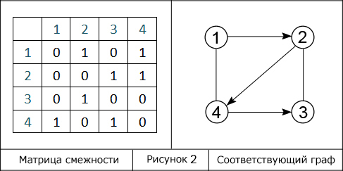
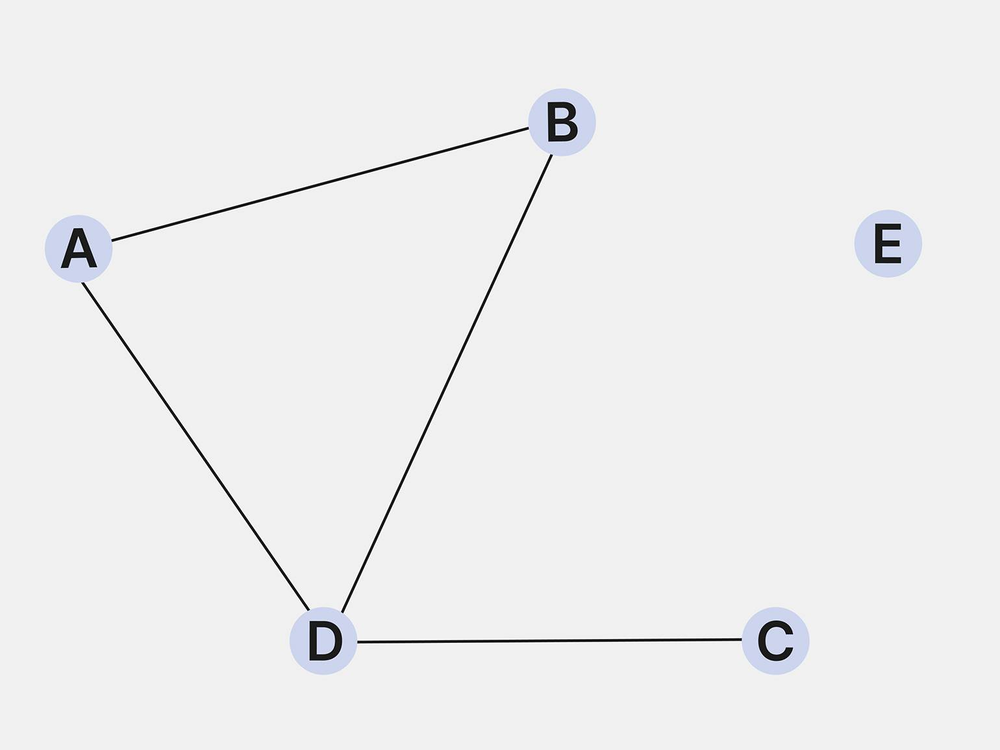
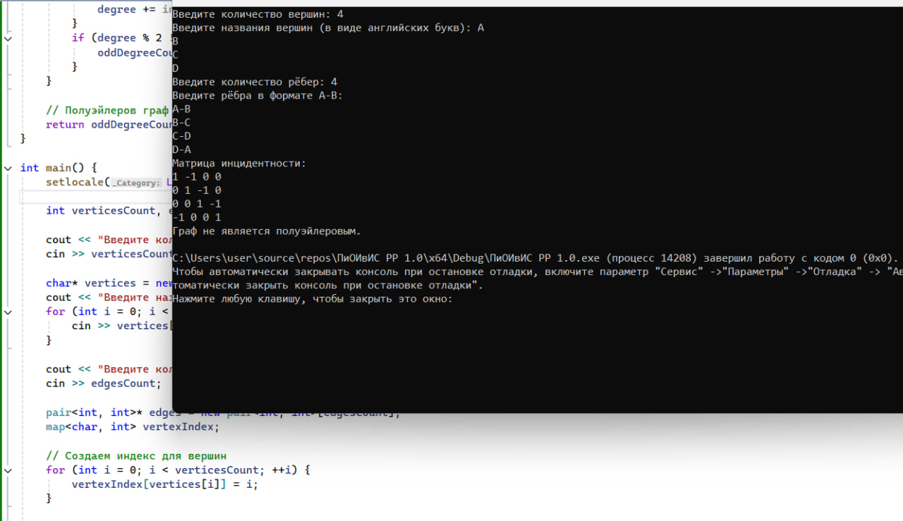
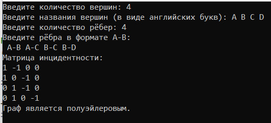
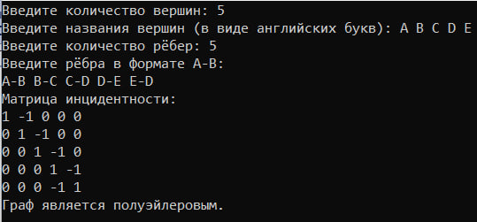
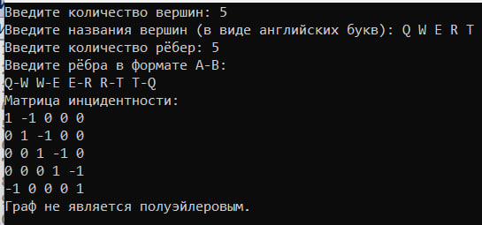

# Отчёт по расчётной работе
**Цель работы:**
1) Изучить основные понятия в теории графов

2) Научиться различать виды графов

3) Уметь использовать основные алгоритмы при работе с графами

**Задачи:**
1) Выполнить свой вариант расчётной работы
2) Перенести получившееся решение на язык программирования С++
3) Ознакомиться с основными алгоритмами по работе с графами

**Вариант расчетной работы:**

Вар. 1.3. Определить, является ли заданный граф полуэйлеровым, используя матрицу инцидентности

**Основные понятия, использованные в данной работе:**

- Граф — математическая абстракция реальной системы любой природы, объекты которой обладают парными связями. Граф как математический объект есть совокупность двух множеств — множества самих объектов, называемого множеством вершин, и множества их парных связей, называемого множеством рёбер.
 

    

- Матрица смежности — это способ представления графа в виде двумерного массива (или матрицы), который используется для хранения информации о связях между вершинами графа. В этой матрице строки и столбцы соответствуют вершинам графа, а элементы матрицы указывают на наличие или отсутствие ребер между этими вершинами.
 

    

- Полуэйлеров граф — когда цикл проходит по всем рёбрам ровно один раз, но не возвращается в исходную вершину

    

---
**Примеры выполнения задания:**

Тест 1) 

    

---
Тест 2) 

    

---
Тест 3) 

    

---
Тест 4)    

    

---
Тест 5) 

    

---

**Описание алгоритма на примере 4 теста:**

Пользователем вводится количество вершин графа (в нашем случае 5), далее пользователь вводит через пробел названия вершин (не важно, в каком порядке(У нас это A B C D E) и количество рёбер (5). Потом пользователю нужно ввести направления рёбер (A-B B-C C-D D-E E-D). После ввода программа выводит на экран матрицу инцидентности к данному графу и определяет, является ли заданный граф полуэйлеровым (в нашем случае является).

---
**Вывод:**
В результате выполнения рассчетной работы я познакомилась и научилась работать с такой структурой данных, как графы, а также научилась создавать матрицу смежности и отличать эйлеров граф от полуэйлерова.

---
**Литературные источники:**
- Теория графов: деревья, планарность, разновидности графов:
https://skillbox.ru/media/code/teoriya-grafov-derevya-planarnost-raznovidnosti-grafov/#stk-1
