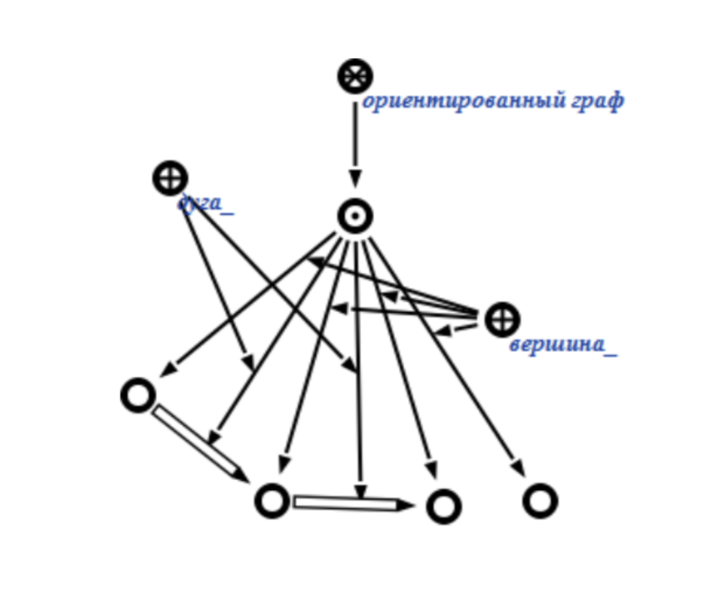
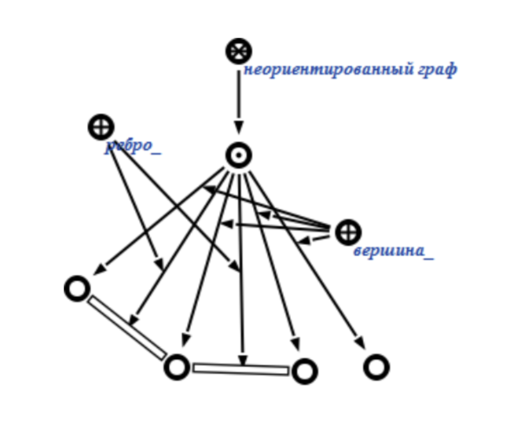
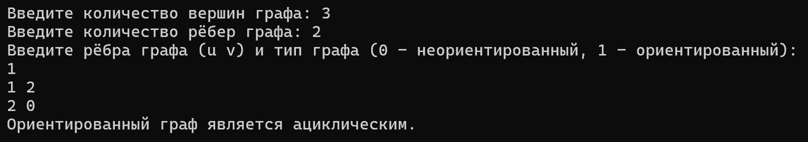
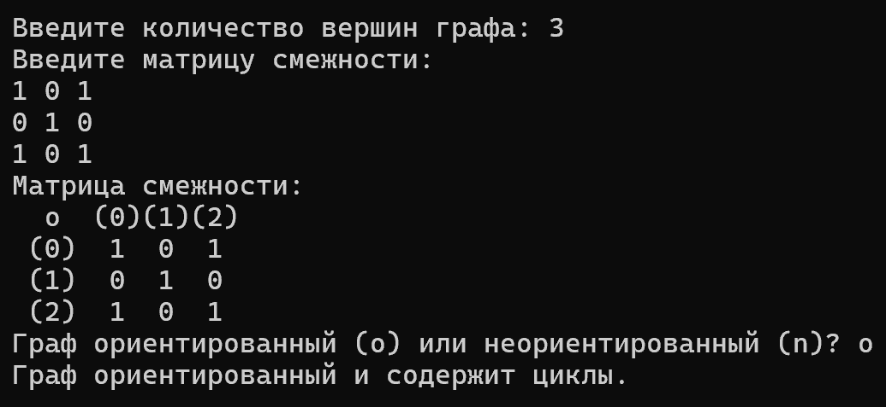
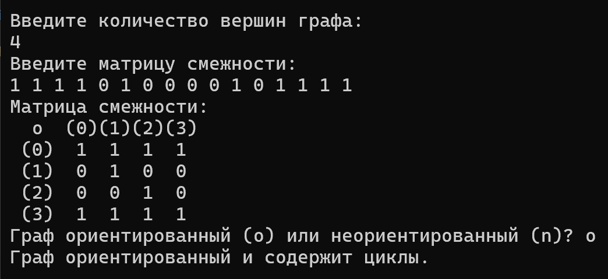
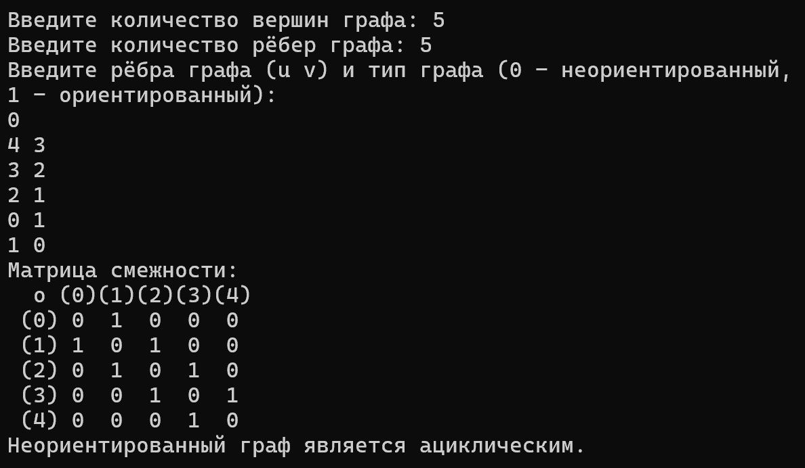

<h1 align="center">Расчётная работа. Теория Графов.</h1>

## Цели:
* Изучить основные понятия в теории графов 
* Научиться различать виды графов
* Уметь использовать основные алгоритмы при работе с графами 

## Задачи:
* Выполнить свой вариант расчётной работы
* Перенести получившееся решение на язык программирования С++
* Ознакомиться с основными алгоритмами по работе с графами

 ## Вариант 
Расчётная работа: вариант **1.2**. Нужно определить является ли граф ациклическим, используя матрицу смежности для ориентированного или неориентированного графа
### Базовые сведения о графах, которые требуются для выполнения расчётной работы 
###


**`Граф`** — математическая абстракция реальной системы любой природы, объекты которой обладают парными связями. Граф как математический объект есть совокупность двух множеств — множества самих объектов, называемого множеством вершин, и множества их парных связей, называемого множеством рёбер.

- **`Ориентированный граф`** — это такой граф, в котором все связки
являются дугами:
<p ></p>

- **`Неориентированный граф`** — это такой граф, в котором все связки
являются ребрами:
<p ></p>

- **`Ациклический граф`** — это граф, который не содержит циклов. Проще говоря, в ациклическом графе невозможно начать с какой-либо вершины, пройти по рёбрам и вернуться в ту же вершину, не проходя по одному и тому же ребру дважды.

### Типы ациклических графов:

- **`Ориентированный ациклический граф (DAG)`**: В этом графе рёбра имеют направление, и он не содержит ориентированных циклов. DAG часто используются в компьютерных науках для моделирования зависимостей между задачами (например, расписание задач или представление зависимостей между пакетами).

- **`Неориентированный ациклический граф`**: В этом графе рёбра не имеют направления, и он не содержит неориентированных циклов. Если граф также является связным (то есть между любой парой вершин существует путь), такой граф называется деревом.

### Примеры применения:

**`Ориентированные ациклические графы (DAG)`** используются в компиляторах для представления зависимостей между различными этапами компиляции.

**`Неориентированные ациклические графы (деревья)`** широко применяются в теории графов и алгоритмах, таких как поиск кратчайшего пути или минимального остовного дерева.


### Основные алгоритмы для работы с графами 

**`Матрица смежности`** — это квадратная матрица, используемая для представления графа в теории графов. Элементы матрицы смежности показывают, существует ли ребро между парой вершин графа. Она широко применяется как для ориентированных, так и для неориентированных графов.
<p ></p>

 ### Пример:
Допустим, у нас есть неориентированный граф с вершинами {1, 2, 3} и рёбрами 
{(1, 2), (2, 3)}.
 Матрица смежности будет выглядеть следующим образом:
<p ></p>

- `Обход графа в глубину, или DFS (англ. depth-first search).` Стратегия поиска в глубину состоит в том, чтобы идти «вглубь» графа настолько, насколько это возможно, а после упора в тупик пойти обратно до ближайшей развилки, после встречи с которой пойти туда, где ещё не были, повторяя алгоритм.
<p ></p>
Пример из кода:

```c++
void dfsDir(int v, int adjMatrix[N][N], bool vis[N], bool St[N], bool& hasc) {
    if (!vis[v]) {
        vis[v] = true;
        St[v] = true;

        for (int i = 0; i < N; ++i) {
            if (adjMatrix[v][i]) {
                if (!vis[i]) {
                    dfsDir(i, adjMatrix, vis, St, hasc);
                    if (hasc) return;
                }
                else if (St[i]) {
                    hasc = true;
                    return;
                }
            }
        }
    }
    St[v] = false;
}
```

- Топологическая сортировка графа — это способ нумерации вершин ориентированного графа, при котором каждое ребро ведёт из вершины с меньшим номером в вершину с большим номером. Алгоритм тривиально определяется через DFS. Будем присваивать номера в убывающем порядке: от большего к меньшему (и, соответственно, от дальнего к ближнему).
<p ></p>


## Выполнение расчётной работы

### Алгоритм выполнения:

1.) Ввод количества вершин графа и матрицы смежности:

- Запрашиваем у пользователя количество вершин графа n.

- Вводим матрицу смежности, которая определяет связи между вершинами.

2.) Вывод матрицы смежности:

- Форматируем и выводим матрицу смежности на экран для наглядности.

3.) Выбор типа графа:

- Запрашиваем у пользователя тип графа: ориентированный (o) или неориентированный (n).

4.) Проверка ацикличности ориентированного графа:

- Используем DFS (поиск в глубину) для проверки наличия циклов в ориентированном графе.

- Если циклы найдены, граф не ациклический, иначе граф ациклический.

5.) Проверка ацикличности неориентированного графа:

- Используем DFS (поиск в глубину) для проверки наличия циклов в неориентированном графе.

- Если циклы найдены, граф не ациклический, иначе граф ациклический.


### код

* **Подключаем нужные библиотеки, импорт всего пространства имен std.**
```c++
#include <iostream>
#include <iomanip>

using namespace std;
```
* **Функция для проверки ацикличности ориентированного графа с использованием поиска циклов через DFS, функция для проверки ацикличности неориентированного графа с использованием поиска циклов через DFS, пример кода которы был указан ранее**

* **Основная часть**.
```c++
   void printAdjMatrix(int adjMatrix[N][N], int n) {
    cout << "Матрица смежности:" << endl;
    cout << "  o  ";
    for (int i = 0; i < n; ++i) {
        cout << setw(1) <<"("<< i<< ")";
    }
    cout << endl;
    for (int i = 0; i < n; ++i) {
        cout << setw(2) << "(" << i << ")";
        for (int j = 0; j < n; ++j) {
            cout << setw(3) << adjMatrix[i][j];
        }
        cout << endl;
    }
}


int main() {
    setlocale(LC_ALL, "RU");
    int n;
    cout << "Введите количество вершин графа: ";
    while (!(cin >> n) || n <= 0 || n > N) {
        cout << "Ошибка ввода! Введите положительное целое число, не превышающее " << N << ": ";
        cin.clear();
        while (cin.get() != '\n');  // Очищаем буфер ввода
    }

    int adjMatrix[N][N] = { 0 };
    cout << "Введите матрицу смежности:" << endl;
    for (int i = 0; i < n; ++i) {
        for (int j = 0; j < n; ++j) {
            while (!(cin >> adjMatrix[i][j])) {
                cout << "Ошибка ввода! Пожалуйста, введите целое число: ";
                cin.clear();
                while (cin.get() != '\n'); 
            }
        }
    }

    printAdjMatrix(adjMatrix, n);

    char graph;
    cout << "Граф ориентированный (o) или неориентированный (n)? ";
    while (!(cin >> graph) || (graph != 'n' && graph != 'o')) {
        cout << "Ошибка ввода! Введите n для неориентированного графа или o для ориентированного: ";
        cin.clear();
        while (cin.get() != '\n');  // Очищаем буфер ввода
    }

    if (graph == 'o') {
        if (DirAcGr(adjMatrix, n)) {
            cout << "Граф ориентированный и ациклический." << endl;
        }
        else {
            cout << "Граф ориентированный и содержит циклы." << endl;
        }
    }
    else if (graph == 'n') {
        if (UndirAcGr(adjMatrix, n)) {
            cout << "Граф неориентированный и ациклический." << endl;
        }
        else {
            cout << "Граф неориентированный и содержит циклы." << endl;
        }
    }
    else {
        cout << "Некорректный ввод типа графа." << endl;
    }

    return 0;
}
```

## Тест

### Проверка №1
  

### Проверка №2


### Проверка №3


### Проверка №4



## Вывод
В ходе выполнения данной расчётной работы:
- Ознакомилась с понятием графов.
- Изучила, какие виды графов бывают (ориентированные/неориентированные).
- Ознакомилась с таким способом представления графов в памяти компьютера, как матрица смежности.
- Реализовала алгоритм решения задачи 1.2 [руководства](https://drive.google.com/file/d/1-rSQZex8jW-2DlY2kko18gU1oUAtEGHl/view) на языке программирования C++ с использованием матрицы смежности.
- Проверила данный алгоритм на корректность при помощи придуманных мной двух тестов.
## Использованные источники
1. Свободная энциклопедия "Википедия" \[Электронный ресурс\]. — Режим доступа: https://ru.wikipedia.org/wiki/Граф_(математика)
2. Сайт "Олимпиадное программирование в Бресте и Беларуси" \[Электронный ресурс\]. — Режим доступа: https://brestprog.by/topics/graphs/
3. Сайт "Олимпиадное программирование в Бресте и Беларуси" \[Электронный ресурс\]. — Режим доступа: https://brestprog.by/topics/dfs/
4. Сайт "Олимпиадное программирование в Бресте и Беларуси" \[Электронный ресурс\]. — Режим доступа: https://brestprog.by/topics/topsort/
