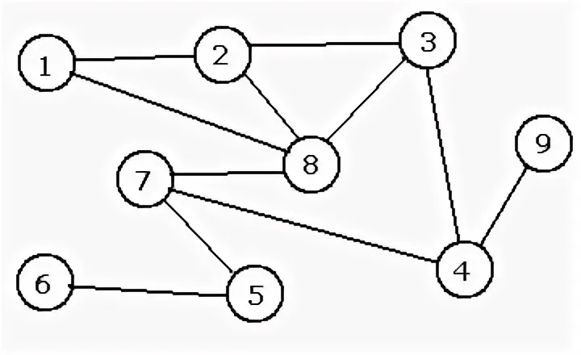
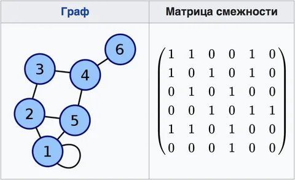
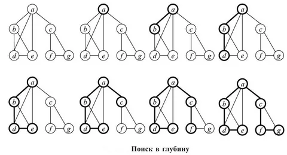
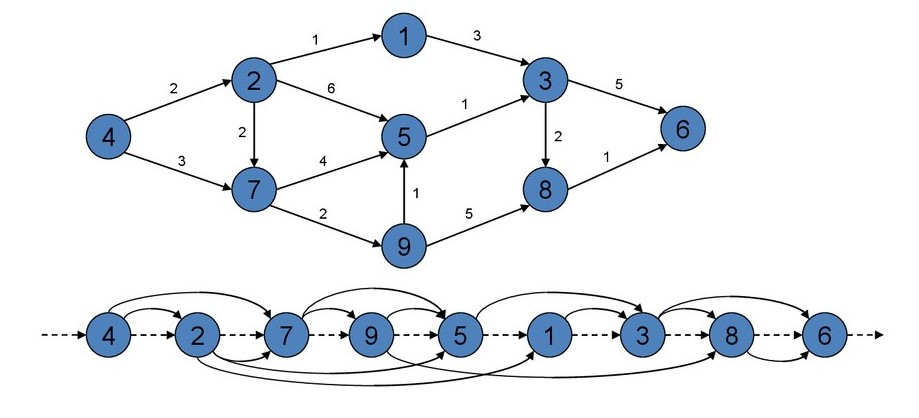

<h1 align="center">Расчётная работа. Теория Графов.</h1>

## Цели:
* Изучить основные понятия в теории графов 
* Научиться различать виды графов
* Уметь использовать основные алгоритмы при работе с графами 

## Задачи:
* Выполнить свой вариант расчётной работы
* Перенести получившееся решение на язык программирования С++
* Ознакомиться с основными алгоритмами по работе с графами

 ## Вариант 
Расчётная работа: вариант **1.2**. Нужно определить является ли граф ациклическим, используя матрицу смежности для ориентированного или неориентированного графа
### Базовые сведения о графах, которые требуются для выполнения расчётной работы 
###




<b>Граф</b> — математическая абстракция реальной системы любой природы, объекты которой обладают парными связями. Граф как математический объект есть совокупность двух множеств — множества самих объектов, называемого множеством вершин, и множества их парных связей, называемого множеством рёбер.

- **Ориентированный граф** — это такой граф, в котором все связки
являются дугами:
<p ></p>

- **Неориентированный граф** — это такой граф, в котором все связки
являются ребрами:
<p ></p>

- **Ациклический граф** — это граф, который не содержит циклов. Проще говоря, в ациклическом графе невозможно начать с какой-либо вершины, пройти по рёбрам и вернуться в ту же вершину, не проходя по одному и тому же ребру дважды.

### Типы ациклических графов:

- **Ориентированный ациклический граф (DAG)**: В этом графе рёбра имеют направление, и он не содержит ориентированных циклов. DAG часто используются в компьютерных науках для моделирования зависимостей между задачами (например, расписание задач или представление зависимостей между пакетами).

- **Неориентированный ациклический граф**: В этом графе рёбра не имеют направления, и он не содержит неориентированных циклов. Если граф также является связным (то есть между любой парой вершин существует путь), такой граф называется деревом.

### Примеры применения:

**Ориентированные ациклические графы (DAG)** используются в компиляторах для представления зависимостей между различными этапами компиляции.

**Неориентированные ациклические графы (деревья)** широко применяются в теории графов и алгоритмах, таких как поиск кратчайшего пути или минимального остовного дерева.


### Основные алгоритмы для работы с графами 

**Матрица смежности** — это квадратная матрица, используемая для представления графа в теории графов. Элементы матрицы смежности показывают, существует ли ребро между парой вершин графа. Она широко применяется как для ориентированных, так и для неориентированных графов.
<p ></p>

  Пример:
Допустим, у нас есть неориентированный граф с вершинами {1, 2, 3} и рёбрами 
{(1, 2), (2, 3)}.
 Матрица смежности будет выглядеть следующим образом:
<p ></p>

- Обход графа в глубину, или DFS (англ. depth-first search). Стратегия поиска в глубину состоит в том, чтобы идти «вглубь» графа настолько, насколько это возможно, а после упора в тупик пойти обратно до ближайшей развилки, после встречи с которой пойти туда, где ещё не были, повторяя алгоритм.
<p ></p>
Пример из кода:

```
// Функция для проверки ацикличности неориентированного графа с использованием поиска циклов через DFS
bool dfs(int** adjMatrix, bool* visited, int* parent, int v, int n) 
{
    visited[v] = true;
    for (int u = 0; u < n; ++u) {
        if (adjMatrix[v][u]) {
            if (!visited[u]) {
                parent[u] = v;
                if (dfs(adjMatrix, visited, parent, u, n)) {
                    return true;
                }
            }
            else if (parent[v] != u) {
                return true;
            }
        }
    }
    return false;
}

bool isAcyclicUndirected(int** adjMatrix, int n) {
    bool* visited = new bool[n]();
    int* parent = new int[n]();
    for (int i = 0; i < n; ++i) {
        parent[i] = -1;
    }

    for (int i = 0; i < n; ++i) {
        if (!visited[i]) {
            if (dfs(adjMatrix, visited, parent, i, n)) {
                delete[] visited;
                delete[] parent;
                return false;
            }
        }
    }

    delete[] visited;
    delete[] parent;
    return true;
}

```

- Топологическая сортировка графа — это способ нумерации вершин ориентированного графа, при котором каждое ребро ведёт из вершины с меньшим номером в вершину с большим номером. Алгоритм тривиально определяется через DFS. Будем присваивать номера в убывающем порядке: от большего к меньшему (и, соответственно, от дальнего к ближнему).
<p ></p>
Пример из кода:

```
// Функция для проверки ацикличности ориентированного графа с использованием метода топологической сортировки
bool isAcyclicDirected(int** adjMatrix, int n) 
{
    int* inDegree = new int[n]();
    for (int i = 0; i < n; ++i) {
        for (int j = 0; j < n; ++j) {
            if (adjMatrix[i][j]) {
                inDegree[j]++;
            }
        }
    }

    // Использование динамического массива в качестве очереди
    int* queue = new int[n];
    int front = 0, rear = 0;

    for (int i = 0; i < n; ++i) {
        if (inDegree[i] == 0) {
            queue[rear++] = i;
        }
    }

    int count = 0;
    while (front != rear) {
        int v = queue[front++];
        count++;

        for (int i = 0; i < n; ++i) {
            if (adjMatrix[v][i]) {
                inDegree[i]--;
                if (inDegree[i] == 0) {
                    queue[rear++] = i;
                }
            }
        }
    }

    delete[] inDegree;
    delete[] queue;
    return count == n;
}
```

## Выполнение расчётной работы
### код

* **Подключаем нужные библиотеки, импорт всего пространства имен std.**
```
#include <iostream>
#include <iomanip>

using namespace std;
```
* **Функция для проверки ацикличности ориентированного графа с использованием метода топологической сортировки, функция для проверки ацикличности неориентированного графа с использованием поиска циклов через DFS, пример кода которы был указан ранее**

* **Основная часть**.
```
// Функция для вывода матрицы смежности
void printAdjMatrix(int** adjMatrix, int n) {
    cout << "Матрица смежности:" << endl;
    cout << "  о";
    for (int i = 0; i < n; ++i) {
        cout << setw(2) << "(" << i << ")";
    }
    cout << endl;
    for (int i = 0; i < n; ++i) {
        cout << setw(2) << "(" << i << ")";
        for (int j = 0; j < n; ++j) {
            cout << setw(2) << adjMatrix[i][j] << " ";
        }
        cout << endl;
    }
}

int main() {
    setlocale(LC_ALL, "RU");
    int n;
    cout << "Введите количество вершин графа: ";
    while (!(cin >> n) || n <= 0) {
        cout << "Ошибка ввода! Введите положительное целое число: ";
        cin.clear();
        cin.ignore(numeric_limits<streamsize>::max(), '\n');
    }

    // Создание матрицы смежности
    int** adjMatrix = new int* [n];
    for (int i = 0; i < n; ++i) {
        adjMatrix[i] = new int[n]();
    }

    int m;
    cout << "Введите количество рёбер графа: ";
    while (!(cin >> m) || m < 0) {
        cout << "Ошибка ввода! Введите неотрицательное целое число: ";
        cin.clear();
        cin.ignore(numeric_limits<streamsize>::max(), '\n');
    }

    cout << "Введите рёбра графа (u v) и тип графа (0 - неориентированный, 1 - ориентированный):" << endl;
    int type;
    while (!(cin >> type) || (type != 0 && type != 1)) {
        cout << "Ошибка ввода! Введите 0 для неориентированного графа или 1 для ориентированного: ";
        cin.clear();
        cin.ignore(numeric_limits<streamsize>::max(), '\n');
    }

    for (int i = 0; i < m; ++i) {
        int u, v;
        while (!(cin >> u >> v) || u < 0 || u >= n || v < 0 || v >= n) {
            cout << "Ошибка ввода! Введите корректные вершины (0 <= u, v < " << n << "): ";
            cin.clear();
            cin.ignore(numeric_limits<streamsize>::max(), '\n');
        }
        adjMatrix[u][v] = 1;
        if (type == 0) {
            adjMatrix[v][u] = 1; // Для неориентированного графа
        }
    }

    printAdjMatrix(adjMatrix, n);

    if (type == 1) {
        if (isAcyclicDirected(adjMatrix, n)) {
            cout << "Ориентированный граф является ациклическим." << endl;
        }
        else {
            cout << "Ориентированный граф является циклическим." << endl;
        }
    }
    else {
        if (isAcyclicUndirected(adjMatrix, n)) {
            cout << "Неориентированный граф является ациклическим." << endl;
        }
        else {
            cout << "Неориентированный граф является циклическим." << endl;
        }
    }

    // Освобождение памяти
    for (int i = 0; i < n; ++i) {
        delete[] adjMatrix[i];
    }
    delete[] adjMatrix;

    return 0;
}
```

## Тест

### Проверка №1
- Тестовые значения:
 
  **количество вершин графа** — 3
  
  **количество ребер графа** — 2
  


### Проверка №2
- Тестовые значения:

  **количество вершин графа** — 3
  
  **количество ребер графа** — 4
  


### Проверка №3
- Тестовые значения:

  **количество вершин графа** — 3
  
  **количество ребер графа** — 3
  


### Проверка №4
- Тестовые значения:

  **количество вершин графа** — 3
  
  **количество ребер графа** — 4
  


## Вывод
В ходе выполнения данной расчётной работы:
- Ознакомилась с понятием графов.
- Изучила, какие виды графов бывают (ориентированные/неориентированные).
- Ознакомилась с таким способом представления графов в памяти компьютера, как матрица смежности.
- Реализовала алгоритм решения задачи 1.2 [руководства](https://drive.google.com/file/d/1-rSQZex8jW-2DlY2kko18gU1oUAtEGHl/view) на языке программирования C++ с использованием матрицы смежности.
- Проверила данный алгоритм на корректность при помощи придуманных мной двух тестов.
## Использованные источники
1. Свободная энциклопедия "Википедия" \[Электронный ресурс\]. — Режим доступа: https://ru.wikipedia.org/wiki/Граф_(математика)
2. Сайт "Олимпиадное программирование в Бресте и Беларуси" \[Электронный ресурс\]. — Режим доступа: https://brestprog.by/topics/graphs/
3. Сайт "Олимпиадное программирование в Бресте и Беларуси" \[Электронный ресурс\]. — Режим доступа: https://brestprog.by/topics/dfs/
4. Сайт "Олимпиадное программирование в Бресте и Беларуси" \[Электронный ресурс\]. — Режим доступа: https://brestprog.by/topics/topsort/
