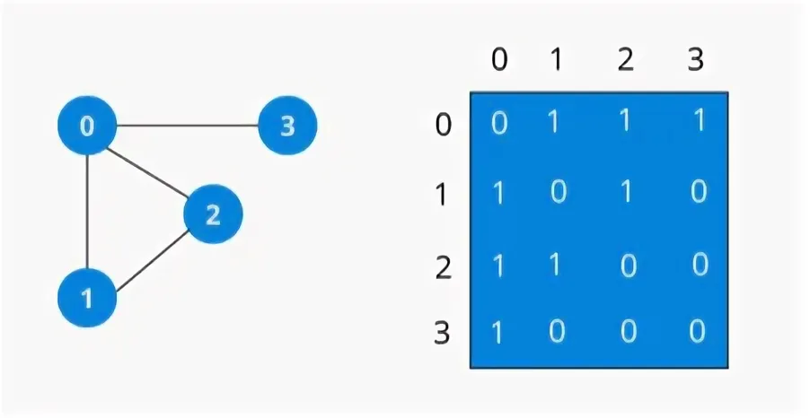

<h1 align="center">Расчётная работа. Теория Графов.</h1>

## Цели:
* Изучить основные понятия в теории графов 
* Научиться различать виды графов
* Уметь использовать основные алгоритмы при работе с графами 

## Задачи:
* Выполнить свой вариант расчётной работы
* Перенести получившееся решение на язык программирования С++
* Ознакомиться с основными алгоритмами по работе с графами

 ## Вариант 
Расчётная работа: вариант **1.2**. Нужно определить является ли граф ациклическим, используя матрицу смежности для ориентированного или неориентированного графа
### Базовые сведения о графах, которые требуются для выполнения расчётной работы 
###


<b>Граф</b> — математическая абстракция реальной системы любой природы, объекты которой обладают парными связями. Граф как математический объект есть совокупность двух множеств — множества самих объектов, называемого множеством вершин, и множества их парных связей, называемого множеством рёбер.

- **Ориентированный граф** — это такой граф, в котором все связки
являются дугами:
<p ></p>

- **Неориентированный граф** — это такой граф, в котором все связки
являются ребрами:
<p ></p>

- **Ациклический граф** — это граф, который не содержит циклов. Проще говоря, в ациклическом графе невозможно начать с какой-либо вершины, пройти по рёбрам и вернуться в ту же вершину, не проходя по одному и тому же ребру дважды.

###Типы ациклических графов:
- **Ориентированный ациклический граф (DAG)**: В этом графе рёбра имеют направление, и он не содержит ориентированных циклов. DAG часто используются в компьютерных науках для моделирования зависимостей между задачами (например, расписание задач или представление зависимостей между пакетами).

- **Неориентированный ациклический граф**: В этом графе рёбра не имеют направления, и он не содержит неориентированных циклов. Если граф также является связным (то есть между любой парой вершин существует путь), такой граф называется деревом.

### Примеры применения:

**Ориентированные ациклические графы (DAG)** используются в компиляторах для представления зависимостей между различными этапами компиляции.

**Неориентированные ациклические графы (деревья)** широко применяются в теории графов и алгоритмах, таких как поиск кратчайшего пути или минимального остовного дерева.


### Основные алгоритмы для работы с графами 

**Матрица смежности** — это квадратная матрица, используемая для представления графа в теории графов. Элементы матрицы смежности показывают, существует ли ребро между парой вершин графа. Она широко применяется как для ориентированных, так и для неориентированных графов.
<p ></p>

  Пример:
Допустим, у нас есть неориентированный граф с вершинами {1, 2, 3} и рёбрами 
{(1, 2), (2, 3)}.
 Матрица смежности будет выглядеть следующим образом:
<p ></p>

- Обход графа в глубину, или DFS (англ. depth-first search). Стратегия поиска в глубину состоит в том, чтобы идти «вглубь» графа настолько, насколько это возможно, а после упора в тупик пойти обратно до ближайшей развилки, после встречи с которой пойти туда, где ещё не были, повторяя алгоритм.
<p ></p>
- Топологическая сортировка графа — это способ нумерации вершин ориентированного графа, при котором каждое ребро ведёт из вершины с меньшим номером в вершину с большим номером. Алгоритм тривиально определяется через DFS. Будем присваивать номера в убывающем порядке: от большего к меньшему (и, соответственно, от дальнего к ближнему).
<p ></p>


## Выполнение расчётной работы

### Способ хранения графа

Для выполнения расчётной работы граф хранился с помощью **матрицы смежности**

вот пример кода 


* Как видно  в коде, для того создать граф  необходимо задать количество вершин и ребер.

* Чтобы заполнить граф, необходимо пройтись циклом **for**  по всем ребрам и задать *начальную* и  *конечную* вершину ,  а также вес каждого ребра.

*  В этом же цикле в начальную  вершину добавляем  пару (конечная вершина, вес ребра),  аналогично поступаем с конечной вершиной.


### План написания кода 
```
dist = массив расстояний от начальной вершины до каждой.
      изначально заполнен бесконечностями (ещё не достигнута).

dist[start] = 0

q = очередь с приоритетом, хранящая пары (d, v),
    где d - предполагаемое расстояние до v

добавить (0,start) в q

пока q не пуста:
    (d, v) = первая вершина в очереди (с минимальным расстоянием), и расстояние до неё
    извлечь (d, v) из очереди

    если dist[v] < d:   //мы уже обработали эту вершину, используя другой путь
        перейти к следующей вершине

    для каждой v -> to:
     прохождении через v
        если dist[v] + weight< dist[to]:        //если мы можем улучшить ответ
            dist[to] = dist[v]+ weight;
            добавить (dist[to], to) в q
```
### код

* **Создание нужных массивов для хранения расстояний, путей, очереди:**
<p text-align="center"></p>

* **Основная часть**.
Улучшение расстояний до вершин (поиск самого короткого пути)

<p text-align="center"></p>

* **Дерево кратчайших путей**. Для того, чтобы вывести кратчайшие пути необходимо было создать массив **pr**, 
который мы изначально заполнили -1. Потом на этапе улучшения расстояний, при  успешном
уменьшении  расстояний записываем нужную вершину в массив. Далее создаем массив **path**,в который
будем записывать вершины до тех пор, пока не встретим -1(не кончится путь).


### Вывод значений путей


## Вывод
В ходе выполнения данной расчётной работы я:
- Ознакомился с понятием графов.
- Выяснил, какие виды графов бывают (ориентированные/неориентированные, связные/несвязные).
- Ознакомился со таким способом представления графов в памяти компьютера, как матрица смежности.
- Реализовал алгоритм решения задачи 4.16 [руководства](https://drive.google.com/file/d/1-rSQZex8jW-2DlY2kko18gU1oUAtEGHl/view) на языке программирования C++ с использованием матрицы смежности и без использованя глобальных переменных.
- Проверил данный алгоритм на корректность при помощи придуманных мной пяти тестов.
## Использованные источники
1. Свободная энциклопедия "Википедия" \[Электронный ресурс\]. — Режим доступа: https://ru.wikipedia.org/wiki/Граф_(математика)
2. Свободная энциклопедия "Википедия" \[Электронный ресурс\]. — Режим доступа: https://ru.wikipedia.org/wiki/Транспонированный_граф
3. Сайт "MAXimal :: algo" \[Электронный ресурс\]. — Режим доступа: http://e-maxx.ru/algo/strong_connected_components
4. Сайт "Algocode wiki" \[Электронный ресурс\]. — Режим доступа: https://wiki.algocode.ru/index.php?title=Конденсация_графа
5. Сайт "Олимпиадное программирование в Бресте и Беларуси" \[Электронный ресурс\]. — Режим доступа: https://brestprog.by/topics/graphs/
6. Сайт "Олимпиадное программирование в Бресте и Беларуси" \[Электронный ресурс\]. — Режим доступа: https://brestprog.by/topics/dfs/
7. Сайт "Олимпиадное программирование в Бресте и Беларуси" \[Электронный ресурс\]. — Режим доступа: https://brestprog.by/topics/connectivity/
8. Сайт "Олимпиадное программирование в Бресте и Беларуси" \[Электронный ресурс\]. — Режим доступа: https://brestprog.by/topics/topsort/
