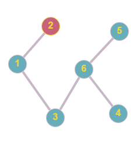
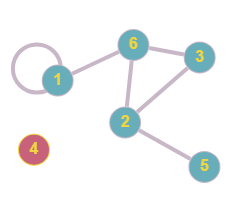
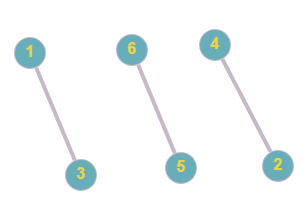
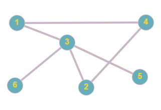
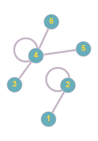
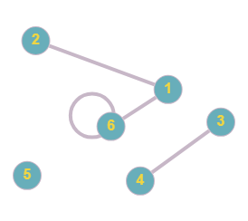
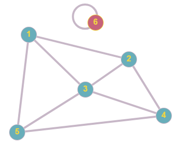
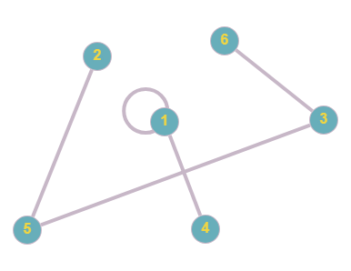
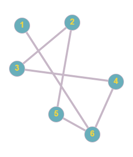

# Расчётная работа.
## Тема работы
Тема работы - основы теории графов, базовые алгоритмы на графах.
## Цель работы
- Ознакомиться с понятием графа.
- Ознакомится с основными типами графов.
- Ознакомиться с различными способами представления графов.
- Научиться решать теоретико-графовые задачи.
## Задачи
Выполнить свой вариант рассчетной работы
Перенести получившееся решение на язык программирования С++
Ознакомиться с оновными алгоритмами по работе с графами
## Вариант
Я выполнил вариант 4.5 из [руководства](https://drive.google.com/file/d/1-rSQZex8jW-2DlY2kko18gU1oUAtEGHl/view?usp=drive_link). Нужно найти композицию двух неориентированных графов. Структура представления данных — список смедности (список инцидентности).
## Список ключевых понятий, использовавшихся при решении задачи
- **Граф** как математический объект есть совокупность двух множеств — множества самих объектов, называемого множеством вершин, и множества их парных связей, называемого множеством рёбер. Элемент множества рёбер есть пара элементов множества вершин.
- Графы, как правило, отображаются графически при помощи точек для представления вершин и отрезков, или ломаных, для отображения рёбер между связанными вершинами. Ориентация ребра (в ориентированном графе) отображается при помощи стрелки.
  Пример графа:
   

- Граф может быть ориентированным и неориентированным.
    - **Ориентированный граф** (далее — орграф) — граф, рёбрам которого присвоено направление. Направленные рёбра именуются также дугами, а в некоторых источниках и просто рёбрами.
    - Граф, ни одному ребру которого не присвоено направление, называется **неориентированным графом**(неорграфом).

На рисунке выше изображен неорграф, а ниже приведен пример орграфа:


Пусть G1(X,E1) и G2(X,E2) — два графа с одним и тем же множеством вершин X.

Композицией G1(G2) графов G1 и G2 называется граф с множеством вершин E, в котором существует дуга (xi,xj) тогда и только тогда, когда существует дуга (xi,xk), принадлежащая множеству E1, и дуга (xk,xj), принадлежащая множеству E2.

## Основные алгоритмы на графах, которые были использованы при решениии теоретико-графовой задачи

Список смежности — один из способов представления графа в виде коллекции списков вершин. Каждой вершине графа соответствует список, состоящий из «соседей» этой вершины.

Ниже представлен пример списка смежности для ориентированного графа:


 
## Текстовые примеры
- Рассмотрим первый тестовый пример:

  

Число вершин - 6, список смежности для этого графа представлени ниже:
```
2 3

6
6
6

```
 

Число вершин - 6, список смежности для этого графа представлени ниже:
```
1 6
3 5 6
6


```
Вывод программы, записанный в текстовом файле:
```
1: 3 5 6 2 
2: 1 6 
3: 1 2 3 
4: 1 2 3 
5: 1 2 3 
6: 2 6 
```
- Рассмотрим второй тестовый пример:

  

Число вершин - 6, список смежности для этого графа представлени ниже:
```
3
4


6

```
 

Число вершин - 6, список смежности для этого графа представлени ниже:
```
3 4
3 4
5 6


```
Вывод программы, записанный в текстовом файле:
```
1: 1 2 5 6 
2: 1 2 
3: 3 4 
4: 3 4 
5: 3 
6: 3 
```
- Рассмотрим третий тестовый пример:

  

Число вершин - 6, список смежности для этого графа представлени ниже:
```
2
2
4
4 5 6


```
 

Число вершин - 6, список смежности для этого графа представлени ниже:
```
2 6

4


6
```
Вывод программы, записанный в текстовом файле:
```
1: 1 
2: 2 6 1 
3: 3 
4: 4 3 1 6 
5: 3 
6: 3 
```
- Рассмотрим четвертый тестовый пример:

  

Число вершин - 6, список смежности для этого графа представлени ниже:
```
2 3 5
3 4
4 5
5

6
```
 

Число вершин - 6, список смежности для этого графа представлени ниже:
```
1 4
5
5 6


```
Вывод программы, записанный в текстовом файле:
```
1: 5 2 3 
2: 1 4 5 6 
3: 5 1 2 3 
4: 5 2 3 
5: 1 4 5 6 
6: 3 
```
- Рассмотрим пятый тестовый пример:

  

Число вершин - 6, список смежности для этого графа представлени ниже:
```
6
3 5
4
6
6

```
 

Число вершин - 6, список смежности для этого графа представлени ниже:
```
2

4 5


```
Вывод программы, записанный в текстовом файле:
```
1: 
2: 4 5 3 
3: 1 3 
4: 4 5 
5: 1 
6: 2 3 
```
## Детализация преобразования входной конструкции в выходную

Рассмотрим пятый текстовый пример:


Входные данные:
```
6
6 
3 5
4
6
6

6
2

4 5


```
Далее следует преобразовать список смежности первого графа в список дуг.

Для данного примера это список для первого графа выглядит следующим образом:
```
1 6
6 1
2 3
3 2
2 5
5 2
3 4
4 3
4 6
6 4
5 6
6 5
```
Список дуг для второго графа:
```
1 2
2 1
3 4
4 3
3 5
5 3
```
Далее пробегаемся по этим двум спискам и сравниваем значения второго элемента пар из списка дуг для первого графа и значения первого элемента пар из списка дуг для второго графа. Если элементы, которые сравнивались, оказались равными, записываем значение первого элемента данной пары из списка дуг для первого графа и значение второго элемента данной пары из списка дуг для второго графа как пару с список дуг композиции. Если получившаяся пара уже есть в списке, ее записывать не нужно.

Для данного примера список дуг композиции выглядит следующим образом:
```
6 2
2 4
2 5
3 1
2 3
5 1
3 3
4 4
4 5
6 3
```
После завершения операции композиции следует преобразовать список дуг в список смежности.

Ниже представлен результат алгоритма для данного примера:
```
1: 
2: 4 5 3 
3: 1 3 
4: 4 5 
5: 1 
6: 2 3 
```
## Вывод

В ходе выполнения расчетной работы:

- Было изучено понятие графа, некоторые типы графов, способы представления графа в памяти компьютера.
- Был выполнен вариант индивидуального задания, составлен алгоритм и перенесен на язык программирования C++ в соответствии с заданными требованиями.
- Алгоритм был проверен пятью тестовыми примерами.

## Список использованных источников
- Сайт "Студфайлс" [Электронный ресурс]. – Режим доступа: https://studfile.net/preview/952557/page:12/
- Сайт "Студбукс" [Электронный ресурс]. – Режим доступа: https://studbooks.net/2305599/matematika_himiya_fizika/kompozitsiya_grafov
- Сайт "Олимпиадное программирование в Бресте и Беларуси" [Электронный ресурс]. – Режим доступа: https://brestprog.by/topics/graphs/
