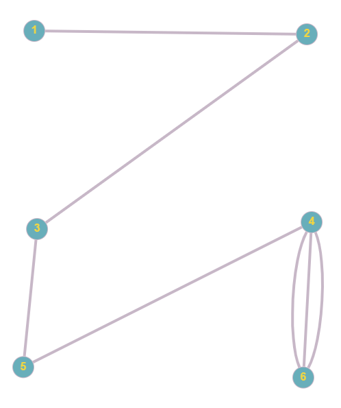
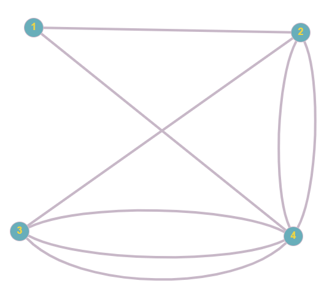
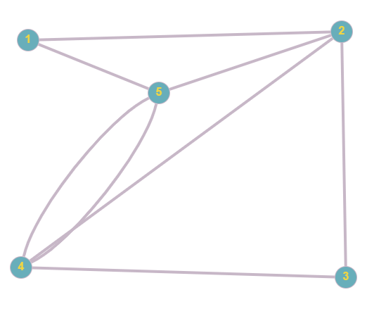
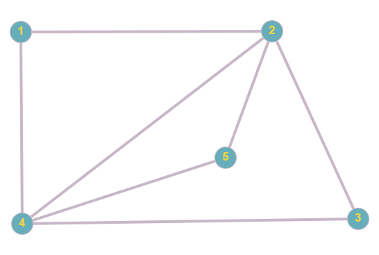

# Расчётная работа.
## Тема работы
Тема работы - основы теории графов, базовые алгоритмы на графах.
## Цель работы
- Ознакомиться с понятием графа.
- Узнать какие бывают графы.
- Ознакомиться с различными способами представления графов.
- Научиться сотставлять алгоритмы для решения теоретико-графовых задач.
## Задачи
- Необходимо разработать алгоритм и перенести его на С/С++, который решает выданную преподавателем теоретико-графовую задачу и соответствует следующим требованиям:
    - Необходимо использовать определенную структуру данных для представления графа.
    - Использование глобальных переменных в программе недопустимо.
    - При своем запуске программа должна в автоматическом режиме стартовать 5 разнообразных примеров решения задачи и выводить результаты работы на консоль.
## Вариант
Я выполнил вариант 5.2 из [руководства](https://drive.google.com/file/d/1-rSQZex8jW-2DlY2kko18gU1oUAtEGHl/view?usp=drive_link). Необходимо найти эйлеров цикл в неориентированном графе. Структура представления данных — матрица инцендентности.
## Список ключевых понятий, использовавшихся при решении задачи
### Основные определения
- **Граф** - это топологичекая модель, которая состоит из множества вершин и множества соединяющих их рёбер. При этом значение имеет только сам факт, какая вершина с какой соединена.
- Графы, как правило, отображаются графически при помощи точек для представления вершин и отрезков, или ломаных, для отображения рёбер между связанными вершинами. Ориентация ребра (в ориентированном графе) отображается при помощи стрелки.
- Инцидентность - вершина и ребро называются инцидентными, если вершина является для этого ребра концевой. Термин “инцидентность” применим только к вершине и ребру. 
  Пример графа:
   

- Граф может быть ориентированным и неориентированным.
    - **Ориентированный граф** (кратко орграф) — граф, рёбрам которого присвоено направление. Направленные рёбра именуются также дугами, а в некоторых источниках и просто рёбрами.
    - Граф, ни одному ребру которого не присвоено направление, называется **неориентированным графом**(неорграфом).

На рисунке выше изображен ориентированный граф, а ниже приведен пример неорграфа:


- **Путем (или маршрут)**  - это последовательность смежных рёбер. Обычно путь задаётся перечислением вершин, по которым он пролегает.

- Подграф. Если в исходном графе выделить несколько вершин и несколько рёбер (между выбранными вершинами), то мы получим подграф исходного графа. 
  
- Граф называется **связным**,  если содержит ровно одну компоненту связности. Это означает, что между любой парой вершин этого графа существует как минимум один путь.


- Компонента связности - множество таких вершин графа, что между любыми двумя вершинами существует маршрут.

- Цикл Эйлера - цикл, проходящий по каждому ребру ровно один раз. Эйлер доказал, что такой цикл существует тогда, и только тогда, когда все вершины в связанном графе имеют чётную степень.

- Степень вершины - это количество рёбер, инцидентных указанной вершине. По-другому - количество рёбер, исходящих из вершины.

## Основные алгоритмы на графах, которые были использованы при решениии теоретико-графовой задачи

- **Матрица инцидентности**  — одна из форм представления графа, в которой указываются связи между инцидентными элементами графа (ребро(дуга) и вершина). Столбцы матрицы соответствуют ребрам, строки — вершинам. Ненулевое значение в ячейке матрицы указывает связь между вершиной и ребром (их инцидентность).



Для данного графа матрица инцидентности выглядит следующим образом:

```
1 0 0 0 0 0 0
1 1 0 0 0 0 0
0 1 0 1 0 0 0
0 0 1 0 1 0 1
0 0 0 1 0 1 0
0 0 1 0 1 1 1
```

- **Поиск в глубину** (DFS) — один из методов обхода графа. Стратегия поиска в глубину, как и следует из названия, состоит в том, чтобы идти «вглубь» графа, насколько это возможно. Алгоритм поиска описывается рекурсивно: перебираем все исходящие из рассматриваемой вершины рёбра. Если ребро ведёт в вершину, которая не была рассмотрена ранее, то запускаем алгоритм от этой нерассмотренной вершины, а после возвращаемся и продолжаем перебирать рёбра.

Пример порядка поиска в глубину:


Реализация обхода в глубину на ЯП C++:

``` C++
/*
list - список смежности графа
visited - массив элементов, в котором visited[i]=1, если вершина была посещена в данном поиске в глубину
start - номер текущей вершины
*/
void dfs_realize(vector<vector<int>> list, int start, vector<int>& visited) {
	visited[start] = 1;

	for (int i = 0; i < list[start].size(); i++) {
		if(!visited[list[start][i]])
		dfs_realize(list, list[start][i], visited);
	}
}
```

## Алгоритм решения поставленной задачи

- Сложность алгоритма — O(E) времени, где E — кол-во рёбер.

# Рассмотрим алгоритм подробнее:

1. Проверяем граф на существование цикла эйлера.
   1.1. Проверяем четность вершин графа.
   1.2. С помощью обхода в глубину проверяем связность графа.
2. Выбираем вершину и начинаем обход по ребрам, пока не придем в начальную вершину(прийти в другую вершину невозможно, т. к. четная степень вершин гарантирует, что если мы по какому-либо ребру вошли в вершину А, то имеется неиспользованное ребро, выходящее из этой вершины).
3. Проверяем все ли ребра мы посетили, если нет то до тех пор, пока не посетим все создаем подграф из непосещенных ребер и инцидентным им вершин и применяем к нему пункт 2, после чего интегрируем получившийся путь в основной.

# В итоге получается данный алгоритм:

1. Проверка графа, если в результате какой-лтбо проверки возвращается false, выводим в консоль запись о том, что цикла эйлера в данном графе не существует.
1.1. Проверяем четность вершин графа.

```C++
/*
matrix - граф в виде матрицы инцидентности
rows - количество вершин
cols - количество ребер
counter - счетчик степени вершины
*/
for (int i = 0; i < rows; i++) {
	int counter = 0;
	for (int j = 0; j < cols; j++) {
		counter += matrix[i][j];
	}
	if (counter % 2 != 0)
		return false;
}

```
1.2. Проверяем связность графа
```C++
/*
smeg_list - список смежности графа
visited - массив элементов, в котором visited[i]=1, если вершина была посещена в данном поиске в глубину
start - номер текущей вершины 
*/
vector<int> visited(rows);
dfs_realize(smeg_list, start, visited);

for (int i = 0; i < rows; i++) {
	if (!visited[i])
		return false;
}
```
2. Выбираем вершину и начинаем обход по ребрам, пока они не закончатся.
``` C++
/*
way_edge - массив для хранения пути, содержащий номера пройденных ребер
way_start - массив для хранения пути, содержащий номера пройденных вершин
start - вершина из которой мы выходи
edge - ребро по которому двигаемся
rows - количество вершин в графе
cols - количество ребер в графе
matrix - матрица инцидентности для графа
visited - массив элементов, в котором visited[i]=1, если ребро было посещено
*/
void find_part_way(vector<vector<int>> matrix, int rows, int cols, int start, int edge, vector<int>& visited, vector<int>& way_edge, vector<int>& way_start) {
way_edge.push_back(edge);
way_start.push_back(start);

for (int i = 0; i < rows; i++) {
	if (i != start && matrix[i][edge]) {
		visited[edge] = 1;
		for (int j = 0; j < cols; j++) {
			if (!visited[j] && j != edge && matrix[i][j]) {
				find_part_way(matrix, rows, cols, i, j, visited, way_edge, way_start);
				break;
			}
		}
		break;
	}
}
```
3.  Проверяем все ли ребра мы посетили, если нет то до тех пор, пока не посетим все создаем подграф из непосещенных ребер и инцидентным им вершин и применяем к нему пункт 2.
```C++
/*
cols - количество ребер
rows - количество вершин
miniway_edge - массив для хранения пути по ребрам в подграфе
miniway_start - массив для хранения пути по вершинам в подграфе
matrix - матрица инцидентности для графа
*/
for (int i = 0; i < cols; i++) {
	if (!visited[i]) {
		vector<int> miniway_edge;
		vector<int> miniway_start;
		for (int j = 0; j < rows; j++) {
			if (matrix[j][i]) {
				find_part_way(matrix, rows, cols, j, i, visited, miniway_edge, miniway_start);
				insert_way(way_edge, way_start, miniway_edge, miniway_start);
				break;
			}
		}
	}
}
```
функиця insert_way для интеграции пути в подграфе в путь в основном графе
```C++
/*
miniway_edge - массив для хранения пути по ребрам в подграфе
miniway_start - массив для хранения пути по вершинам в подграфе
way_edge - массив для хранения пути, содержащий номера пройденных ребер
way_start - массив для хранения пути, содержащий номера пройденных вершин
*/
void insert_way(vector<int>& way_edge, vector<int>& way_start, vector<int> miniway_edge, vector<int> miniway_start) {
	miniway_start.push_back(miniway_start[0]);
	for (int i = 0; i < way_start.size(); i++) {
		if (way_start[i] == miniway_start[0]) {
			for (int j = 0; j < miniway_edge.size(); j++) {
				way_start.insert(way_start.begin() + i, miniway_start[j + 1]);
				way_edge.insert(way_edge.begin() + i, miniway_edge[j]);
			}
			break;
		}
	}
}
```

## Тестовые примеры

- Рассмотрим первый тестовый пример:

  

Число вершин - 6, ребер - 7. Ниже матрица инцидентности для графа:

```
1 0 0 0 0 0 0
1 1 0 0 0 0 0
0 1 0 1 0 0 0
0 0 1 0 1 0 1
0 0 0 1 0 1 0
0 0 1 0 1 1 1
```

Вывод программы:

```
Test 1:
Цикл Эйлера не существует
```

- Рассмотрим второй тестовый пример:

  

Число вершин - 4, ребер - 8. Ниже матрица инцидентности для графа:

```
1 0 0 1 0 0 0 0
1 1 0 0 1 1 0 0
0 1 1 0 0 0 1 1
0 0 1 1 1 1 1 1
```

Вывод программы:

```
Test 2:
Edge_way: 1 6 5 2 8 7 3 4
Vertex_way: 1 2 4 2 3 4 3 4 1
Matrix:
1 0 0 0 0 0 0 1
1 1 1 1 0 0 0 0
0 0 0 1 1 1 1 0
0 1 1 0 1 1 1 1
```

- Рассмотрим третий тестовый пример:

  

Число вершин - 5, ребер - 8. Ниже матрица инцидентности для графа:

```
1 0 0 1 0 0 0 0
1 1 0 0 0 1 1 0
0 1 1 0 0 0 1 1
0 0 1 1 1 0 0 1
0 0 0 0 1 1 0 0
```

Вывод программы:

```
Test 3:
Edge_way: 1 2 3 8 7 6 5 4
Vertex_way: 1 2 3 4 3 2 5 4 1
Matrix:
1 0 0 0 0 0 0 1
1 1 0 0 1 1 0 0
0 1 1 1 1 0 0 0
0 0 1 1 0 0 1 1
0 0 0 0 0 1 1 0
```

- Рассмотрим четвёртый тестовый пример:

  

Число вершин - 5, ребер - 8. Ниже матрица инцидентности для графа:

```
1 0 0 0 0 1 0 0
1 1 0 1 1 0 0 0 
0 1 1 0 0 0 0 0
0 0 1 1 0 0 1 1 
0 0 0 0 1 1 1 1
```

Вывод программы:

```
Test 4:
Edge_way: 1 2 3 8 7 4 5 6
Vertex_way: 1 2 3 4 5 4 2 5 1
Matrix:
1 0 0 0 0 0 0 1
1 1 0 0 0 1 1 0
0 1 1 0 0 0 0 0
0 0 1 1 1 1 0 0
0 0 0 1 1 0 1 1
```

- Рассмотрим пятый тестовый пример:

  

Число вершин - 5, ребер - 7. Ниже матрица инцидентности для графа:

```
1 0 0 0 1 0 0
1 1 0 1 0 1 0
0 1 1 0 0 0 0
0 0 1 1 1 0 1
0 0 0 0 0 1 1
```

Вывод программы:

```
Test 5:
Edge_way: 1 2 3 4 6 7 5
Vertex_way: 1 2 3 4 2 5 4 1
Matrix:
1 0 0 0 0 0 1
1 1 0 1 1 0 0
0 1 1 0 0 0 0
0 0 1 1 0 1 1
0 0 0 0 1 1 0
```

## Детализация преобразования входной конструкции в выходную

- Рассмотрим работу программы на втором тестовом примере.


Входные данные:

```
4 8
1 0 0 1 0 0 0 0
1 1 0 0 1 1 0 0
0 1 1 0 0 0 1 1
0 0 1 1 1 1 1 1
```

1. Функция проверки графа на наличие в нем цикла эйлера вернет true.

2. После первого обхода по ребрам получим следующие значения в массивах way_edge и way_start.

```
way_edge: 1 2 3 4
way_start: 1 2 3 4 1
```

3. Так как не все ребра посещены, будем создавать подграфы, искать в них пути и интегрировать пути в основные.
пути в первом подграфе:
```
miniway_edge: 6 5
miniway_start: 2 4 2
```
после интеграции:
```
way_edge: 1 6 5 2 3 4
way_start: 1 2 4 2 3 4 1
```
пути во втором подграфе:
```
miniway_edge: 8 7
miniway_start: 3 4 3
```
после интеграции:
```
way_edge: 1 6 5 2 8 7 3 4
way_start: 1 2 4 2 3 4 3 4 1
```

## Вывод

В ходе выполнения расчетной работы:

- Было изучено понятие графа, некоторые типы графов, способы представления графа в памяти компьютера.
- Было решено индивидуальное, составлен и записан на языке программирование C++ алгоритм в соответствии с заданными требованиями.
- Алгоритм был проверен на пяти тестовых примерах.

## Список использованных источников

1. Свободная энциклопедия "Википедия" \[Электронный ресурс\]. – Режим доступа: [https://ru.wikipedia.org/wiki/Ориентированный_граф](https://ru.wikipedia.org/wiki/%D0%9C%D0%B0%D1%82%D1%80%D0%B8%D1%86%D0%B0_%D0%B8%D0%BD%D1%86%D0%B8%D0%B4%D0%B5%D0%BD%D1%82%D0%BD%D0%BE%D1%81%D1%82%D0%B8)
2. Свободная энциклопедия "Википедия" \[Электронный ресурс\]. – Режим доступа: [https://ru.wikipedia.org/wiki/Связный_граф#:~:text=Ориентированный%20граф%20называется%20сильно-связным,ровно%20одну%20сильно%20связную%20компоненту.](https://ru.wikipedia.org/wiki/%D0%9F%D0%BE%D0%B8%D1%81%D0%BA_%D0%B2_%D0%B3%D0%BB%D1%83%D0%B1%D0%B8%D0%BD%D1%83)
3. Свободная энциклопедия "Википедия" \[Электронный ресурс\]. – Режим доступа: [https://ru.wikipedia.org/wiki/Компонента_сильной_связности](https://ru.wikipedia.org/wiki/%D0%A1%D0%B2%D1%8F%D0%B7%D0%BD%D1%8B%D0%B9_%D0%B3%D1%80%D0%B0%D1%84)
4. Свободная энциклопедия "Википедия" \[Электронный ресурс\]. – Режим доступа: [https://ru.wikipedia.org/wiki/Граф_(математика)#Обобщение_понятия_графа](https://ru.wikipedia.org/wiki/%D0%9E%D1%80%D0%B8%D0%B5%D0%BD%D1%82%D0%B8%D1%80%D0%BE%D0%B2%D0%B0%D0%BD%D0%BD%D1%8B%D0%B9_%D0%B3%D1%80%D0%B0%D1%84)
5. Сайт "Хабр.Статьи" \[Электронный ресурс\]. - Режим доступа: [https://habr.com/ru/articles/537290/](https://habr.com/ru/companies/otus/articles/568026/)
