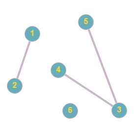

# Расчетная работа 

## Введение

### Цель
Изучить основы теории графов, способы представления графов, базовые алгоритмы для работы с графами, 
### Задание
5.3(Гамильтонов цикл в графе)

Реализовать на C++ код, который может реализовать нахождение Гамильтонов цикла в графе.

Граф представляется в виде матрицы смежности.
Граф неориентированный,невзвешенный.

### Ключевые понятия
`Граф` - математическая абстракция реальной системы любой природы, объекты которой обладают парными связями.

`Ориентированный граф (кратко орграф)` —  граф, рёбрам которого присвоено направление.

`Список смежности` - один из способов представления графа в виде коллекции списков вершин. Каждой вершине графа соответствует список, состоящий из «соседей» этой вершины.

`Матрица смежности` - это вид представления графа в виде матрицы, когда пересечение столбцов и строк задаёт дуги.

`Путь в графе` – это последовательность рёбер, в которой конец каждого ребра (кроме последнего) совпадает с началом следующего.
Замкнутый путь называется `циклом`. 

`Обхват графа` — длина наименьшего цикла, содержащегося в данном графе. Если граф не содержит циклов (то есть является `ациклическим графом`), его обхват по определению равен бесконечности.

Графический пример обхода в ширину:

<p></p>

## Алгоритм решения

Выполняет поиск кратчайшего цикла в графе. Применяем поиск в ширину (BFS) для каждой вершины графа, чтобы определить минимальную длину цикла, начинающегося в этой вершине.

Начинаем поиск с каждой вершины и инициируем очередь для выполнения поиска в ширину. Для каждой вершины в очереди, рассматриваем всех соседей этой вершины и добавляем их в очередь, если они еще не были посещены. Если один из соседей совпадает с начальной вершиной, то обновляем минимальную длину найденного цикла.

Затем  возвращаем минимальную длину цикла в графе. Если такой цикл не найден, это значит что граф является ациклическим и его обхват равен бесконечности.

Чтобы было немного понятней, привидём простенький пример работы алгоритма:

Исходный граф:

<p></p>

Теперь представим этот граф:

<p>&nbsp;   0  1  2  3 </p>
<p> 0  0  1  0  1 </p>
<p> 1  0  0  1  1 </p>
<p> 2  0  0  0  1 </p>
<p> 3  1  0  0  0 </p>


1. Начинаем с вершины 0:

- Добавляем вершину 0 в очередь с расстоянием 0.

- Распространяемся по смежным вершинам: добавляем вершину 1 в очередь с расстоянием 1.

2. Переходим к вершине 1:

- Распространяемся по смежным вершинам: добавляем вершины 2 и 3 в очередь с расстоянием 2.

- Обнаруживаем, что смежная вершина 3 смежна с начальной вершиной 0, обновляем минимальное расстояние до цикла = 3.

3. Переходим к вершине 2:

- Распространяемся по смежным вершинам: добавляем вершину 3 в очередь с расстоянием 3.

- Обнаруживаем, что смежная вершина 3 смежна с начальной вершиной 0, но расстояние 4 больше минимального, поэтому не обновляем минимальное расстояние.

4. Переходим к вершине 3:

- Распространяемся по смежной вершине 0, но она уже была посещена, поэтому не добавляем в очередь.

Таким образом, минимальная длина цикла в данном графе равна 3 (0 -> 1 -> 3 -> 0).

## Реализация на C++

Код, выполняющий наш алгоритм:

```c++
#include <iostream>
#include <fstream>
#include <vector>
#include <queue>
#include <limits>

using namespace std;

int shortestCycle(vector<vector<int>>& adjMatrix, int numberofsize) {
    int minCycle = numeric_limits<int>::max();

    for (int start = 0; start < numberofsize; start++) {
        vector<int> distance(numberofsize, -1);
        queue<int> bfsQueue;

        bfsQueue.push(start);
        distance[start] = 0;

        while (!bfsQueue.empty()) {
            int cur = bfsQueue.front();
            bfsQueue.pop();

            for (int neighbor = 0; neighbor < numberofsize; neighbor++) {
                if (adjMatrix[cur][neighbor] == 1) {
                    if (distance[neighbor] == -1) {
                        distance[neighbor] = distance[cur] + 1;
                        bfsQueue.push(neighbor);
                    } else if (neighbor == start) {
                        minCycle = min(minCycle, distance[cur] + 1);
                    }
                }
            }
        }
    }
    return (minCycle == numeric_limits<int>::max()) ? -1 : minCycle;
}

int main() {
    setlocale(LC_ALL, "ru");

    string fileName;
    cout << "Введите имя файла: ";
    cin >> fileName;

    ifstream inputFile(fileName);
    if (!inputFile.is_open()) {
        cerr << "Ошибка: не удалось открыть файл." << endl;
        return 1;
    }

    ofstream outputFile("obhvat.txt");
    if (!outputFile.is_open()) {
        cerr << "Ошибка: не удалось создать выходной файл." << endl;
        return 1;
    }

    int numberof_usl;
    inputFile >> numberof_usl;

    vector<vector<int>> adjMatrix(numberof_usl, vector<int>(numberof_usl, 0));
    for (int i = 0; i < numberof_usl; i++) {
        for (int j = 0; j < numberof_usl; j++) {
            inputFile >> adjMatrix[i][j];
        }
    }

    inputFile.close();

    int cycleLength = shortestCycle(adjMatrix, numberof_usl);
    if (cycleLength == -1) {
        outputFile << "Обхват графа: бесконечность" << endl;
    } else {
        outputFile << "Обхват графа: " << cycleLength << endl;
    }

    outputFile.close();
    return 0;
}
```

## Разбор кода:

- `#include <vector>`, `#include <fstream>` и `#include <queue>`: библиотеки , которые предоставляют возможность использовать векторы, файлы и очереди.
- `int shortestCycle(vector<vector<int>>& adjList, int numberofsize)`: Объявление функции shortestCycle, которая принимает ссылку на вектор векторов adjList и целочисленное значение n, обозначающее количество вершин в графе. Функция возвращает целочисленное значение - длину кратчайшего цикла в графе, либо -1, если цикл отсутствует.
- `for (int i = 0; i < numberofsize; i++)` : Цикл, в котором происходит перебор всех вершин графа. Внутри этого цикла будет запущен поиск кратчайшего цикла из каждой вершины:
  -   `vector<bool> visited(numberofsize, false) `: Объявление вектора visited размером n, которая будет использоваться для отслеживания посещенных вершин во время обхода графа.
  - `queue<pair<int, int>> q`: Объявление очереди q с элементами типа pair<int, int>, где первый элемент - вершина графа, а второй - расстояние от начальной вершины.
  - `q.push({ i, 0 })`: Добавление начальной вершины i в очередь q с расстоянием 0.
  - `while (!q.empty())`: Цикл, который будет выполняться, пока очередь не станет пустой. Здесь происходит обход графа в ширину (BFS) из текущей вершины:
     - `int cur = q.front().first`: Извлечение текущей вершины из очереди.
     -  `int dist = q.front().second `: Извлечение расстояния от начальной вершины до текущей вершины.
     -   `q.pop()`: Очищение очереди
     -   `for (int neighbor : adjList[cur]`: Цикл, в котором происходит перебор всех смежных вершин текущей вершины.
     -   `if (neighbor == i)`: Проверка, является ли смежная вершина начальной вершиной. Если да, то обновляем значение `minCycle` с помощью строки `minCycle = min(minCycle, dist + 1)`
     -   `else if (!visited[neighbor])`: Проверка, была ли уже посещена смежная вершина. Если нет, то добавляем её в очередь c помощью строк `visited[neighbor] = true` и `q.push({ neighbor, dist + 1 })`.
- `if (minCycle == numberofsize  + 1){ return -1;} `:Проверка, был ли найден цикл во всем графе. Если нет, возвращаем -1, чтобы обозначить отсутствие цикла.
- `else { return minCycle; }`: Если же цикл был найден, возвращаем его длину.


## Вывод
 
В результате выполнения расчётной работы приобрёл следующие навыки:
- изучил основы теории графов
- изучил способы представления графов
- изучил базовые алгоритмы для работы с графами
- изучил базовые алгоритмы работы с векторами, очерядими и файлами в C++

## Список литературы
[1] Оре О. Теория графов. – 2-е изд.. – М.: Наука, 1980. – С. 336.

[2] Кормен Т. Х. и др. Часть VI. Алгоритмы для работы с графами // Алгоритмы: построение
и анализ = Introduction to Algorithms. – 2-е изд.. – М.: Вильямс, 2006. – С. 1296.

[3] Харари, Ф. Теория графов / Ф. Харари / Пер. с англ. и предисл. В.П. Козырева. Под ред.
Г.П. Гаврилова. Изд. 2-е. – М.: Едиториал УРСС, 2003. – 269 с.

[4] Нечипуренко, М. И. Алгоритмы и программы решения задач на графах и сетях / М.И.
Нечипуренко, В.К. Попков, С.М. Майнагашев и др. – Новосибирск: Наука. Сиб. отд-ние,
1990. – 515 с.

[5] Емеличев В. А., Мельников О. И., Сарванов В. И., Тышкевич Р. И. Лекции по теории
графов. М.: Наука, 1990. 384с. (Изд.2, испр. М.: УРСС, 2009. 392 с.)

[6] Касьянов, В. Н. Графы в программировании: обработка, визуализация и применение / В.
Н. Касьянов, В. А. Евстигнеева. – СПб. : БХВ-Петербург, 2003.

[7] База знаний по теории графов OSTIS GT [Электронный ресурс] / проект OSTIS, 2012. –
Режим доступа: http://ostisgraphstheo.sourceforge.net. — Дата доступа : 11.09.2012.
