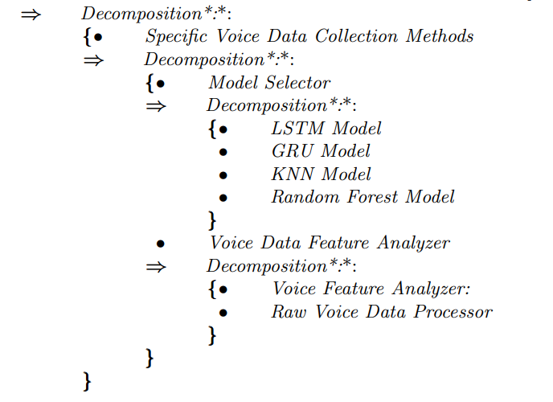
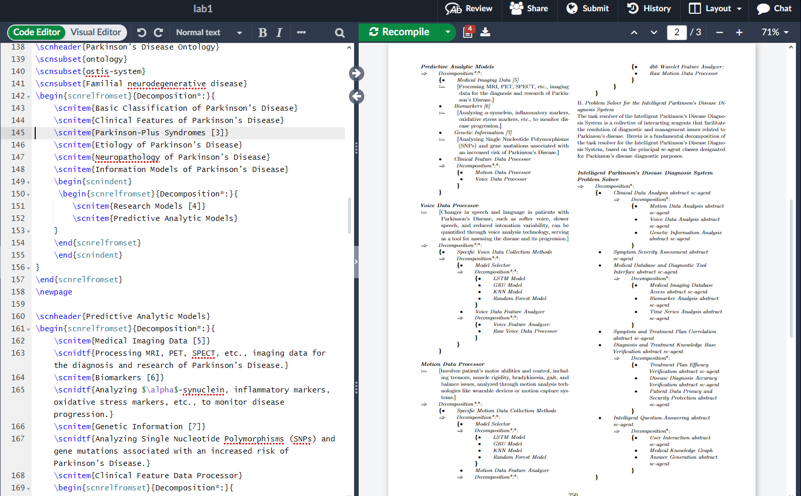

# Лабораторная работа 1

### Цель:

Познакомиться с системой верстки текстов TeX, языком верстки TeX, издательской системой LaTeX.Выполнить вариант индивидуального задания.

### Основные команды, использованные при выполнениии лабораторной работы №1:

* `enumerate` - для создания нумерованного списка
* `\section{}` - для разбиения текста на главы
* `figure` - для вставки картинок
* `scnrelfromset` , `\scnitem` , `scnindent` - для создания списков как на скриншоте ниже:

Краткое обучение по *Tex* размещено на сайте **overleaf.com** [ссылка](https://www.overleaf.com/learn/latex/Learn_LaTeX_in_30_minutes).

Пример запуска программы:

