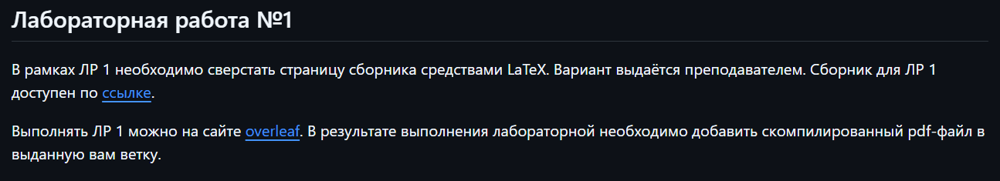
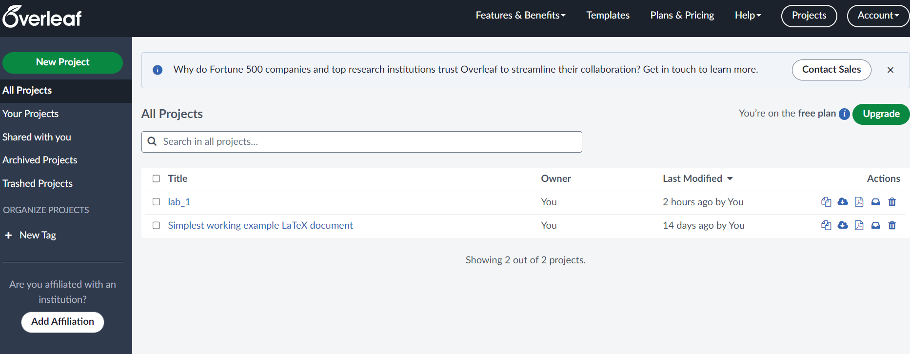
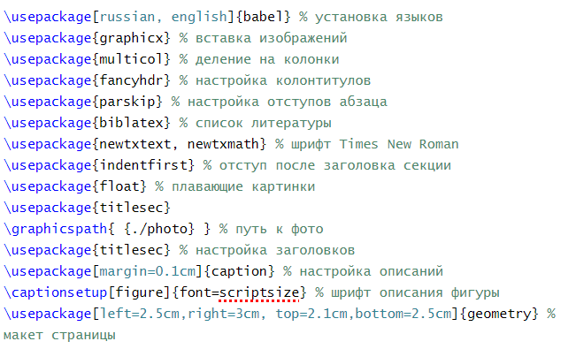
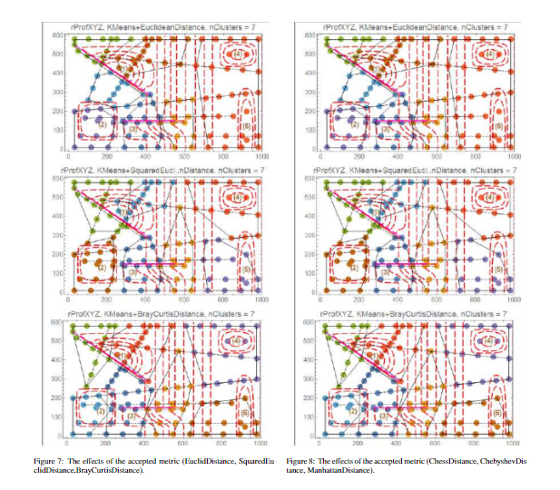
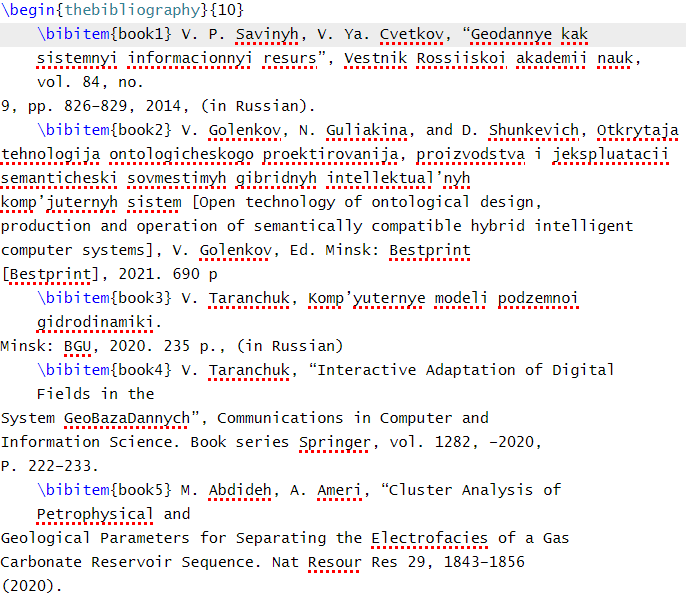

#  LaTeX
## Цели
Ознакомление с :
* системой верстки текстов TeX
* языком верстки TeX
* издательской системой LaTeX
## Задачи
В рамках работы было необходимо сверстать 3 страницы научной статьи с использованием системы верстки текстов TeX

На странице https://proc.ostis.net/proc/Proceedings%20OSTIS-2024.pdf были выбраны страницы, соответствующие варианту индивидуального задания(193-195)
## Условие лабораторной работы №1

## Среда
При выполнении лабораторной работы было необходимо использовать сайт Overleaf

[Overleaf](https://www.overleaf.com/learn)

## Использованные пакеты 

## Основные аспекты выполнения работы

Картинки вставляются в **figure** с помощью команды *\includegrafics*

Подпись к фотографии создается с помощью команды *\caption*, расположенной в **figure**

Команда *\label* создает маркер, на который можно ссылаться в дальнейшем коде

Для расположения элементов в двух колонках они были размещены внутри блока *\begin{multicols}{2} ... \end{multicols}{2}*

Для расположения двух картинок рядом друг с другом они были помещены в разные **minipage**, которые распологались в единой **figure**

Список литературы был создан при помощи **thebibliography**

## Итоги 

В результате выполнения лабораторной работы были сверстаны 3 страницы научного текста с помощью сайта Overleaf, я ознакомился с системой верстки текстов Tex, языком верстки Tex, издательской системой Latex. Все поставленные задачи были выполнены, а цели достигнуты

## Выводы по лабораторной работе №3

В ходе лабораторной работы я:
* ознакомился с программами git
* освоил их программные аргументы
* получил практические навыки работы в консоли, использования консольных команд 
* ознакомился с возможностью кастомизации репозиториев на GitHub с помощью README-файла на языке разметки Markdown