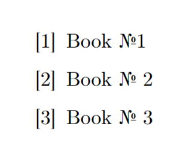
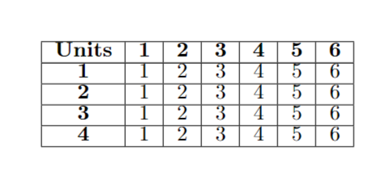
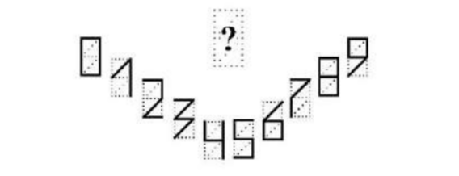

# Лабораторная 1 

### Цель:
Изучить систему верстки текстов *TeX*, язык верстки *TeX* и издательскую систему *LaTeX*. Выполнить индивидуальное задание по выбранному варианту.

### Перед началом работы необходимо подключить специальные пакеты
```
\documentclass[10pt, a4paper]{article}%создание базы , шрифт 10

\usepackage{graphicx} %подключение пакета для картинок
\usepackage{multicol} %подключение библиотеки для разделения текста на колонки
\usepackage{amsmath}

\usepackage[colorlinks=true, allcolors=blue]{hyperref}
\graphicspath{ {images/} }
\usepackage{lipsum}
\usepackage{setspace}%подключение бибилотеки для отступов между строками
\usepackage{fancyhdr}
\usepackage{float}
\usepackage[left=2.1cm,right=2.1cm, top=2.1cm,bottom=2.2cm]{geometry} % создание шаблона с определенными отступами
\setlength{\columnsep}{0.45cm} %расстояние между двумя колонками с текстами
\usepackage{fancyhdr}
\cfoot{\textbf{\thepage}} % номер страницы становится жирным
\pagestyle{fancy}
\setcounter {page}{114}% установление номера страницы
\renewcommand{\headrulewidth}{0pt} % убрать разделительную линиб в верхнем колонтитуле
\newcommand{\RomanNumeralCaps}[1]
    {\MakeUppercase{\romannumeral #1}}

```
### Создание списка
```
\begin{enumerate}[label={[\arabic*]}]

    \bibitem{book1} Book №1

    \bibitem{book2} Book № 2

    \bibitem{book3} Book № 3
    
\end{enumerate}
```
как это будет выглядеть 
 <p  align="center"></p>

### Создание таблицы
```
\begin{tabular}{|c|c|c|c|c|c|c|c|c|c|c|}
\hline
\textbf{Units} & \textbf{1} & \textbf{2} & \textbf{3} & \textbf{4} & \textbf{5} & \textbf{6} \\
\hline
\textbf{1} & 1 & 2 & 3 & 4 & 5 & 6  \\
\hline
\textbf{2} & 1 & 2 & 3 & 4 & 5 & 6  \\
\hline
\textbf{3} & 1 & 2 & 3 & 4 & 5 & 6  \\
\hline
\textbf{4} & 1 & 2 & 3 & 4 & 5 & 6  \\
\hline
\end{tabular}
```
как это будет выглядеть 
 <p  align="center"></p>
 
### Добавление изображений
```
 \begin{center}
    \begin{figure}[H]
    \centering
   \includegraphics[width=0.8\columnwidth]{pic2.png}
    \label{fig:first}
\end{figure}
\end{center}
```
как это будет выглядеть 
 <p  align="center"></p>
 
###  Так же могут прикодиться комманды
* `\par` - абзац
* `\newpage` - новая страница
* `\vspace{N}` - оступ на N

Подробная инструкция для работы в *Overleaf* можно почитать [вот здесь](https://www.overleaf.com/learn/latex/Learn_LaTeX_in_30_minutes).


# Лабараторная 3

## Цель
Изучить систему управления версиями *Git* и веб-сервис *GitHub*.

### Основные команды Git:
* `git init` - инициализация нового репозитория
* `git status` - проверка файлов на индексирование и наличие его в репозитории
* `git add N.txt` - перенести файл N.txt из рабочего каталога в раздел проиндексированных файлов

### Работа с удаленными хостингами

Популярным хостингом для хранения удаленных репозиториев является *__GitHub__*.
Чтоб начать работу с ним, можно изучить [данную страницу](https://ru.hexlet.io/courses/intro_to_git/lessons/github/theory_unit).

### Вывод:

Git дает возможность сохранять изменения на локальном уровне и при необходимости возвращаться к предыдущим версиям проекта. Кроме того, можно создать удалённую копию на хостинг-платформе, поддерживающей Git, и поделиться результатами с другими пользователями.

