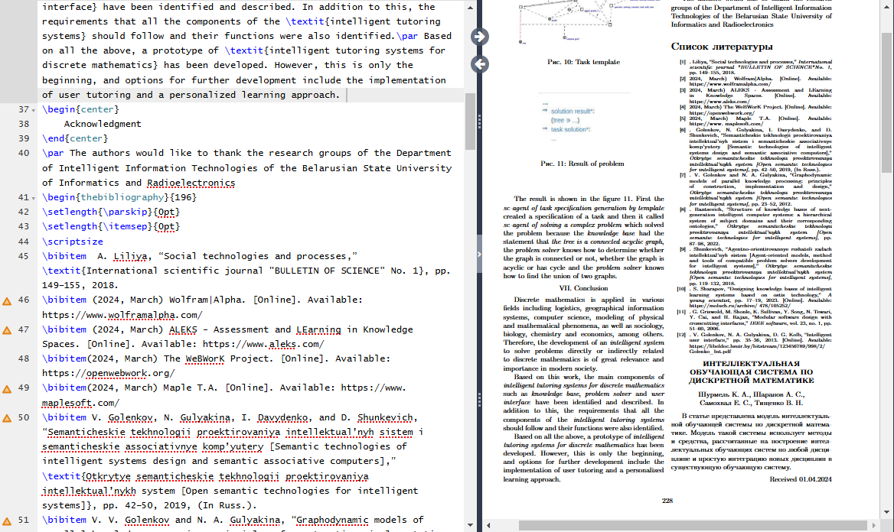

# Лабораторная работа №3
---
### Условие лабораторной работы №1

В рамках ЛР1 необходимо сверстать страницу сботрика средствами LaTeX. Вариант выдаётся проподавателем. Сборник для лр1 доступен по ссылке.

Выполнять ЛР1 можно на сайте overleaf.com. В результате выполнения лабораторной необходимо добавить скомпилированный pdf-файл в выданную вам ветку.:

### Основные коменды при выполнении лабораторной работы
1. Для создания списка библиографии:
   
`\usepackage[nottoc]{tocbibind}`

`\begin{thebibliography}{196}`

`\bibitem`

`\end{thebibliography}`

2. Для создания ненумированного списка:

`\begin{itemize}`

`\item`

`\end{itemize}`

3. Для создания картинки:

`\begin{figure}[H]`

`\includegraphics[width=\linewidth]{Название файла с картинкой}`

`\caption{Подпись к картинке}`

`\end{figure}`
### Цель лабораторной работы №3

Научиться работать с Git и GitHub. Научиться создавать и оформлять README-файлы.

### Вывод по лабораторной работе №3
1. Научился ориентироваться и работать в системе контроля версий Git и платформе GitHub. 
2. Научился создавать и оформлять файлы формата .md 
### Скриншоты выполнения работы

